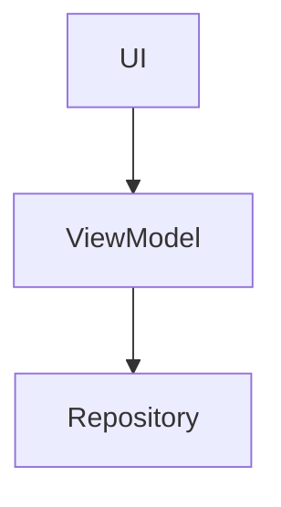

# TECH SPEC: [Feature Name]

> **Ref**: [Link to PRD]

## 1. Traceability Matrix

| Requirement ID | Implementation File   | Function/Component |
| :------------- | :-------------------- | :----------------- |
| REQ-ID-001     | `src/path/to/file.ts` | `functionName()`   |

## 2. Architecture

**Pattern**: [e.g., MVVM, Repository Pattern]
**Diagram**:



## 2. Data Model

**Schema Changes**:

```sql
ALTER TABLE users ADD COLUMN preferences JSONB;
```

## 3. API Contract

**Endpoint**: `POST /api/export`
**Request**:

```json
{ "format": "csv" }
```

**Response**:

```json
{ "url": "https://..." }
```

## 4. Implementation Plan

- [ ] Step 1: Migration.
- [ ] Step 2: Backend API.
- [ ] Step 3: UI Integration.

## 5. Security & Risks

- **Risk**: Large export payloads.
- **Mitigation**: Stream response + Timeout.
