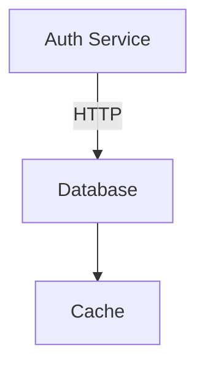

# TECHSPEC-WHITEBOARD: Whiteboard Modality Architecture v2.1

## 1. System Overview
The Whiteboard Modality consists of three distinct runtime environments that must coordinate:
1.  **Runtime Hub (Node.js Main Process):** Hosts the `ArtifactStore` and manages file I/O.
2.  **Client UI (React/Renderer):** Renders Excalidraw, handles user events, generates snapshots.
3.  **MCP Server (Standalone Process):** Exposes tools to the Agent; communicates with Runtime Hub via IPC.

## 2. The Spine: Universal Artifact Store (Runtime Hub)

### 2.1 Implementation Details
The `ArtifactStore` is a modality-agnostic singleton in the Main Process. It treats all artifacts as generic files (text or binary) while providing specialized "write policies" (immediate vs. debounced). It is designed to be the single source of truth for all multimodal data (Whiteboards, Slides, Code Annotations, etc.).

**File:** `src/main/services/ArtifactStore.ts`

```typescript
interface WriteOptions {
  actor: 'user' | 'agent';
  reason: string;
  debounce?: boolean; // If true, wait 500ms
  createSnapshot?: boolean; // If true, expect binary data in payload
}

class ArtifactStore {
  // Concurrency: 1. Guarantees FIFO write order.
  private queue = new PQueue({ concurrency: 1 });
  private debounceTimers = new Map<string, NodeJS.Timeout>();

  /**
   * The Universal Write Method.
   * Handles locking, history, atomicity, and logging.
   */
  async write(filePath: string, content: string | Buffer, opts: WriteOptions) {
    const absolutePath = this.resolvePath(filePath);

    // 1. Handle Debounce (for UI dragging)
    if (opts.debounce) {
      return this.scheduleDebounce(absolutePath, content, opts);
    }

    // 2. Queue the Atomic Operation
    return this.queue.add(async () => {
      // A. Rolling History (REQ-CORE-05)
      // Copy current file to .opencode/artifacts/history/<hash>.bak
      await this.versionControl.snapshot(absolutePath);

      // B. Atomic Write (REQ-CORE-02)
      const tempPath = `${absolutePath}.tmp`;
      await fs.writeFile(tempPath, content);
      await fs.rename(tempPath, absolutePath);

      // C. Audit Log (REQ-CORE-06)
      await this.eventLogger.log({
        action: 'WRITE',
        file: filePath,
        actor: opts.actor,
        reason: opts.reason,
        timestamp: new Date().toISOString()
      });
      
      // D. Broadcast Change (to sync other windows)
      this.broadcastToRenderers('FILE_CHANGED', { path: filePath });
    });
  }
}
```

## 3. The Bridge: Reconciliation Logic (Client UI)
This is the most critical algorithmic component. It ensures the Agent's logic updates don't destroy the User's layout.

**File:** `src/client/hooks/useMermaidBridge.ts`

### 3.1 The Algorithm
The merge happens in the Client immediately after the Agent updates the `.graph.mmd` file.

**Trigger:** ArtifactStore notifies Client that `.graph.mmd` changed.

**Inputs:**
- **NewMermaid:** The string from the Agent.
- **CurrentExcalidraw:** The current JSON on the canvas.

**Process (reconcileGraph):**

```typescript
import mermaid from 'mermaid';
import dagre from 'dagre';

export function reconcileGraph(mermaidCode: string, currentElements: ExcalidrawElement[]) {
  // 1. Parse Mermaid to Graph (Nodes/Edges)
  const { nodes, edges } = parseMermaidToAST(mermaidCode);

  // 2. Initialize Dagre (Auto-Layout Engine)
  const g = new dagre.graphlib.Graph();
  g.setGraph({ rankdir: 'TD' });
  g.setDefaultEdgeLabel(() => ({}));

  // 3. Map Existing Elements (Stable ID Check)
  const existingMap = new Map();
  currentElements.forEach(el => {
    if (el.customData?.id) existingMap.set(el.customData.id, el);
  });

  // 4. Build New Element List
  const newElements = [];

  nodes.forEach(node => {
    const existing = existingMap.get(node.id);

    if (existing) {
      // CASE A: UPDATE (Keep User's Position)
      newElements.push({
        ...existing,
        text: node.label
      });
    } else {
      // CASE B: CREATE (Auto-Layout)
      g.setNode(node.id, { label: node.label, width: 100, height: 50 });
    }
  });

  // 5. Run Layout for NEW nodes only
  dagre.layout(g);

  // 6. Convert Dagre positions to Excalidraw Elements
  g.nodes().forEach(nodeId => {
    if (!existingMap.has(nodeId)) {
      const pos = g.node(nodeId);
      newElements.push(createExcalidrawRect({
        id: nodeId, 
        x: pos.x,
        y: pos.y,
        text: pos.label,
        customData: { id: nodeId } 
      }));
    }
  });

  // 7. Reconstruct Edges
  edges.forEach(edge => {
    // ... arrow binding logic ...
  });

  return newElements;
}
```

## 4. UI Integration & Interaction Flow

### 4.1 Modality Frame Component
**Component:** `src/components/whiteboard/WhiteboardFrame.tsx`
* **Isolated State:** The component manages its own Excalidraw instance and Mermaid parser. It is rendered in a dedicated panel or sidebar.
* **Events:**
    * `onUserCommit`: Triggered when the user clicks "Send to Agent". It emits a message to the chat timeline with the latest Mermaid code and a snapshot.
    * `onExternalUpdate`: Listener for filesystem changes (via ArtifactStore broadcast) to trigger `reconcileGraph`.

### 4.2 Entry Points
* **File Tree:** `FileTree.tsx` handles `.graph.mmd` and `.excalidraw` extensions by dispatching an `OPEN_WHITEBOARD` action to the global layout manager.
* **Slash Command:** `PromptInput.tsx` detects `/whiteboard [name]` and triggers creation.
* **Creation Menu:** A new "Create Artifact" menu in the sidebar with a "Whiteboard" option.

### 4.3 User-Agent Interaction Loop
1. **User Action:** User drags/draws in Excalidraw. `writeDebounced` saves `.excalidraw` and `.png`.
2. **User Commit:** User clicks "Send to Agent" or types a message.
3. **Bridge Action:** Client converts Excalidraw elements back to Mermaid logic.
4. **Message Flow:** A message is sent to the Agent context including the Mermaid Code and Snapshot.
5. **Agent Action:** Agent processes, calls `update_whiteboard` via MCP Tool.
6. **Persistence:** `ArtifactStore` writes new `.graph.mmd`.
7. **Reflect:** Client detects change, runs `reconcileGraph`, UI updates.

## 5. MCP Communication Layer (IPC)
Since the Agent communicates via an MCP Server (which is a separate process spawned by the IDE or terminal), it cannot call `ArtifactStore.write()` directly.

### 5.1 The Protocol
- **Transport:** HTTP/REST (Internal Localhost) or Named Pipes.
- **Auth:** A generated `AUTH_TOKEN` passed to the MCP process env.

### 5.2 MCP Server Implementation
**File:** `src/mcp-server/whiteboard.ts`

```typescript
// This runs in the MCP Process
server.tool('update_whiteboard', async ({ mermaid_code, reason }) => {
  if (!isValidMermaid(mermaid_code)) throw new Error("Invalid Syntax");

  const response = await fetch(`http://localhost:${PORT}/api/v1/write`, {
    method: 'POST',
    headers: { 'Authorization': AUTH_TOKEN },
    body: JSON.stringify({
      path: 'design/whiteboard.graph.mmd',
      content: mermaid_code,
      meta: { actor: 'agent', reason }
    })
  });

  if (!response.ok) throw new Error("ArtifactStore Write Failed");
  return { content: [{ type: "text", text: "Whiteboard logic updated." }] };
});
```

## 6. Directory & File Formats

### 6.1 Canonical: whiteboard.graph.mmd


### 6.2 Projection: whiteboard.excalidraw
Standard Excalidraw JSON, but every semantic node must have:
```json
{
  "type": "rectangle",
  "x": 100, "y": 200,
  "label": "Auth Service",
  "customData": {
    "id": "A"  // MATCHES MERMAID ID
  }
}
```

## 7. Implementation Checklist

### Phase 1: The Spine (Runtime)
- [ ] Implement `ArtifactStore` class with `PQueue`.
- [ ] Implement `EventLogger` (ndjson appender).
- [ ] Create internal HTTP/IPC endpoint for MCP to talk to Runtime.

### Phase 2: The Bridge (Client)
- [ ] Setup `mermaid` and `dagre` dependencies.
- [ ] Implement `reconcileGraph` function.
- [ ] Implement `WhiteboardFrame` component with modular isolation.
- [ ] Implement `useDebouncedSave` hook for `.excalidraw` and `.png` exports.

### Phase 3: The Agent (MCP)
- [ ] Build `whiteboard-mcp` executable.
- [ ] Connect `update_whiteboard` tool to the Runtime API.
