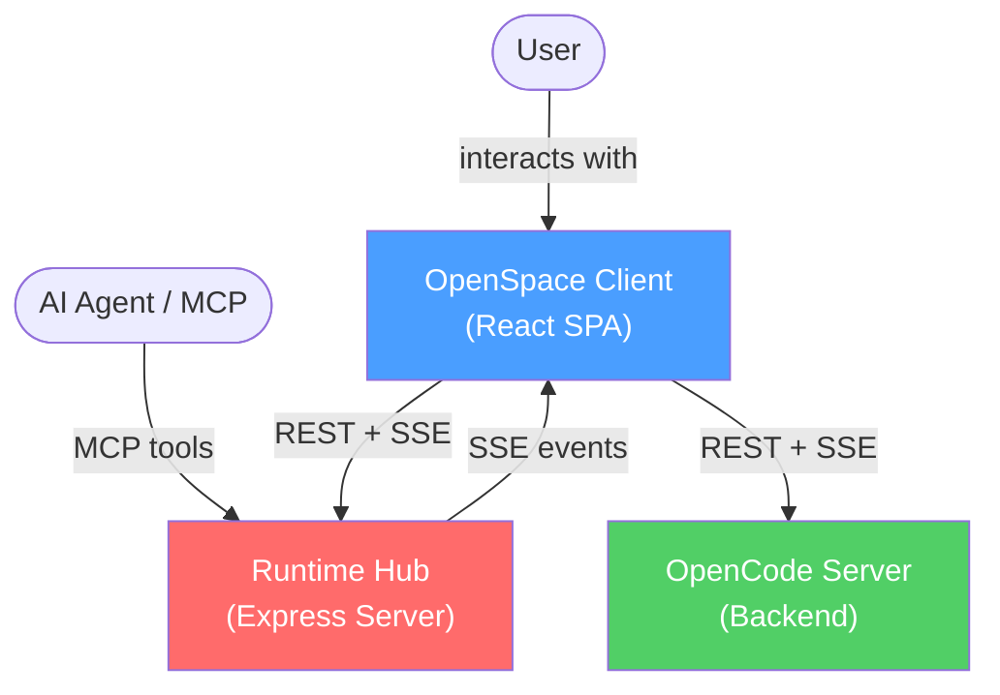
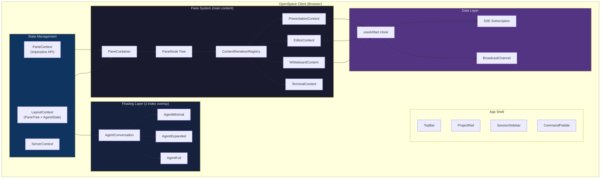
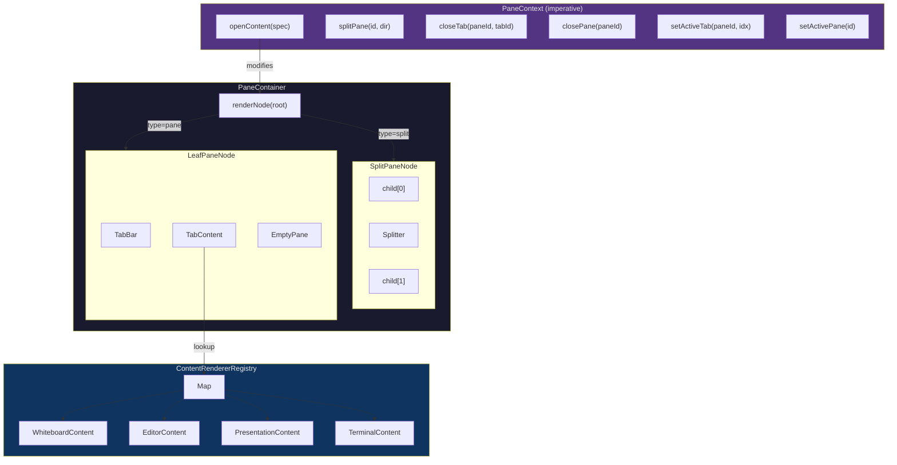

# TECHSPEC-002: Pane System with Floating Agent Conversation

## Status: APPROVED

**Requirements Reference:** REQ-002-window-pane-management.md
**Review Method:** Architectural Review Skill (C4 + Multi-Expert Debate + Chaos Monkey + Simplicity Checklist)

---

## 1. Executive Summary

This architecture replaces the current layout approach with a **Pane System** as the primary content surface and an **Agent Conversation** as a floating overlay. The design follows three core principles:

1. **Panes own content** — Every artifact (whiteboard, editor, presentation) renders inside a pane tab. No content floats outside the pane tree.
2. **Agent floats above everything** — The conversation UI is a viewport-level overlay, independent of the pane tree.
3. **State lives in context, not components** — All layout state (pane tree, active pane, agent conversation size/position) is managed by a single `LayoutContext` and persisted per session.

### Key Architectural Decisions

| # | Decision | Rationale |
|---|----------|-----------|
| AD-1 | **Discriminated union for PaneNode** | Eliminates runtime null-checks for `tabs`/`children`. Split nodes have `children`, leaf nodes have `tabs`. |
| AD-2 | **Content rendering via registry, not switch** | A `ContentRendererRegistry` maps `SpaceType → React.ComponentType`. New content types plug in without modifying Pane.tsx. |
| AD-3 | **PaneContext exposes imperative API** | Components outside the pane tree (FileTree, commands, agent) can open content in panes via `paneApi.openContent(...)`. |
| AD-4 | **Agent conversation state in LayoutContext** | Not a separate context. Size, position, visibility co-locate with other layout state for atomic persistence. |
| AD-5 | **Splitter uses `ResizeObserver` + refs** | No `document.querySelector`. Parent container size measured via ref, resize delta computed from pointer events. |
| AD-6 | **Session-level layout persistence** | Layout JSON serialized to session metadata via hub. Restored on session switch. |
| AD-7 | **Single keyboard handler in App.tsx** | PaneContainer does NOT register its own `window.keydown`. All shortcuts go through the existing App.tsx handler + `shortcuts.ts` system. |
| AD-8 | **Merge FileTabsContext into PaneContext** | FileTabsContext is a parallel tab system that will create confusion. Its responsibilities are subsumed by the pane tab system. |
| AD-9 | **Always-valid active pane invariant** | `activePaneId` is always populated; normalization resolves missing/invalid ids to first leaf pane. |
| AD-10 | **Terminal is pane content only** | Remove bottom terminal panel mode and top-bar terminal toggle to simplify layout model. |
| AD-11 | **Agent dock mode in pane tree** | Agent can dock into active pane without destroying underlying tabs; undock restores pane content. |

---

## 2. C4 Architecture Visualization

### 2.1 Context Diagram (Level 1)



**Boundary Check:** ✅ No circular dependencies. Client → Hub is unidirectional REST+SSE. Agent → Hub is unidirectional MCP. All network crossings have failure handling (SSE reconnect, REST error envelopes).

### 2.2 Container Diagram (Level 2) — Client Internal



**Dependency Analysis:**
- ✅ PaneSystem depends on StateLayer (reads layout), DataLayer (loads content). No reverse dependency.
- ✅ FloatingLayer depends on StateLayer (reads agent state). No dependency on PaneSystem.
- ✅ DataLayer has zero knowledge of UI components. Pure data fetch + sync.
- ✅ ContentRendererRegistry decouples PaneNode from content implementations.

### 2.3 Component Diagram (Level 3) — Pane System Detail



---

## 3. Type System

### 3.1 Discriminated Union for PaneNode (AD-1)

The existing `PaneNode` type uses optional fields for both split and leaf nodes, creating ambiguity. The new type system uses a discriminated union:

```typescript
// ── Base ──
interface PaneNodeBase {
  id: string;
}

// ── Leaf: a single pane with tabs ──
interface LeafPaneNode extends PaneNodeBase {
  type: 'pane';
  tabs: PaneTab[];
  activeTabIndex: number; // -1 when empty
}

// ── Split: two children separated by a splitter ──
interface SplitPaneNode extends PaneNodeBase {
  type: 'split';
  direction: 'horizontal' | 'vertical';
  splitRatio: number; // 0.1 to 0.9
  children: [PaneNode, PaneNode]; // Always exactly 2
}

// ── Union ──
type PaneNode = LeafPaneNode | SplitPaneNode;

// ── Tab ──
interface PaneTab {
  id: string;
  type: SpaceType;
  title: string;
  contentId?: string;  // file path, whiteboard name, etc.
  state?: unknown;     // component-specific persisted state (scroll pos, zoom, etc.)
  dirty?: boolean;     // unsaved changes indicator
}

// ── Space types ──
type SpaceType =
  | 'editor'
  | 'whiteboard'    // renamed from 'sketch' for clarity
  | 'presentation'
  | 'terminal'
  | 'dashboard'
  | 'diff'
  | 'browser'
  | 'media';

// ── Content specification (used by openContent API) ──
interface ContentSpec {
  type: SpaceType;
  title: string;
  contentId?: string;
  targetPaneId?: string;  // optional: open in specific pane
}
```

**Why this matters:** With the discriminated union, TypeScript narrows correctly:
```typescript
if (node.type === 'pane') {
  // node.tabs is PaneTab[] — guaranteed
  // node.children does not exist — compile error if accessed
}
if (node.type === 'split') {
  // node.children is [PaneNode, PaneNode] — guaranteed
  // node.tabs does not exist — compile error if accessed
}
```

### 3.2 Layout State

```typescript
interface PaneLayout {
  version: '1.0';
  root: PaneNode;
  activePaneId: string;
}

interface AgentConversationState {
  size: 'minimal' | 'expanded' | 'full';
  mode: 'floating' | 'docked-pane';
  dockedPaneId?: string;
  floatingRect: { x: number; y: number; width: number; height: number }; // viewport %, resizable
  lastFloatingRect?: { x: number; y: number; width: number; height: number };
  visible: boolean;
}

interface AppLayoutState {
  version: '1.0';
  panes: PaneLayout;
  agent: AgentConversationState;
  navigationCollapsed: boolean;
  rightSidebarExpanded: boolean;
  layoutOrganization: 'per-session' | 'per-project';
}
```

**Note on position units:** Agent conversation position is stored as percentage of viewport (0-100), not pixels. This ensures positions remain valid across window resizes.

### 3.3 Structural Constraints

- **Pane minimum size (enforced):** `200px` width and `150px` height.
- **Split depth limit (enforced):** maximum tree depth `4`.
- **Enforcement points:** `splitPane()` checks depth before creating new split nodes; Splitter clamps ratios based on container size and minimum pane dimensions.

---

## 4. Component Architecture

### 4.1 App Layout Structure

```tsx
<div className="app-container">
  <ToastHost />
  <TopBar />
  
  <div className="flex h-full min-h-0">
    <ProjectRail />
    <SessionSidebar />      {/* collapsible */}
    
    <main className="flex-1 flex flex-col min-w-0">
      <PaneContainer />     {/* fills main area */}
    </main>
    
    <FileTree />             {/* collapsible right sidebar */}
  </div>
  
  <AgentConversation />      {/* position: fixed, z-index: 9999 */}
  <CommandPalette />
</div>
```

### 4.2 PaneContainer

**Responsibility:** Renders the pane tree. Pure rendering — no state management.

```typescript
interface PaneContainerProps {
  // No props. Reads from PaneContext.
}
```

PaneContainer reads `paneLayout.root` from `PaneContext` and recursively renders `SplitPaneNode` or `LeafPaneNode`. It does NOT:
- Own keyboard handlers (those live in App.tsx)
- Own state (lives in PaneContext)
- Know about content types (delegated to ContentRendererRegistry)

### 4.3 PaneContext (AD-3, AD-8)

**Responsibility:** Single source of truth for pane tree state. Provides imperative API for all pane operations.

```typescript
interface PaneContextType {
  // ── State (read-only from consumers) ──
  layout: PaneLayout;
  
  // ── Imperative API ──
  openContent: (spec: ContentSpec) => void;
  splitPane: (paneId: string, direction: 'horizontal' | 'vertical') => void;
  closePane: (paneId: string) => void;
  closeTab: (paneId: string, tabId: string) => void;
  setActiveTab: (paneId: string, tabIndex: number) => void;
  setActivePane: (paneId: string) => void;
  moveTab: (fromPaneId: string, tabId: string, toPaneId: string) => void;
  resizeSplit: (splitId: string, newRatio: number) => void;
  resetLayout: () => void;
  
  // ── Query ──
  getActivePane: () => LeafPaneNode | null;
  findPaneByTabContentId: (contentId: string) => LeafPaneNode | null;
}
```

**`openContent` behavior:**
1. If `spec.targetPaneId` is set → open in that pane.
2. Else, check if a tab with the same `contentId` already exists anywhere in the tree → if yes, activate that tab and its pane (focus, don't duplicate).
3. Else, find the active pane → add a new tab.
4. If no active pane → use the root (which is always a leaf on fresh start).

This replaces the current `setActiveArtifactPane` in LayoutContext AND the entire `FileTabsContext`.

### 4.4 ContentRendererRegistry (AD-2)

**Responsibility:** Maps `SpaceType` to a React component that renders content inside a tab.

```typescript
type ContentRendererProps = {
  tab: PaneTab;
  isActive: boolean;
  paneId: string;
};

type ContentRenderer = React.ComponentType<ContentRendererProps>;

// Registry (simple Map, could be module-level singleton)
const contentRenderers = new Map<SpaceType, ContentRenderer>();

// Registration (at module load time)
contentRenderers.set('whiteboard', WhiteboardContent);
contentRenderers.set('editor', EditorContent);
contentRenderers.set('presentation', PresentationContent);
contentRenderers.set('terminal', TerminalContent);
// ... more as needed
```

**Why a registry?** When we later add `dashboard`, `diff`, `browser`, `media` content types, the `Pane.tsx` component doesn't change at all. We just register a new renderer.

### 4.5 Leaf Pane Rendering

```tsx
function LeafPane({ node, isActive }: { node: LeafPaneNode; isActive: boolean }) {
  const { setActivePane, closeTab, setActiveTab, splitPane, closePane } = usePaneContext();
  
  const activeTab = node.tabs[node.activeTabIndex];
  const Renderer = activeTab ? contentRenderers.get(activeTab.type) : null;
  
  return (
    <div className="flex flex-col h-full w-full">
      <PaneHeader
        paneId={node.id}
        isPaneActive={isActive}
        tabs={node.tabs}
        activeTabIndex={node.activeTabIndex}
        onSelectTab={(idx) => setActiveTab(node.id, idx)}
        onCloseTab={(tabId) => closeTab(node.id, tabId)}
        onSplitHorizontal={() => splitPane(node.id, 'horizontal')}
        onSplitVertical={() => splitPane(node.id, 'vertical')}
        onClosePane={() => closePane(node.id)}
      />
      
      <div className="flex-1 overflow-hidden">
        {Renderer && activeTab ? (
          <Renderer tab={activeTab} isActive={isActive} paneId={node.id} />
        ) : (
          <EmptyPane paneId={node.id} />
        )}
      </div>
    </div>
  );
}
```

**Critical detail:** ALL tabs are rendered (for state preservation), but only the active tab is visible. Inactive tabs get `display: none` or `visibility: hidden + position: absolute`. This prevents remounting components (which would lose Tldraw canvas state, editor cursor position, etc.).

```tsx
{node.tabs.map((tab, idx) => {
  const R = contentRenderers.get(tab.type);
  if (!R) return null;
  return (
    <div
      key={tab.id}
      className={idx === node.activeTabIndex ? 'block h-full' : 'hidden'}
    >
      <R tab={tab} isActive={isActive && idx === node.activeTabIndex} paneId={node.id} />
    </div>
  );
})}
```

### 4.6 AgentConversation (Floating)

**Responsibility:** Wraps the existing `AgentConsole` in a floating, resizable, draggable container.

```typescript
// State comes from LayoutContext
interface AgentConversationState {
  size: 'minimal' | 'expanded' | 'full';
  position: { x: number; y: number }; // viewport %
  visible: boolean;
}
```

**Architecture:**

```
AgentConversation (position: fixed, z-index: 9999)
├── [size=minimal]  → AgentMinimal (pill button, bottom-right)
├── [size=expanded] → AgentExpanded (draggable card, chat UI)
│   ├── DragHandle (header bar)
│   ├── AgentConsole (existing component, unchanged)
│   └── ResizeHandles (all edges + corners)
└── [size=full]     → AgentFull (centered modal-like, chat UI)
    ├── Header (collapse button)
    └── AgentConsole (existing component, unchanged)
```

**Key design decisions:**
- AgentConsole is **not refactored** — it remains as-is. AgentConversation is a pure layout wrapper.
- Header strip uses blur + ~50% tint with explicit non-transparent fallback color; title text is `Agent` with stronger typography.
- Dragging uses pointer events + `transform: translate()` for performance (no layout thrashing) and is allowed from header area only.
- Resizing is supported from all edges and corners in expanded mode.
- Position is clamped to viewport bounds on every drag frame AND on window resize (edge contact allowed).
- ESC key minimizes to `minimal` from any state (handled in App.tsx shortcuts).

**Size specifications:**

| Size | Width | Height | Position | Behavior |
|------|-------|--------|----------|----------|
| minimal | 48px | 40px | fixed, default bottom-right | Click → expanded |
| expanded | clamp(320px, 40vw, 600px) | clamp(300px, 50vh, 600px) | draggable, default center-right | Drag header to move |
| full | min(80vw, 1200px) | 90vh | centered, not draggable | Centered overlay |

### 4.7 Splitter (AD-5)

Pane seams follow single-owner rendering rules: adjacent panes share one divider line with no double-border + margin gap artifact.


```tsx
function Splitter({ splitId, direction }: { splitId: string; direction: 'horizontal' | 'vertical' }) {
  const containerRef = useRef<HTMLDivElement>(null);
  const { resizeSplit } = usePaneContext();
  
  // Use ResizeObserver to track parent container size
  const parentSizeRef = useRef(0);
  useEffect(() => {
    const parent = containerRef.current?.parentElement;
    if (!parent) return;
    const observer = new ResizeObserver(([entry]) => {
      parentSizeRef.current = direction === 'horizontal' 
        ? entry.contentRect.width 
        : entry.contentRect.height;
    });
    observer.observe(parent);
    return () => observer.disconnect();
  }, [direction]);
  
  const handlePointerDown = (e: React.PointerEvent) => {
    e.preventDefault();
    const startPos = direction === 'horizontal' ? e.clientX : e.clientY;
    const startRatio = /* read from context */;
    
    const onMove = (ev: PointerEvent) => {
      const currentPos = direction === 'horizontal' ? ev.clientX : ev.clientY;
      const delta = currentPos - startPos;
      const newRatio = startRatio + delta / parentSizeRef.current;
      resizeSplit(splitId, Math.max(0.1, Math.min(0.9, newRatio)));
    };
    
    const onUp = () => {
      document.removeEventListener('pointermove', onMove);
      document.removeEventListener('pointerup', onUp);
    };
    
    document.addEventListener('pointermove', onMove);
    document.addEventListener('pointerup', onUp);
  };
  
  return <div ref={containerRef} onPointerDown={handlePointerDown} /* ... */ />;
}
```

**Key improvements over existing code:**
- Uses `ResizeObserver` instead of `document.querySelector`
- Uses `PointerEvent` instead of `MouseEvent` (better touch/pen support)
- Computes ratio from initial position (no accumulated floating-point drift)
- Uses refs, not state, for drag tracking (no re-renders during drag)

---

## 5. State Management & Data Flow

### 5.1 Unified LayoutContext

The existing `LayoutContext` is extended to include pane and agent state:

```typescript
interface LayoutContextType {
  // ── Pane Layout ──
  paneLayout: PaneLayout;
  setPaneLayout: (layout: PaneLayout) => void;
  
  // ── Agent Conversation ──
  agentConversation: AgentConversationState;
  setAgentConversation: (state: AgentConversationState) => void;
  
  // ── Existing layout flags ──
  leftSidebarExpanded: boolean;
  setLeftSidebarExpanded: Dispatch<SetStateAction<boolean>>;
  rightSidebarExpanded: boolean;
  setRightSidebarExpanded: Dispatch<SetStateAction<boolean>>;
  layoutOrganization: 'per-session' | 'per-project';
  setLayoutOrganization: Dispatch<SetStateAction<'per-session' | 'per-project'>>;
}
```

**What gets removed:**
- `activeArtifactPane` / `setActiveArtifactPane` — replaced by `paneApi.openContent()`
- `FileTabsContext` entirely — subsumed by pane tabs

### 5.2 PaneContext (Separate from LayoutContext)

PaneContext wraps LayoutContext's pane data and provides the imperative API. This separation ensures:
- LayoutContext stays a thin state container (easy to persist)
- PaneContext adds behavior (tree operations, content opening logic)

```tsx
<LayoutProvider>
  <PaneProvider>   {/* wraps LayoutContext's pane state with API */}
    <App />
  </PaneProvider>
</LayoutProvider>
```

### 5.3 Content Opening Flow

```
User clicks file in FileTree
  → FileTree calls paneApi.openContent({ type: 'editor', contentId: 'src/App.tsx', title: 'App.tsx' })
    → PaneContext.openContent:
      1. Search all tabs: does contentId='src/App.tsx' already exist?
         YES → activate that tab + pane (no duplication)
         NO  → continue
      2. Get active pane (layout.activePaneId)
      3. Create new PaneTab { id: uuid(), type: 'editor', contentId: 'src/App.tsx', title: 'App.tsx' }
      4. Insert tab into active pane's tabs array
      5. Set activeTabIndex to new tab
      6. Emit layout change → LayoutContext.setPaneLayout(newLayout)
```

```
Agent creates whiteboard via MCP
  → Hub emits SSE ARTIFACT_UPDATED event
    → Client receives event
      → If agent published ActiveContext with modality='drawing':
        → paneApi.openContent({ type: 'whiteboard', contentId: 'design/flow.diagram.json', title: 'flow' })
```

```
User types /whiteboard myflow
  → AgentConsole handles client command
    → calls paneApi.openContent({ type: 'whiteboard', contentId: 'design/myflow.diagram.json', title: 'myflow' })
```

### 5.4 Layout Persistence

```
Session Switch:
  1. Serialize current AppLayoutState to JSON
  2. Store in session metadata (via hub endpoint or local storage keyed by session ID)
  3. Load new session → deserialize AppLayoutState
  4. If no saved layout → use default (single pane, agent minimal)

Default Layout:
  {
    version: '1.0',
    panes: {
      version: '1.0',
      root: { id: 'root', type: 'pane', tabs: [], activeTabIndex: -1 },
      activePaneId: 'root'
    },
    agent: {
      size: 'minimal',
      mode: 'floating',
      floatingRect: { x: 95, y: 92, width: 40, height: 40 },
      visible: true
    },
    navigationCollapsed: false,
    rightSidebarExpanded: false,
    layoutOrganization: 'per-session'
  }
```

### 5.5 Agent Control over Panes and Floating Window

The agent conversation supports both floating and docked-pane modes.

- `dockAgentToPane(paneId?: string)`
  - Docks into target pane, or current active pane when omitted.
  - Docking hides pane content and overlays the agent conversation in that pane.
- `undockAgentToFloating()`
  - Returns agent to floating mode and restores pane content.
- `setAgentFloatingRect({ x, y, width, height })`
  - Full control of floating geometry with viewport clamping.
- `focusAgentConversation()`
  - Brings agent UI to front and expands as needed.

Safety rules:
- User can always undock.
- Docking does not delete tabs/content; it only hides content while docked.
- Invalid restored `dockedPaneId` falls back to floating mode.

### 5.6 Selector Population Governance

- Agent selector must include top-level agents only (`Build`, `Plan`, `Oracle`, etc.).
- Sub-agent/internal utility entries (`Compaction`, `Title`, `Summary`, etc.) are excluded.
- Model selector must show only models enabled in settings.
- Source of truth is the persisted enabled/disabled model state from `Manage models`.
- Settings must provide `Connect provider` and `Manage models` to toggle model visibility.
- Required parity with OpenCode client:
  - provider connection entry point,
  - manage-models searchable list,
  - per-model toggle persistence,
  - selector filtering to enabled models only.

---

## 6. Keyboard Shortcuts

All keyboard shortcuts are registered in `App.tsx` via the existing `shortcuts.ts` system. PaneContainer does NOT register its own handler (AD-7).

| Shortcut | Action | Handler |
|----------|--------|---------|
| `Cmd/Ctrl + \` | Split active pane right | `paneApi.splitPane(activePaneId, 'horizontal')` |
| `Cmd/Ctrl + Shift + \` | Split active pane down | `paneApi.splitPane(activePaneId, 'vertical')` |
| `Cmd/Ctrl + W` | Close active tab (or pane if last tab) | `paneApi.closeTab(activePaneId, activeTabId)` |
| `Cmd/Ctrl + 1-9` | Switch to tab N in active pane | `paneApi.setActiveTab(activePaneId, N-1)` |
| `Cmd/Ctrl + B` | Toggle left sidebar | existing |
| `Escape` | Minimize agent to minimal | `setAgentConversation({ ...agent, size: 'minimal', mode: 'floating' })` |

---

## 7. Architecture Review Log

### 7.1 C4 Container View

See Section 2 above. All three levels (Context, Container, Component) are documented.

**Findings:**
- ✅ No circular dependencies between containers
- ✅ All network boundaries (Client↔Hub, Client↔OpenCode) have established error handling patterns
- ✅ DataLayer (useArtifact) is fully decoupled from UI components
- ⚠️ **Finding C4-1:** Current `FileTabsContext` creates a parallel tab state that would conflict with pane tabs → **Resolution:** Merge into PaneContext (AD-8)
- ⚠️ **Finding C4-2:** `activeArtifactPane` in LayoutContext is a disconnected signal (set but never consumed for rendering) → **Resolution:** Replace with `paneApi.openContent()` flow

### 7.2 Expert Panel Consensus

#### The Operator (Reliability & Ops)

**Concerns raised:**

1. **"What if the pane tree state becomes corrupted (e.g., a split node with only one child)?"**
   - **Mitigation:** Tree normalization on every state update. A `normalizePaneTree()` function runs before `setPaneLayout`. It collapses single-child splits, ensures all leaf nodes have valid `activeTabIndex`, and replaces corrupted nodes with defaults. This is a validation guard, not a self-healing system — it fires once synchronously.

2. **"What if a tab references content that no longer exists (deleted file, removed whiteboard)?"**
   - **Mitigation:** Content renderers handle missing content gracefully. `WhiteboardContent` shows "Whiteboard not found — Create?" if the artifact doesn't exist. `EditorContent` shows "File not found" with a close-tab suggestion. The pane system itself never validates content existence — that's the renderer's job.

3. **"How do we monitor pane system performance? What if 12 panes with active whiteboards cause memory issues?"**
   - **Mitigation:** Tab suspension. Tabs not visible for > 5 minutes are eligible for suspension (component unmounted, state serialized to `tab.state`). When reactivated, the component remounts from serialized state. The soft limit of 6 panes warns; hard limit of 12 prevents creation. Monitoring: console warnings when > 6 panes active, and `performance.measure()` calls around layout recalculations.

4. **"What happens during a session switch mid-drag (splitter resize)?"**
   - **Mitigation:** Drag operations use pointer capture. Session switch during drag is a user-initiated navigation — the pointer events are released by the browser. No cleanup needed because we're using `document.addEventListener` with cleanup in `pointerup`, and the entire React tree unmounts on session switch anyway.

**Operator Verdict:** ✅ PASS with mitigations applied.

#### The Guardian (Security)

**Concerns raised:**

1. **"Are file paths in `contentId` validated before being sent to the hub?"**
   - **Mitigation:** `contentId` is used as an opaque key for tab deduplication. The actual file operations go through `useArtifact`, which calls hub endpoints that already validate paths (path traversal protection exists in `ArtifactStore.ts`). The pane system never reads/writes files itself.

2. **"Can a malicious SSE event inject content into a pane?"**
   - **Mitigation:** SSE events only trigger `openContent()` if the client's `ActiveContext` handling decides to. The content renderer then fetches the file via authenticated hub endpoints. The SSE payload itself is never rendered — it's a trigger, not content.

3. **"Layout state persistence — could stored layout JSON be tampered with?"**
   - **Mitigation:** Layout JSON is stored in session metadata (server-side) or `localStorage` (client-side). Client-side storage is inherently user-controlled. The `normalizePaneTree()` function described above also serves as deserialization validation — corrupt JSON structures are normalized to defaults, not blindly rendered.

4. **"The AgentConsole renders AI-generated markdown. Is that sanitized?"**
   - **Mitigation:** Not in scope of this TECHSPEC (existing behavior). The AgentConsole already uses a markdown renderer with sanitization. The pane system just wraps it.

**Guardian Verdict:** ✅ PASS. No new attack surfaces introduced.

#### The Pragmatist (Simplicity / YAGNI)

**Concerns raised:**

1. **"Do we need the ContentRendererRegistry pattern? Why not a simple switch statement?"**
   - **Response:** The registry is a single `Map` — 6 lines of code. A switch statement would work today but requires modifying `Pane.tsx` for every new content type. With 8+ content types in the requirements (editor, whiteboard, presentation, terminal, dashboard, diff, browser, media), the switch would be large and tightly coupled. The registry is the simpler long-term solution.
   - **Pragmatist ruling:** ✅ Accepted — registry is minimal and justified.

2. **"Tab suspension (unmount after 5 min) adds complexity. Is it needed for MVP?"**
   - **Response:** With the hard limit of 12 panes, and typical usage of 2-4 panes with 1-2 tabs each, memory pressure is unlikely in MVP. 
   - **Pragmatist ruling:** ⏳ **DEFERRED to P2.** MVP renders all tabs. Suspension added only if memory issues are observed. Remove from P0/P1 scope.

3. **"Do we need `moveTab` (drag tab between panes) in MVP?"**
   - **Response:** Requirements list it as P1. Core user workflow doesn't require it initially.
   - **Pragmatist ruling:** ⏳ **P1, not P0.** Can be added after core pane system works.

4. **"The discriminated union for PaneNode — is that over-engineering for a tree that maxes out at 4 levels?"**
   - **Response:** The union eliminates an entire class of bugs (accessing `node.tabs` on a split node, `node.children` on a leaf) for zero runtime cost. It's a type-level improvement only.
   - **Pragmatist ruling:** ✅ Accepted — zero cost, high safety.

5. **"Agent position as viewport percentage — is this necessary vs. just pixels?"**
   - **Response:** If the user resizes their browser, a pixel-based position could put the agent off-screen. Percentage-based positioning self-corrects.
   - **Pragmatist ruling:** ✅ Accepted — simple formula, prevents real bug.

6. **"Do we need `findPaneByTabContentId` in PaneContext?"**
   - **Response:** Yes — it's how `openContent` implements "don't duplicate, focus instead." Without it, every `openContent` call would create a new tab for the same file.
   - **Pragmatist ruling:** ✅ Required for core behavior.

**Pragmatist Verdict:** ✅ PASS with two deferrals (tab suspension → P2, moveTab → P1).

### 7.3 Chaos Monkey Simulation

#### Scenario A: Layout State Corruption

**Trigger:** `localStorage` or session metadata returns malformed pane tree JSON (e.g., split node with zero children, leaf node with negative activeTabIndex, circular reference in children).

**Simulation:**
```
1. User opens app → loadLayout() reads from session metadata
2. JSON.parse succeeds but tree is invalid:
   { id: 'root', type: 'split', children: [{ id: 'c1', type: 'pane', tabs: null }] }
3. normalizePaneTree() runs:
   - Split with <2 children → collapses to single child (c1)
   - c1.tabs is null → normalizes to []
   - c1.activeTabIndex is undefined → normalizes to -1
   - Result: { id: 'c1', type: 'pane', tabs: [], activeTabIndex: -1 }
4. User sees fresh single pane. No crash.
```

**Result:** ✅ Graceful degradation. User loses layout but not data. 
**Mitigation needed?** No — normalization function handles this.

#### Scenario B: Content Renderer Throws Error

**Trigger:** `WhiteboardContent` component throws during render (e.g., Tldraw initialization fails, canvas WebGL context lost).

**Simulation:**
```
1. User has whiteboard tab open in pane
2. WhiteboardContent.render() throws Error("WebGL context lost")
3. Without mitigation: React error boundary NOT present → entire pane tree crashes → white screen
4. WITH mitigation: Each tab content area is wrapped in an ErrorBoundary
   - ErrorBoundary catches error
   - Shows: "Content failed to load. [Retry] [Close Tab]"
   - Other tabs in the same pane continue working
   - Other panes are completely unaffected (separate React subtrees)
5. User clicks [Retry] → re-mounts WhiteboardContent
   OR clicks [Close Tab] → tab removed, pane shows next tab or empty state
```

**Result:** ✅ With ErrorBoundary per tab. ❌ Without — catastrophic cascading failure.
**Mitigation needed?** Yes — **REQUIRED: ErrorBoundary wrapper around each content renderer.**

#### Scenario C: Rapid Pane Operations During SSE Storm

**Trigger:** User rapidly splits panes (4 splits in <1s) while hub is emitting SSE events that trigger `openContent()` calls.

**Simulation:**
```
1. User hits Cmd+\ four times rapidly
2. Each split is a synchronous state update (React batches)
3. Meanwhile, SSE emits 3 ARTIFACT_UPDATED events
4. Each SSE event calls openContent() which reads activePaneId
5. Race condition: activePaneId may reference a pane that was just restructured
   (e.g., 'pane-left' was split and renamed to 'pane-left-left')
6. WITHOUT mitigation: openContent fails silently (tab added to non-existent pane)
7. WITH mitigation: openContent validates that activePaneId exists in tree.
   If not, falls back to first leaf pane found via tree traversal.
```

**Result:** ✅ With fallback logic in `openContent`. The worst case is content opening in an unexpected pane — annoying but not destructive.
**Mitigation needed?** Yes — **REQUIRED: `openContent` validates target pane exists, falls back to first available leaf.**

### 7.4 Simplicity Checklist

- [x] **Understandability:** Can a junior dev understand the pane system in 5 minutes?
  - The tree is a standard recursive data structure. Split or leaf. Two components. One context. The content registry is a Map. Yes, a junior dev can understand this.

- [x] **Modularity:** Can components be tested in isolation?
  - PaneContainer: render test with mock PaneContext.
  - LeafPane: render test with mock tabs + registry.
  - ContentRenderers: each tested independently (WhiteboardContent with mock useArtifact, etc.).
  - PaneContext: pure logic tests on tree operations (split, close, addTab, normalize).
  - AgentConversation: render test for each size state.

- [x] **Abstraction:** Are implementation details leaked in interfaces?
  - PaneContext API is behavior-focused (`openContent`, `splitPane`), not state-focused.
  - ContentRenderers receive only `PaneTab` — no access to the tree structure.
  - AgentConversation reads only `AgentConversationState` — no knowledge of panes.

- [x] **YAGNI:** Is every component necessary for MVP?
  - After Pragmatist deferrals: tab suspension removed from P0. moveTab deferred to P1. Everything remaining is essential for the stated requirements.

---

## 8. Implementation Phases

### Phase 0: Foundation (P0 — Must complete first)

**Goal:** Type system, context, and tree operations. No UI changes yet.

1. **Create discriminated union types** (`types.ts`)
2. **Create PaneContext** with imperative API and tree operations
3. **Create `normalizePaneTree()`** validation/normalization utility
4. **Unit tests** for all tree operations (split, close, addTab, removeTab, normalize, openContent deduplication)
5. **Remove FileTabsContext** — migrate any consumers to PaneContext
6. **Remove `activeArtifactPane` from LayoutContext** — migrate consumers to `paneApi.openContent()`

### Phase 1: Core Pane UI (P0)

**Goal:** Panes render, split, resize, close. Content is placeholder.

1. **Rewrite PaneContainer** — reads from PaneContext, renders tree recursively
2. **Rewrite Splitter** — ResizeObserver + PointerEvent based
3. **Update App.tsx** — single pane default, keyboard shortcuts via shortcuts.ts
4. **ErrorBoundary** wrapper for tab content areas
5. **Visual tests** — pane splits, resizes, closes correctly

### Phase 2: Content Renderers (P0)

**Goal:** Real content appears in pane tabs.

1. **Create ContentRendererRegistry** (simple Map)
2. **Create WhiteboardContent** — wraps TldrawWhiteboard + useArtifact
3. **Create EditorContent** — file editor using useArtifact
4. **Create PresentationContent** — wraps PresentationFrame + useArtifact
5. **Create TerminalContent** — wraps existing Terminal component
6. **Wire FileTree clicks** → `paneApi.openContent()`
7. **Wire `/whiteboard` command** → `paneApi.openContent()`
8. **Wire `?file=` URL parameter** → `paneApi.openContent()`

### Phase 3: Agent Conversation (P0)

**Goal:** Floating agent conversation with three size states.

1. **Create AgentConversation** — floating wrapper component
2. **Create AgentMinimal** — pill button
3. **Create AgentExpanded** — draggable card wrapping AgentConsole
4. **Create AgentFull** — centered overlay wrapping AgentConsole
5. **Add to App.tsx** — outside PaneContainer, fixed position
6. **Wire ESC shortcut** — minimize to minimal
7. **Drag/position logic** — pointer events, viewport clamping

### Phase 4: Polish & Integration (P0/P1)

**Goal:** Tab drag-and-drop, persistence, context awareness.

1. **Tab reordering** via drag-and-drop within pane
2. **Tab move** between panes (P1)
3. **Layout persistence (P0)** — serialize/deserialize on session switch
4. **Agent context awareness** — visual indicator of active content
5. **Tab close history** — reopen last 20 closed tabs
6. **Keyboard shortcuts** — Cmd+1-9 for tab switching

### Phase 5: Performance (P2)

**Goal:** Optimization for power users.

1. **Tab suspension** — unmount inactive tabs after timeout
2. **Performance monitoring** — warn on > 6 panes
3. **Lazy content loading** — heavy components (Tldraw, terminal) loaded on demand

---

## 9. File Changes Summary

### New Files

| File | Purpose |
|------|---------|
| `src/context/PaneContext.tsx` | Imperative pane API + tree state management |
| `src/context/PaneContext.test.tsx` | Unit tests for all tree operations |
| `src/components/pane/types.ts` | Rewritten: discriminated union types |
| `src/components/pane/ContentRendererRegistry.ts` | SpaceType → Component mapping |
| `src/components/pane/content/WhiteboardContent.tsx` | Whiteboard tab renderer |
| `src/components/pane/content/EditorContent.tsx` | Editor tab renderer |
| `src/components/pane/content/PresentationContent.tsx` | Presentation tab renderer |
| `src/components/pane/content/TerminalContent.tsx` | Terminal tab renderer |
| `src/components/pane/content/ContentErrorBoundary.tsx` | Per-tab error boundary |
| `src/components/pane/PaneHeader.tsx` | TabBar + pane actions (extracted from Pane.tsx) |
| `src/components/pane/LeafPane.tsx` | Leaf pane component (replaces Pane.tsx) |
| `src/components/pane/SplitPane.tsx` | Split pane component (extracted from PaneContainer) |
| `src/components/pane/utils/normalize.ts` | Tree normalization utility |
| `src/components/pane/utils/normalize.test.ts` | Normalization tests |
| `src/components/pane/utils/treeOps.ts` | Pure tree operation functions |
| `src/components/pane/utils/treeOps.test.ts` | Tree operation tests |
| `src/components/agent/AgentConversation.tsx` | Floating agent wrapper |
| `src/components/agent/AgentMinimal.tsx` | Minimal size pill |
| `src/components/agent/AgentExpanded.tsx` | Expanded chat card |
| `src/components/agent/AgentFull.tsx` | Full-size overlay |
| `src/components/agent/useDraggable.ts` | Drag positioning hook |

### Modified Files

| File | Changes |
|------|---------|
| `src/App.tsx` | Remove defaultPaneLayout, add PaneProvider, add AgentConversation, unify keyboard shortcuts |
| `src/context/LayoutContext.tsx` | Add paneLayout + agentConversation state, remove activeArtifactPane |
| `src/components/pane/PaneContainer.tsx` | Rewrite: read from PaneContext, pure rendering |
| `src/components/pane/Splitter.tsx` | Rewrite: ResizeObserver + PointerEvent |
| `src/components/pane/EmptyPane.tsx` | Update to use paneApi.openContent() |
| `src/components/pane/TabBar.tsx` | Minor: updated props, no structural change |
| `src/components/FileTree.tsx` | Replace setActiveArtifactPane → paneApi.openContent() |
| `src/components/AgentConsole.tsx` | Remove /whiteboard command handler (moved to pane system), remove setActiveArtifactPane usage |
| `src/utils/shortcuts.ts` | Add pane split, close, tab switch shortcuts |

### Deleted Files

| File | Reason |
|------|--------|
| `src/context/FileTabsContext.tsx` | Subsumed by PaneContext (AD-8) |
| `src/components/pane/Pane.tsx` | Replaced by LeafPane.tsx + SplitPane.tsx |

---

### 9.1 R7 Visual/Interaction Contracts

- Sidebars must use slide transitions for open/close (persistent shell, no mount/unmount jump).
- Composer area must remove nested-frame appearance and use straight seam with distinct background from message area.
- Composer top/bottom input padding target is at least 50% lower than pre-R7 baseline.
- Agent window frame composition must avoid rounded/pointy corner overlap artifacts.
- Sidebar controls must use explicit icon semantics: sessions/history icon for sessions sidebar, file-tree icon for file tree sidebar, both distinct from pane split controls.

## 10. Acceptance Criteria

### Core Pane System (P0)
- [ ] App loads with ONE pane taking full content area
- [ ] `Cmd+\` splits pane right, creating two equal panes
- [ ] `Cmd+Shift+\` splits pane down, creating two equal panes
- [ ] Splitter drag resizes panes smoothly with no lag
- [ ] Active pane is selected via pane header click and header style clearly indicates active state
- [ ] Close button removes pane, remaining pane fills space
- [ ] Last pane cannot be closed (close button hidden or disabled)
- [ ] Maximum 12 panes enforced, warning at 6

### Tab System (P0)
- [ ] Opening content creates new tab in active pane
- [ ] Opening same content (same contentId) focuses existing tab instead of duplicating
- [ ] Tab click switches visible content
- [ ] Active tab in active pane has strongest emphasis; active tab in inactive pane remains visibly selected with reduced emphasis
- [ ] Tab close (X or Cmd+W) removes tab
- [ ] Closing last tab shows empty pane (not close pane)
- [ ] Tab switching preserves component state (no remount)

### Content Rendering (P0)
- [ ] Whiteboard content renders TldrawWhiteboard in pane tab
- [ ] Editor content renders file content in pane tab
- [ ] Presentation content renders PresentationFrame in pane tab
- [ ] Terminal content renders Terminal in pane tab
- [ ] Content renderer crash shows error boundary, not white screen
- [ ] Other tabs/panes unaffected by one tab crashing

### Agent Conversation (P0)
- [ ] Minimal pill appears on startup, bottom-right
- [ ] Click on pill → expands to chat interface
- [ ] Header title is `Agent` with emphasized typography and readable tint+blur strip on all backgrounds
- [ ] Expanded state: shows conversation history + input
- [ ] Expanded state: draggable by header only
- [ ] Expanded state: resizable from all edges/corners
- [ ] Expanded state: constrained to viewport bounds with edge-touch allowed
- [ ] Click expand button → full size (80vw, 90vh, centered)
- [ ] ESC → minimize to pill from any state
- [ ] `Grab Pane` docks agent into active pane and fully occupies pane
- [ ] Docked mode hides pane content without deleting tabs
- [ ] Undock restores original pane content and previous floating geometry
- [ ] Agent conversation floats above panes (z-index)
- [ ] Agent conversation does not affect pane layout
- [ ] Pane interactions work while agent is expanded (click-through)

### Integration (P0)
- [ ] FileTree click opens file in active pane tab
- [ ] `/whiteboard` command opens whiteboard in active pane tab
- [ ] `?file=` URL parameter opens content in pane tab
- [ ] SSE ARTIFACT_UPDATED events can trigger content opening
- [ ] Manage-models enable/disable state persists and model selector displays enabled models only
- [ ] Agent selector excludes sub-agent/internal entries
- [ ] Terminal opens only as pane content; no top-bar terminal toggle and no bottom terminal panel
- [ ] Active pane is always defined and receives new content by default

### Layout Persistence (P0)
- [ ] Pane layout saved on session switch
- [ ] Pane layout restored when session is reopened
- [ ] Agent conversation position/size saved per session
- [ ] Invalid saved layout falls back to default (single pane)

---

## 11. Dependencies

| Dependency | Type | Notes |
|------------|------|-------|
| React 18+ | Existing | Concurrent mode batching for rapid state updates |
| Tailwind CSS | Existing | All styling |
| lucide-react | Existing | Icons |
| useArtifact hook | Existing | Content data layer for whiteboard/editor/presentation |
| AgentConsole | Existing | Reused as-is inside floating wrapper |
| TldrawWhiteboard | Existing | Rendered by WhiteboardContent |
| PresentationFrame | Existing | Rendered by PresentationContent |
| Terminal | Existing | Rendered by TerminalContent |
| runtime-hub SSE | Existing | Event-driven content updates |

No new external dependencies required.

---

## 12. Risk Register

| Risk | Likelihood | Impact | Mitigation |
|------|-----------|--------|------------|
| Tldraw remounts on tab switch losing canvas state | High | High | Hidden rendering (display:none) for inactive tabs |
| Layout state corruption from bad persistence | Medium | Medium | normalizePaneTree() on every load |
| Content renderer crash cascading to entire pane tree | Medium | High | ErrorBoundary per tab (REQUIRED) |
| Keyboard shortcut conflicts between App.tsx and components | Medium | Low | Single handler in App.tsx (AD-7) |
| Agent conversation covering important pane content | Low | Low | User can drag to reposition; minimal state is tiny |
| Performance with 12 panes × multiple tabs | Low | Medium | Hard limit enforced; suspension available at P2 |

---

## 13. Deferred Items

| Item | Priority | Trigger to Implement |
|------|----------|---------------------|
| Tab suspension (unmount after 5min) | P2 | Memory issues observed with many tabs |
| Tab move between panes (drag) | P1 | After core pane system works |
| Tab close history (reopen last 20) | P1 | After core pane system works |
| Agent MCP pane control | Future BLK | Product decision for agent-driven UI |
| Named layout presets | Future | User requests for saved layouts |
| Split snap to grid (25/33/50/66/75%) | P1 | After core splitting works |
| Agent "locked to pane" mode | Future | Product decision |

---

## 14. Revision History

| Version | Date | Author | Changes |
|---------|------|--------|---------|
| 0.1 | 2026-02-13 | Oracle | Initial architecture draft |
| 1.0 | 2026-02-13 | oracle_7f3e | Full architectural review: C4 diagrams, expert panel debate, chaos monkey simulation, simplicity checklist. Discriminated union types, ContentRendererRegistry, PaneContext API, ErrorBoundary requirement, normalization guard. Pragmatist deferrals: tab suspension → P2, moveTab → P1. |
| 1.1 | 2026-02-13 | oracle_7f3e | Merged agent-pane-control addendum into canonical TECHSPEC and incorporated R7: always-active pane invariant, terminal-as-pane-only model, docked agent mode, selector governance, layout organization preference, and pane/tab active-state clarity. |
