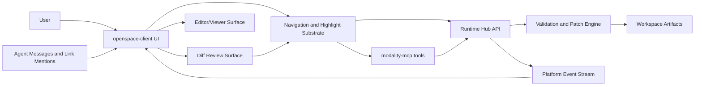

# Tech Spec: BLK-003 Editor/Viewer MVP with Diff Integration Edge

## 1. Purpose

Define implementation architecture for BLK-003 (`REQ-EDT-001..020`) and the BLK-004 interaction edge (`REQ-DFR-008..010`), with explicit support for agent-guided reveal/highlight workflows.

This spec locks the behavior that agent links and handoff actions open the editor at deterministic locations and apply transient highlights.

## 2. Requirements Baseline

Source requirements:
- `docs/requirements/REQ-MODALITY-PLATFORM-V2.md`
- `docs/requirements/REVIEW-BLK-003-EDITOR-DIFF-INTERACTION-2026-02-13.md`
- `docs/requirements/TRACEABILITY-BLK-003-BLK-004-2026-02-13.md`

Locked product decisions:
- Agent focus default is `auto-focus` with settings override.
- Highlights are ephemeral and demonstration-scoped.
- Agent reveal opens side-by-side by default.
- Dirty-tab agent edits use preview-first flow, default action `Apply to buffer`.
- `Escape` always returns control to user.
- Diff to editor handoff auto-highlights selected range and supports jump-back.

## 2.1 Technology Lock (Editor and Viewer)

MVP stack is explicitly locked as follows:

- **Primary code editor engine**: Monaco Editor via `@monaco-editor/react` + `monaco-editor`.
- **Editable content classes**: text/code/config/markdown source view use Monaco model-backed documents.
- **Read-only viewer rendering**:
  - Markdown: `react-markdown`
  - Code blocks: `react-syntax-highlighter`
  - Mermaid blocks: `mermaid`
- **Highlight mechanism**: Monaco decorations API for transient agent and handoff highlights.
- **Fallback path**: if Monaco fails to initialize, show explicit error and offer plain-text fallback viewer (read-only) without silent degradation.

Rationale:
- Monaco gives deterministic line/column navigation and stable range decorations required by `REQ-EDT-007..013`.
- Existing dependency set already supports markdown/viewer rendering and presentation link integration.

## 3. Architectural Position

Editor/Viewer and Diff Review remain separate modalities with shared navigation contracts.

- Editor/Viewer owns canonical file open/edit/save/view behavior.
- Diff Review owns comparative review behavior and range selection.
- Shared substrate provides `location`, `reveal`, `highlight`, and `jump-back` primitives.

## 4. Container View (C4)



## 5. Core Contracts

### 5.1 Location Contract

```ts
interface EditorLocation {
  path: string
  startLine: number
  startColumn?: number
  endLine?: number
  endColumn?: number
}
```

Rules:
- `path` must be workspace-normalized.
- Missing `endLine/endColumn` implies single-point caret location.
- Invalid ranges fail with actionable validation error.

### 5.2 Reveal Contract

```ts
interface OpenFileAtOptions {
  source?: 'agent-link' | 'diff-handoff' | 'presentation-link' | 'manual'
  focusPolicy?: 'auto-focus' | 'suggest-only' | 'disabled'
  splitMode?: 'side-by-side' | 'reuse-active-pane'
  applyHighlight?: boolean
  highlightId?: string
}

openFileAt(path: string, selection?: EditorLocation, options?: OpenFileAtOptions): Promise<void>
```

Rules:
- default `splitMode` for agent-driven reveal is `side-by-side`.
- `focusPolicy` resolves from settings unless explicitly overridden by stricter policy.
- all opens route through one deterministic resolver.

### 5.3 Highlight Contract (Ephemeral)

```ts
interface HighlightRange {
  id: string
  path: string
  startLine: number
  startColumn?: number
  endLine?: number
  endColumn?: number
  actor: 'agent' | 'system'
  reason: 'explanation' | 'diff-handoff' | 'link-follow'
}

applyHighlight(range: HighlightRange): void
updateHighlight(range: HighlightRange): void
clearHighlight(id: string): void
clearAllAgentHighlights(): void
```

Rules:
- highlights are in-memory UI state only.
- next agent step clears prior highlight unless explicitly updated.
- `Escape` triggers `clearAllAgentHighlights()` and exits guided mode.

### 5.4 Link Resolution Contract

Any clickable link with location metadata from:
- agent conversation
- presentation surface
- future modality adapters

must resolve to:

```ts
{ path, selection, source }
```

and call `openFileAt(...)` through the shared substrate.

### 5.5 Dirty-Tab Preview Contract

If agent proposes edit and tab is dirty:
- show preview diff panel (proposed vs current buffer)
- default CTA: `Apply to buffer`
- secondary CTA: `Apply to disk via patch`
- tertiary CTA: `Reject`

No silent overwrite path is permitted.

### 5.6 Diff to Editor Handoff Contract

```ts
interface DiffEditorHandoff {
  sourceModality: 'diff-review'
  target: { path: string }
  location: EditorLocation
  side: 'before' | 'after'
  handoffId: string
}
```

Behavior:
- opens editor at target location
- applies transient highlight for selected range
- records `handoffId` for deterministic jump-back to diff anchor

## 6. Runtime and MCP Integration

### 6.1 Runtime Hub

Required enhancements:
- add editor-safe open/read/update path handling for workspace files (not restricted to diagram-only patch route)
- keep `REQ-PLT-002..004` mutation gate mandatory for agent-originated writes
- emit event payloads for reveal/highlight and preview actions under standard envelope

### 6.2 Modality MCP

Add namespaced editor tools:
- `editor.open_file_at`
- `editor.apply_highlight`
- `editor.clear_highlight`
- `editor.preview_edit`
- `editor.apply_preview`
- `editor.jump_back`

Tool payloads must use normalized location schema and fail loudly on invalid input.

## 7. Client Architecture Changes

Primary client additions in `openspace-client`:
- shared navigation controller for all link/handoff open flows
- editor tab model with stable key by normalized path
- transient highlight store and renderer
- guided-focus controller with Escape interceptor
- preview panel component for dirty-tab agent edits
- `EditorFrame` using Monaco:
  - one Monaco model per normalized file path
  - save dirty tracking from model content version
  - location reveal via `editor.setSelection(range)` + `editor.revealLineInCenter(line)`
  - transient highlight via `editor.deltaDecorations(...)`
- link adapters:
  - agent message renderer -> `openFileAt`
  - presentation markdown link resolver -> `openFileAt`
  - diff selection handoff -> `openFileAt + applyHighlight`

Viewer behavior model:
- Markdown files support toggle: `source` (Monaco) <-> `rendered` (ReactMarkdown + Mermaid rendering).
- Non-markdown files default to source editor mode.
- Rendered view link clicks (file/location links) route back through `openFileAt`.

### 7.1 Monaco Multi-Tab Architecture (Correct Usage)

MVP uses a single Monaco editor instance with per-tab models and per-tab view state.

Data structures:

```ts
type TabId = string // normalized path

interface EditorTabRuntime {
  model: monaco.editor.ITextModel
  viewState?: monaco.editor.ICodeEditorViewState | null
  dirty: boolean
  lastSavedVersionId: number
}

Map<TabId, EditorTabRuntime>
```

Rules:
- Tab identity key is normalized path (`REQ-EDT-002`).
- On tab switch: save current `viewState`, swap `editor.setModel(nextModel)`, restore next `viewState`.
- Dirty state derives from `model.getAlternativeVersionId()` vs `lastSavedVersionId`.
- Close tab disposes model only when no references remain.
- Session restore reopens tabs and restores view state; transient highlights are not restored.

### 7.2 Highlight Implementation Details

Highlights are Monaco decorations attached to the active model:
- Use `editor.createDecorationsCollection` (or `deltaDecorations`) with `className` and minimap marker.
- Maintain `highlightId -> decorationIds[]` mapping.
- Clearing agent step removes prior decorations before applying next step.
- Cross-file highlight automatically opens target tab then applies decorations.

## 7.3 MVP Editor Command Surface (Explicit)

Supported in BLK-003:

| Command Group | Capability | Source |
|---|---|---|
| File | Open, Save | OpenSpace command palette + keyboard shortcuts + agent reveal/link actions |
| File | Save As | Supported in editor toolbar/menu (new target path), validated through patch/write policy |
| Edit | Undo, Redo, Cut, Copy, Paste, Select All | Monaco/browser native behavior |
| Edit | Find, Replace, Find Next/Prev | Monaco find widget (single-file scope) |
| Edit | Toggle Line Comment | Monaco action (`editor.action.commentLine`) |
| Navigate | Go to line/column (from links, handoff, commands) | `openFileAt` + Monaco reveal |
| View | Markdown source/rendered toggle | Editor frame mode switch |
| View | Zoom in/out/reset and font size increase/decrease/reset | Monaco options + persisted editor appearance settings |
| Agent Assist | Reveal, transient highlight, jump-back, Escape cancel | Shared navigation/highlight substrate |

Deferred (not in BLK-003 MVP):

| Capability | Reason / Target |
|---|---|
| Find in files (workspace-global) | Belongs to broader workspace search subsystem; candidate BLK-003.2 or BLK-004 dependency |
| Structural refactor tools (rename symbol, extract, etc.) | Requires LSP/service layer and language infra not in MVP |
| Writing tools/AI rewrite inside editor widget | Out of scope for BLK-003 core editor/viewer contract |
| Full IDE view options matrix (minimap controls, split-grid manager, breadcrumbs) | Nice-to-have after core reveal/highlight reliability gates |

UX rule:
- Deferred commands must be visibly disabled or omitted; never silently no-op.

## 8. State Model

Persisted across session restore:
- open tabs
- active tab
- cursor/scroll per tab
- editor appearance preferences (zoom level, font size)

Not persisted:
- agent walkthrough highlights
- guided-focus active step

Jump-back stack is bounded and session-local.

## 9. Event Model

Use standard envelope (`REQ-PLT-005`) with event names:
- `EDITOR_FOCUS_CHANGED`
- `EDITOR_HIGHLIGHT_APPLIED`
- `EDITOR_HIGHLIGHT_CLEARED`
- `EDITOR_PREVIEW_OPENED`
- `EDITOR_PREVIEW_APPLIED`
- `EDITOR_JUMP_BACK`

Each event includes `modality`, `artifact`, `actor`, `timestamp`, and relevant location metadata.

## 10. Failure Handling

Mandatory explicit failures:
- invalid path/range -> validation error with location and remediation
- missing file target -> actionable not-found error
- dirty-tab apply-to-disk conflict -> explicit conflict response with retry path
- failed highlight render -> non-blocking UI error + event log
- Monaco initialization failure -> explicit editor bootstrap error and read-only fallback viewer option

No silent fallback to unrelated modality surface is allowed.

## 11. Testing Strategy

Unit:
- location parsing/normalization
- highlight lifecycle reducer
- focus policy resolver
- preview decision reducer

Integration:
- agent link click -> `openFileAt` -> editor location + highlight
- presentation link click -> editor open at range
- diff handoff -> editor highlight + jump-back
- dirty-tab preview path (`Apply to buffer` default)

E2E:
- agent-guided explanation workflow with multi-step highlights
- Escape takeover cancel path
- settings change (`auto-focus` -> `suggest-only`) effect
- deterministic replay for same link/handoff payload

## 12. Architecture Review Log

### 12.1 Expert Panel Consensus

- Operator: required explicit events and bounded jump-back stack for observability and safety.
- Guardian: required path/range validation and patch-only agent write path.
- Pragmatist: rejected merging diff and editor into one mega-mode; kept separate modalities with shared substrate.

Golden path selected:
- separate modality responsibilities
- one shared reveal/highlight contract
- preview-first edit safety

### 12.2 Chaos Monkey Simulation

| Scenario | Expected Behavior | Mitigation |
|---|---|---|
| Invalid location payload from agent link | Reject action; keep current editor state | Strict location validator with actionable error |
| Runtime patch apply fails while preview open | Keep preview and buffer unchanged; show explicit failure | Two-phase apply with user retry and reject options |
| Event stream delay during guided walkthrough | UI still applies local highlight state; events reconcile when stream recovers | Local-first highlight store + idempotent event processing |

### 12.3 Simplicity Checklist

- Understandability: pass (separate modality ownership, shared primitives)
- Modularity: pass (controller/store/tool boundaries)
- Abstraction: pass (link sources depend on reveal contract only)
- YAGNI: pass (token-level highlight deferred behind extensible API)

## 13. Delivery Plan

1. Add editor engine dependencies (`@monaco-editor/react`, `monaco-editor`) and bootstrap `EditorFrame`.
2. Implement shared location/reveal/highlight contracts.
3. Implement editor surface with tab identity and preview-first dirty flow.
4. Add agent-link and presentation-link adapters to `openFileAt`.
5. Add diff handoff integration (`REQ-DFR-008..010`).
6. Add test coverage and traceability tags for BLK-003/BLK-004 requirements.
