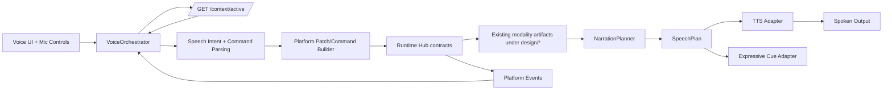

# Tech Spec: BLK-007 Voice MVP (Interface Layer)

## 1. Purpose

Define BLK-007 as a voice interface layer that operates on existing modality content.

Voice is not a peer content modality (not like drawing/editor/presentation). Voice is a control and narration layer:
- input path: speech -> intent -> standard platform operation on active modality content
- output path: existing artifact content -> narration plan -> speech

## 2. Requirements Baseline

Sources:
- `docs/requirements/REQ-MODALITY-PLATFORM-V2.md`
- `docs/requirements/REVIEW-BLK-007-VOICE-REQUIREMENTS-2026-02-13.md`
- `docs/requirements/QUESTIONS-BLK-007-VOICE-DECISIONS-2026-02-13.md`

Locked decisions preserved:
- transcript mode: `edit-before-send | automatic-send`
- output default: `on-demand` (mutable any time)
- device/language fallback chain enabled
- barge-in default ON with toggle
- timeline segment fields: `segmentId`, `startedAt`, `endedAt`, `interruptionCause`, `actor`
- bounded retries with shared `MIN_INTERVAL`
- explicit FSM requirement

## 2.1 Technology Lock (MVP)

STT/TTS choices are now implementation-locked for MVP.

- `STT primary`: local `whisper.cpp` adapter in runtime-hub
- `STT optional secondary`: local `faster-whisper` adapter (feature-flagged)
- `TTS primary`: local `Kokoro` adapter in runtime-hub
- `Fallback`: browser-native speech APIs when local engines are unavailable
- `Transport posture`: text-first between client and runtime orchestration paths

Evidence note:
- VoiceInk public README identifies `whisper.cpp` as its core STT technology; this aligns with your current quality baseline.

Portability note:
- This stack does not lock out desktop distribution. Voice remains browser-rendered UI + local runtime services, and can be wrapped later by Tauri/Electron without changing STT/TTS core adapters.

## 3. Architectural Positioning

### 3.1 Correct placement

Voice overlays the existing modality platform.

- Voice does not own canonical content artifacts in `design/*`.
- Voice does not become active modality context.
- Voice reads current active context and issues normal platform operations against that context.

### 3.2 Topology



## 4. Integration with Existing Platform Constraints

## 4.1 Event system integration (no tuple expansion)

Current platform event tuple remains unchanged:
- `ARTIFACT_UPDATED`
- `PATCH_APPLIED`
- `VALIDATION_FAILED`

Voice domain signals are encoded in `PlatformEvent.details`:
- `details.domain = "voice"`
- `details.voiceEvent = <voice event name>`
- `details.sessionId`, `details.segmentId`, and other voice metadata

This avoids changing `PLATFORM_EVENT_TYPES` while preserving structured voice telemetry.

Allowed `details.voiceEvent` values for MVP:
- `SESSION_STARTED`
- `SESSION_STOPPED`
- `TRANSCRIPT_UPDATED`
- `OUTPUT_QUEUED`
- `OUTPUT_STARTED`
- `OUTPUT_INTERRUPTED`
- `STREAM_RETRY`
- `STREAM_FAILED`

## 4.2 Active context behavior

Voice uses existing active context only:
- read via `/context/active`
- no voice-specific call to set active context
- no change required to hardcoded active modality list

If active context is missing or invalid, voice returns actionable error and pauses command execution.

## 4.3 Artifact path constraints

Since `normalizeArtifactPath` enforces `design/*`, voice does not create canonical voice artifacts.

Voice state model:
- ephemeral session state in memory (runtime process)
- optional short-lived transcript cache in memory only
- optional persistent audit logs via existing logging/event channels (not content artifacts)

No `design/*.voice.*` artifact is introduced in MVP.

## 5. Core Component Contracts

## 5.1 VoiceOrchestrator

Role:
- source of truth for voice session runtime state
- coordinates FSMs, narration planning, streaming retries, and policy updates

Interface:
- `startSession(input: VoiceSessionStart): VoiceSessionState`
- `stopSession(input: VoiceSessionStop): VoiceSessionState`
- `updatePolicy(input: VoicePolicyPatch): VoicePolicy`
- `handleUtterance(input: AudioChunk | TranscriptText): VoiceActionResult`
- `narrateFromActiveContext(input: NarrationRequest): SpeechPlan`

## 5.2 NarrationPlanner

Caller relationship:
- invoked by VoiceOrchestrator when output policy permits speech

Input:
```ts
interface NarrationInput {
  sessionId: string
  activeContext: { modality: string; path: string; location?: { startLine: number; endLine: number } }
  source: { kind: 'text' | 'code' | 'diagram' | 'error'; content: string }
  language: string
  policy: VoicePolicy
}
```

Output:
```ts
interface SpeechPlan {
  planId: string
  sessionId: string
  strategy: 'summary' | 'snippet_descriptor' | 'visual_explainer' | 'verbatim'
  segments: Array<{
    segmentId: string
    text: string
    allowBargeIn: boolean
    cueHints: string[]
    priority: 'low' | 'normal' | 'high'
  }>
}
```

Strategy thresholds (MVP defaults):
- `text`: summary when > 600 chars, else verbatim unless policy overrides
- `code`: always `snippet_descriptor` unless user explicitly requests verbatim
- `diagram`: always `visual_explainer`
- `error`: concise actionable summary

Segment ID generation:
- deterministic: `sha1(sessionId + planId + segmentIndex + normalizedText).slice(0,12)`

## 5.3 Streaming Transport

Transport choice for MVP:
- continue with existing HTTP + SSE pattern
- no WebSocket introduction in BLK-007
- transport carries text/control events by default (transcript deltas, intent payloads, speech-plan segments)
- raw audio transport is not required in default path; keep optional debug-only hooks behind flags

Mechanics:
- input streaming: chunk upload over HTTP endpoint in bounded batches
- output streaming: incremental segment playback events over existing event stream semantics

Audio processing default:
- STT inference executes locally in runtime adapter (`whisper.cpp` primary)
- TTS synthesis executes locally in runtime adapter (`Kokoro` primary)

Retry policy:
- retry with floor `MIN_INTERVAL`
- max retries: 3 per segment
- emit `VALIDATION_FAILED` or `PATCH_APPLIED` with `details.voiceEvent = STREAM_FAILED` after exhaustion

Buffer limits for `NFR-PLT-004`:
- input chunk queue max: 64 chunks/session
- output segment queue max: 24 segments/session
- transcript buffer max: 20,000 chars/session (rolling window)

Overflow behavior:
- reject new enqueue with actionable error and event details

## 5.4 Expressive Cue Adapter

Purpose:
- optional non-lexical cues (laughter, acknowledgment, uncertainty cues)

Policy fields:
- `expressiveCuesEnabled: boolean`
- `cueProfile: minimal | balanced | expressive`
- `allowedCueTypes: string[]`

Rules:
- cues disabled by default
- max 1 cue per spoken segment
- cues blocked for critical errors unless explicitly allowed

## 6. FSM Transition Tables (Explicit)

## 6.1 Input FSM

States: `idle`, `listening`, `processing`, `interrupted`, `stopped`

| From | Trigger | Condition | To |
|---|---|---|---|
| idle | `startSession` | policy valid | listening |
| listening | `stopCapture` | user/system request | processing |
| listening | `interrupt` | barge-in/system interrupt | interrupted |
| processing | `transcriptReady` | parse success | stopped |
| processing | `parseError` | recoverable | listening |
| interrupted | `resumeCapture` | barge-in enabled | listening |
| interrupted | `stopSession` | always | stopped |
| stopped | `startSession` | new session | listening |

Invalid transitions must return structured validation errors.

## 6.2 Transcript FSM

States: `empty`, `interim`, `final`, `editable`, `sent`

| From | Trigger | Condition | To |
|---|---|---|---|
| empty | `interimChunk` | text present | interim |
| interim | `interimChunk` | text present | interim |
| interim | `finalize` | ASR done | final |
| final | `enableEdit` | mode=`edit-before-send` | editable |
| final | `autoSend` | mode=`automatic-send` | sent |
| editable | `submit` | user confirm | sent |
| editable | `cancel` | user cancels | final |
| sent | `newUtterance` | same session | interim |

## 6.3 Output FSM

States: `idle`, `queued`, `speaking`, `paused`, `interrupted`, `completed`

| From | Trigger | Condition | To |
|---|---|---|---|
| idle | `enqueuePlan` | output policy allows | queued |
| queued | `startPlayback` | device ready | speaking |
| speaking | `pause` | user/system request | paused |
| paused | `resume` | user/system request | speaking |
| speaking | `bargeIn` | barge-in enabled | interrupted |
| interrupted | `resume` | pending segments exist | queued |
| speaking | `segmentDone` | more segments | queued |
| speaking | `segmentDone` | no segments left | completed |
| completed | `enqueuePlan` | output policy allows | queued |

## 7. Voice-to-Platform Operations and Handoff

## 7.1 Voice input to operation mapping

Voice commands map to existing platform operations:
- edit command -> patch envelope against active context path
- navigate command -> context/open command for target modality
- summarize command -> narration request, no artifact mutation

All mutations must use existing patch/validation/version gates.

## 7.2 Cross-modality handoff payload

Voice-triggered handoffs use base contract plus extension:

```ts
interface VoiceHandoffPayload {
  sourceModality: 'voice-interface'
  targetModality: string
  target: { path: string; location?: { startLine: number; endLine: number } }
  reason: 'voice-command' | 'voice-followup'
  utteranceId: string
  transcriptMode: 'edit-before-send' | 'automatic-send'
}
```

This is sent through existing handoff mechanisms and keeps deterministic fields.

## 8. Policy and Defaults

Session policy:
- transcript mode: `edit-before-send | automatic-send`
- output mode: `off | on-demand | on-completion | on-error | always`
- bargeInEnabled: boolean
- expressiveCuesEnabled: boolean
- cueProfile: `minimal | balanced | expressive`
- language: BCP-47
- devicePreference?: string

MVP defaults:
- transcript mode = `edit-before-send`
- output mode = `on-demand`
- barge-in = `true`
- expressive cues = `false`
- cue profile = `minimal`

Fallbacks:
- device: requested -> system default -> actionable fail
- language: requested -> app default locale -> `en-US`

## 9. Validation, Safety, and Observability

Validation order:
1. payload schema
2. FSM transition legality
3. policy permission checks
4. platform contract checks (path/version/operation)

Observability:
- all voice actions log start/success/failure with ISO timestamps
- all domain-specific voice milestones encoded in `details.voiceEvent`

Disallowed:
- creating voice-owned content artifacts under `design/*`
- setting voice as active content modality
- uncapped retries
- silent state transition failures

## 10. BLK-001 Dependency Revision

Revised view:
- Voice no longer needs new foundational platform work to represent its own modality/artifacts.
- Voice consumes already-established BLK-001 contracts as an interface client.

Required dependency posture:
- BLK-001 must remain complete and stable (already marked `done` in backlog table).
- BLK-007 does not require reopening BLK-001 scope.

## 11. Testing Strategy

Unit:
- FSM transition matrix tests (all legal + illegal transitions)
- NarrationPlanner strategy selection and thresholds
- deterministic segmentId generation
- expressive cue policy rules

Integration:
- voice command -> active context operation -> patch apply path
- narration of text/code/diagram through strategy router
- streaming retry and exhaustion behavior with `MIN_INTERVAL`

E2E:
- edit-before-send session flow
- automatic-send session flow
- on-demand narration from active editor/drawing contexts
- barge-in interruption/resume path
- language/device fallback behavior

## 12. Architecture Review Section

### Multi-Expert Review
Panel:
- Platform Contract Architect
- Realtime Systems Engineer
- Conversational UX Architect

Consensus:
- Treating voice as interface layer removes conflict with modality registry and artifact path constraints.
- Reusing existing event tuple with structured `details.voiceEvent` gives low-risk integration.
- Explicit FSM tables are mandatory to keep behavior deterministic across runtime/client/test suites.

### Simplicity Checklist
- Simplicity: pass (voice overlay, no new core modality type)
- Modularity: pass (orchestrator/planner/stream/cue components)
- Abstraction: pass (SpeechPlan contract decouples model from engine)
- YAGNI: pass (no WebSocket migration in MVP)
- Performance: pass with explicit queue limits and bounded retries

### Risk Assessment

| Risk | Impact | Likelihood | Mitigation |
|---|---|---|---|
| voice events become inconsistent across producers | Medium | Medium | shared helper to stamp `details.domain/voiceEvent` |
| verbose narration on code/diagrams hurts UX | Medium | High | default strategy router with strict non-verbatim rules |
| session memory growth | High | Medium | hard queue/buffer caps + rolling transcript window |
| FSM drift between runtime/client | High | Medium | shared fixture-based transition tests |
