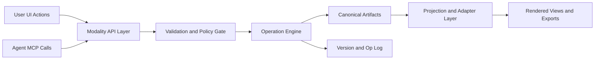
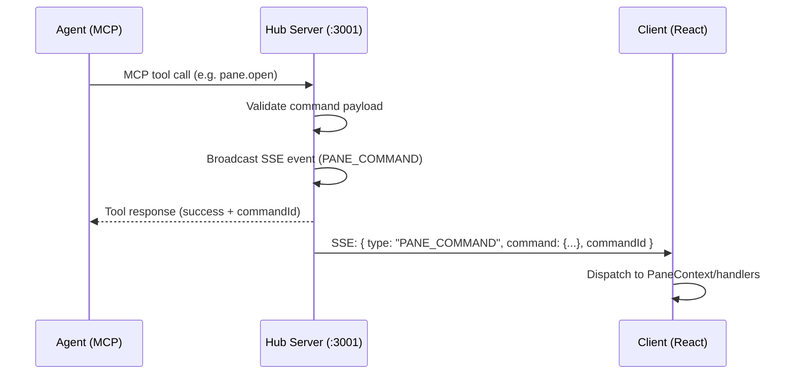

# Tech Spec: Modality Platform V2

## 1. Purpose

Define the canonical architecture for all modalities.

This is the active architecture reference for implementation. If any other document conflicts with this spec, this spec wins.

## 2. Architectural Baseline

The platform is aligned to drawing V2 principles:
- Canonical model first
- Patch/operation mutations
- Validation before apply
- Deterministic versioned state transitions
- Adapters/projections as derived outputs

Reference:
- `openspace-client/docs/architecture/drawing-modality-implementation-guide-v2.md`

## 3. System Topology



## 4. Core Contracts

### 4.1 Mutation Contract

- Agent writes are operation/patch requests.
- Agent blind full-document rewrite is non-canonical behavior.
- Apply is atomic for each accepted patch request.

### 4.2 Validation Contract

Validation stages:
1. Schema validation
2. Semantic validation
3. Policy validation (path safety, size limits, allowed actions)

Rejected requests return:
- machine-readable code
- location/path/field
- human-readable reason
- remediation hint

### 4.3 Version Contract

- Canonical artifacts are versioned.
- Patch requests include `baseVersion`.
- Same `baseVersion` + same operations produce deterministic outcomes.

### 4.4 Event Contract

Runtime emits standard events:
- `ARTIFACT_UPDATED`
- `PATCH_APPLIED`
- `VALIDATION_FAILED`

Event payload includes at least:
- `modality`
- `artifact`
- `actor`
- `timestamp`
- `version` (when applicable)

### 4.5 Context Contract

Unified active context contract:

```json
{
  "modality": "editor",
  "data": {
    "path": "src/main.ts",
    "location": { "startLine": 42, "endLine": 42 }
  }
}
```

No per-modality active-context endpoint variants are canonical.

### 4.6 Cross-Modality Handoff Contract

Handoff payloads must include:
- `sourceModality`
- target artifact path/id
- optional location metadata

Repeated identical user actions must emit identical payloads.

## 5. Modality Canonical Models

### 5.1 Drawing
- Canonical: `design/<name>.diagram.json`
- Derived: Mermaid/PlantUML projections, snapshots

### 5.2 Presentation
- Canonical: `docs/deck/<name>.deck.md`
- Derived: slide render state, export outputs

### 5.3 Editor/Viewer
- Canonical: normalized workspace file text
- Derived: syntax-highlight and markdown render projections

### 5.4 Diff Review
- Canonical: normalized diff artifact for review scope/session
- Derived: unified/split views, selection/focus state

### 5.5 Comments
- Canonical: thread timeline artifacts (thread/messages/status)
- Derived: filtered and grouped comment views

### 5.6 Annotation
- Canonical: snapshot metadata with source reference (MVP)
- Derived: flattened annotated image outputs

### 5.7 Voice
- Canonical (general model): transcript segments and audio metadata artifacts
- BLK-007 MVP exception: voice is implemented as an interface layer over active modality content; session/transcript state is ephemeral and not persisted as canonical `design/*` artifacts in MVP.
- Derived: TTS queue and playback projections

### 5.8 Browser Snapshot Preview
- Canonical: snapshot artifact and optional source URL metadata
- Derived: launch contexts for annotation/comments

## 6. MCP Architecture

One unified modality MCP server with namespaced tools.

Tool categories follow a shared shape where applicable:
- inspect
- propose
- validate
- apply
- read/update/export/navigate for modality-specific workflows

### 6.1 Agent → Client Command Channel

The agent cannot directly manipulate the client UI. All agent-initiated UI actions flow through the Hub as an intermediary:



**Hub endpoint**: `POST /commands`

Request body:
```json
{
  "type": "pane.open",
  "payload": {
    "type": "editor",
    "title": "main.ts",
    "contentId": "src/main.ts",
    "newPane": true,
    "splitDirection": "horizontal"
  }
}
```

Response:
```json
{
  "success": true,
  "commandId": "cmd-1739..."
}
```

SSE event broadcast:
```json
{
  "type": "PANE_COMMAND",
  "command": "pane.open",
  "payload": { ... },
  "commandId": "cmd-1739...",
  "actor": "agent",
  "ts": "2026-02-15T..."
}
```

**Client handling**: The client's SSE listener (connected to `/events`) receives `PANE_COMMAND` events and dispatches them to a `CommandDispatcher` that maps command types to PaneContext actions.

### 6.2 MCP Tool Definitions (Tier 1)

#### 6.2.1 Pane Management Tools

| Tool | Parameters | Returns | Hub Action |
|---|---|---|---|
| `pane.open` | `{ type: SpaceType, title: string, contentId?: string, targetPaneId?: string, newPane?: boolean, splitDirection?: 'horizontal'\|'vertical' }` | `{ commandId, paneId? }` | POST /commands → SSE PANE_COMMAND |
| `pane.close` | `{ paneId?: string, contentId?: string }` | `{ commandId }` | POST /commands → SSE PANE_COMMAND |
| `pane.list` | `{}` | Current pane layout tree (pane IDs, tabs, active states) | GET /panes (reads client-reported state) |
| `pane.focus` | `{ paneId?: string, contentId?: string }` | `{ commandId }` | POST /commands → SSE PANE_COMMAND |

#### 6.2.2 Editor Tools

| Tool | Parameters | Returns | Hub Action |
|---|---|---|---|
| `editor.open` | `{ path: string, line?: number, endLine?: number, highlight?: boolean, mode?: 'edit'\|'view', newPane?: boolean, splitDirection?: 'horizontal'\|'vertical' }` | `{ commandId }` | POST /commands (type: editor.open) → SSE |
| `editor.read_file` | `{ path: string, startLine?: number, endLine?: number }` | File content (full or range) | GET /files/:path (direct Hub read) |
| `editor.close` | `{ path: string }` | `{ commandId }` | POST /commands (type: editor.close) → SSE |

#### 6.2.3 Presentation Tools (New)

| Tool | Parameters | Returns | Hub Action |
|---|---|---|---|
| `presentation.open` | `{ name?: string, path?: string, newPane?: boolean }` | `{ commandId }` | POST /commands (type: presentation.open) → SSE |
| `presentation.navigate` | `{ name?: string, slideIndex: number }` | `{ commandId }` | POST /commands (type: presentation.navigate) → SSE |

### 6.3 Client-Side Command Dispatcher

The client implements a `useAgentCommands` hook that:
1. Listens to Hub SSE events for `PANE_COMMAND` type.
2. Maps each command to the appropriate PaneContext action:
   - `pane.open` → `openContent(spec)` (optionally preceded by `splitPane` if `newPane: true`)
   - `pane.close` → `closePane(paneId)` or `closeTab(paneId, tabId)`
   - `pane.focus` → `setActivePane(paneId)` or activate tab by contentId
   - `editor.open` → `openContent({ type: 'editor', contentId: path, ... })` + scroll/highlight metadata
   - `editor.close` → `closeTab` matching contentId
   - `presentation.open` → `openContent({ type: 'presentation', contentId: path, ... })`
   - `presentation.navigate` → dispatch navigation event to PresentationFrame
3. Reports layout state back to Hub via `POST /panes/state` for `pane.list` queries.

### 6.4 Pane State Reporting

For `pane.list` to work, the client must periodically or on-change report its pane layout to the Hub:
- Endpoint: `POST /panes/state` — client pushes serialized `PaneLayout` to Hub.
- Endpoint: `GET /panes/state` — MCP reads last-reported layout.
- Push frequency: on every layout change (debounced 500ms).
- The state includes: pane IDs, tab titles, content IDs, active tab indices, active pane ID.

## 7. Reliability, Safety, and Observability

- External I/O emits explicit start/success/failure logs with ISO timestamps.
- Retry/poll loops enforce shared `MIN_INTERVAL` on success and error paths.
- Public entry points use defensive assertions on required input invariants.
- Path normalization and workspace scoping are mandatory.
- Failures are surfaced explicitly; silent degradation is disallowed.

## 8. Testing Strategy

- Unit: validators, reducers/operation engines, adapters.
- Integration: API + validation + persistence + event stream.
- MCP contract: schemas and behavior for tool calls.
- E2E: critical modality workflows and cross-modality handoffs.

## 9. Documentation Policy

- This file is the canonical architecture document for modalities.
- `docs/requirements/REQ-MODALITY-PLATFORM-V2.md` is the canonical requirements document.
- Legacy planning/handoff/archive docs are non-canonical and removed from active documentation.

## 10. Execution Order (Current)

Implementation should follow this order to reduce integration risk:

1. Platform contracts and infrastructure
   - Unified context contract
   - Event contract payload normalization
   - Unified modality MCP namespaces
2. **Agent-Modality Control (Tier 1) — BLK-011** ← CURRENT
   - Hub: Fix `ACTIVE_MODALITIES` to include `'presentation'`
   - Hub: `POST /commands` endpoint + SSE `PANE_COMMAND` broadcast
   - Hub: `GET /panes/state` + `POST /panes/state` endpoints
   - MCP: `pane.*` tools (open/close/list/focus)
   - MCP: `editor.*` tools (open/read_file/close)
   - MCP: `presentation.open` + `presentation.navigate` tools
   - Client: `useAgentCommands` hook (SSE listener + PaneContext dispatch)
   - Client: Pane state reporter (debounced push to Hub)
   - Unit tests for all Hub endpoints and MCP tools
   - E2E tests for agent-driven pane/editor/presentation operations
3. Presentation modality
   - Deck + slide operations
   - Playback state machine
   - PDF export
4. Editor/Viewer modality
   - Canonical open/edit/save
   - Markdown viewer with Mermaid
   - External-change and restore behavior
5. Diff Review modality
   - Diff source contract + renderer abstraction
   - Range selection + comment handoff
6. Comment modality
   - Durable thread lifecycle + agent participation
   - Source-open handoff actions
7. Annotation modality
   - Snapshot-first annotate/save/send
   - Comment bridge compatibility
8. Voice modality
   - Input/output lifecycle, policies, interruption, streaming
9. Browser Snapshot Preview
   - Clipboard intake + persistence + annotation/comment launch

Each step must satisfy unit + integration + e2e acceptance for that modality before moving to the next.
