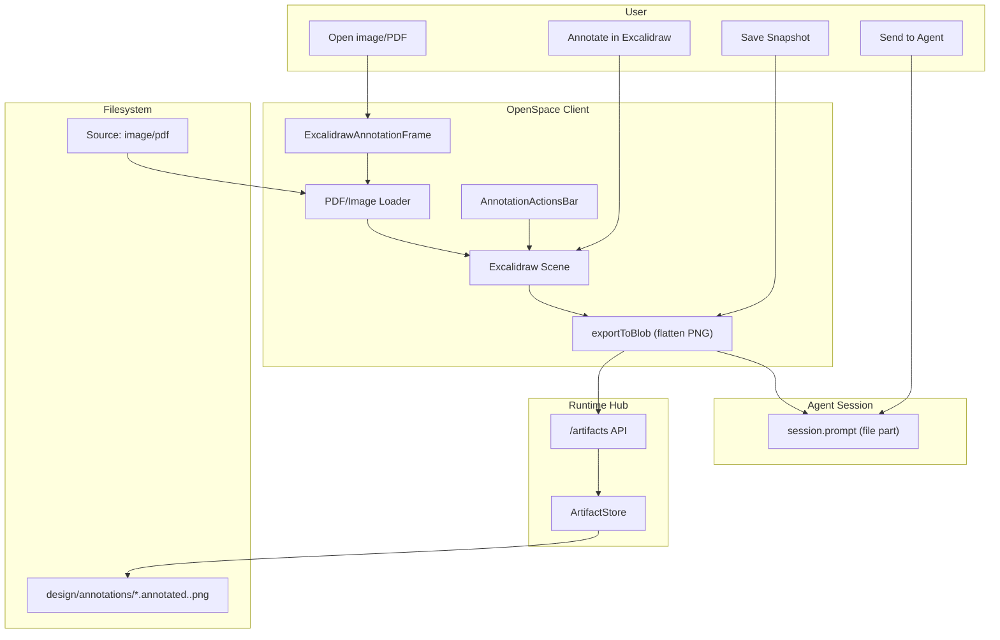

# Annotation Modality Implementation Guide

Status: Ready for implementation  
Audience: Any coding agent implementing end-to-end  
Scope: Excalidraw-based annotation MVP on static surfaces (image/PDF), snapshot-first
Cross-cutting baseline: `docs/architecture/multi-modality-implementation-guide.md`.

---

## 1. User Stories

### US-ANN-001 Annotate Static Artifact with Familiar Tools
As a user, I can open an image or PDF page and annotate using text/rectangle/arrow/freehand tools, so feedback is fast and intuitive.

Acceptance criteria:
- Supported targets: image (`.png`, `.jpg`, `.jpeg`, `.webp`) and PDF pages.
- Annotation surface uses Excalidraw tools (text, rect, arrow, draw, etc.).

### US-ANN-002 Send Annotated Snapshot to Agent
As a user, I can send the annotated result to the model as an image.

Acceptance criteria:
- Single action sends flattened PNG to active session.
- Agent receives file part in `session.prompt`.

### US-ANN-003 Save Snapshot for Later Reference
As a user, I can save flattened annotated snapshot to workspace.

Acceptance criteria:
- Saved file is PNG.
- Original source artifact is unchanged.

### US-ANN-004 Keep MVP Disposable
As a user, annotation does not need persistent editable state in MVP.

Acceptance criteria:
- No `.annotations` sidecar file in MVP.
- No anchor model in MVP.
- Session can be closed without preserving editable annotation data.

---

## 2. Requirements

## 2.1 Functional Requirements

### FR-ANN-001 Target Surfaces (MVP)
- Start with static targets:
  - images
  - PDF pages (render page to bitmap first)
- Whiteboard/dynamic surfaces are deferred.

### FR-ANN-002 Excalidraw Annotation Surface
- Use Excalidraw as overlay editor, not custom canvas drawing.
- Background artifact is inserted as locked image element.
- Toolset can be constrained via UI policy if needed.

### FR-ANN-003 Snapshot Output
- Export flattened PNG from Excalidraw scene.
- Include background + annotation overlay in exported image.

### FR-ANN-004 Send-to-Agent
- Reuse existing `openCodeService.client.session.prompt`.
- Send PNG as file part (`mime: image/png`).

### FR-ANN-005 Source Safety
- Source image/PDF is never modified.

### FR-ANN-006 TargetRef Metadata on Output
- Every saved/sent annotation snapshot includes a `TargetRef` describing source artifact context.
- Minimum fields:
  - `targetType` (`image` or `pdf`)
  - `path`
  - `location.page` for PDF
  - `sourceModality: "annotation"`

### FR-ANN-007 Interop-Ready Snapshot Contract
- Snapshot output must be consumable by comment modality bridge without modality-specific parsing.
- Metadata schema should be stable and versioned.

## 2.2 Non-Functional Requirements

### NFR-ANN-001 Reuse Mature Library
- Prefer Excalidraw primitives/undo/history/export over custom implementation.

### NFR-ANN-002 Low Complexity
- No annotation MCP server for MVP.
- No persistent editable annotation artifact for MVP.

### NFR-ANN-003 Performance
- PDF page bitmap resolution must be bounded for responsive interaction.

### NFR-ANN-004 Testability
- Snapshot naming and export helpers are unit-testable.
- UI workflow is component/e2e testable.

### NFR-ANN-005 Cross-Modality Predictability
- For same source target + page, generated `TargetRef` is deterministic.

---

## 3. Technology Architecture

## 3.1 Chosen Technologies (MVP)
- Annotation/editor surface: `@excalidraw/excalidraw` (already in repo).
- PDF rendering: `pdfjs-dist` (page -> bitmap image).
- Snapshot export: Excalidraw `exportToBlob`.
- Save path: runtime `/artifacts/*` (existing ArtifactStore flow).
- Agent send: existing `session.prompt` file-part API.

## 3.2 Architecture Components
- Client:
  - `ExcalidrawAnnotationFrame` (artifact load + Excalidraw host).
  - `AnnotationActionsBar` (`Save Snapshot`, `Send to Agent`, `Clear`, `Close`).
  - `pdf-render.ts` helper (PDF page -> data URL/blob URL).
  - `annotation-path.ts` helper (snapshot naming).
- Runtime:
  - Existing `/artifacts` + `ArtifactStore`.
- Agent integration:
  - Existing session prompt call.

## 3.3 Architecture Diagram (Mermaid)



## 3.4 End-to-End Flows

### Flow A: Image Annotation
1. User opens image.
2. App creates Excalidraw scene with locked background image element.
3. User annotates with Excalidraw tools.
4. User exports snapshot (save/send).

### Flow B: PDF Annotation
1. User opens PDF + page number.
2. App renders page to bitmap via `pdfjs-dist`.
3. Bitmap is inserted as locked background image in Excalidraw.
4. User annotates and exports snapshot.

### Flow C: Snapshot Interop Metadata
1. User saves or sends snapshot.
2. App builds `TargetRef` for source artifact/page.
3. App emits/stores snapshot metadata with `schemaVersion`.
4. Comment bridge (future/optional in MVP) can consume metadata directly.

---

## 4. Data Structures and Contracts

## 4.1 In-Client Session State

```ts
type AnnotationTargetType = "image" | "pdf";

interface AnnotationSessionState {
  targetPath: string;
  targetType: AnnotationTargetType;
  page?: number; // required for pdf
  excalidrawElements: readonly unknown[]; // in-memory only for active session
  loading: boolean;
  error?: string;
}
```

## 4.2 Snapshot Output Naming

```ts
function buildAnnotationSnapshotPath(
  targetPath: string,
  opts?: { page?: number; ts?: Date }
): string;
```

Rules:
- Always output under `design/annotations/`.
- Include timestamp.
- Include page suffix for PDF when relevant.

## 4.3 Send-to-Agent Contract
- `session.prompt` parts include:
  - optional text
  - `{ type: "file", mime: "image/png", filename, url: "data:image/png;base64,..." }`

## 4.4 TargetRef + Snapshot Metadata Contract

```ts
type TargetRef = {
  targetType: "image" | "pdf";
  path: string;
  location?: { page?: number };
  sourceModality?: "annotation";
};

interface AnnotationSnapshotMeta {
  schemaVersion: 1;
  snapshotPath: string;
  targetRef: TargetRef;
  createdAt: number;
}
```

---

## 5. Exact Implementation Details

## 5.1 Files to Add

Client:
- `openspace-client/src/components/annotation/ExcalidrawAnnotationFrame.tsx`
- `openspace-client/src/components/annotation/AnnotationActionsBar.tsx`
- `openspace-client/src/components/annotation/pdf-render.ts`
- `openspace-client/src/lib/annotation/annotation-path.ts`
- `openspace-client/src/lib/annotation/annotation-target-ref.ts`
- `openspace-client/src/lib/annotation/annotation-snapshot-meta.ts`
- `openspace-client/src/components/annotation/ExcalidrawAnnotationFrame.test.tsx`
- `openspace-client/src/lib/annotation/annotation-path.test.ts`
- `openspace-client/src/lib/annotation/annotation-target-ref.test.ts`

Docs/design:
- `design/AnnotationModality.graph.mmd`
- `docs/architecture/annotation-modality-implementation-guide.md`

## 5.2 Files to Modify

Client:
- `openspace-client/package.json`
  - add `pdfjs-dist`.
- `openspace-client/src/context/LayoutContext.tsx`
  - add `activeAnnotationTargetPath: string | null`.
- `openspace-client/src/components/FileTree.tsx`
  - route image/PDF to annotation frame open action.
- `openspace-client/src/App.tsx`
  - mount `ExcalidrawAnnotationFrame` when annotation target is active.

Runtime:
- no new runtime service/MCP required for annotation MVP.

## 5.3 Excalidraw Integration Rules

1. Background image element:
- Insert as first element.
- Set locked semantics (policy: cannot be edited/moved by user).

2. Annotation elements:
- Drawn normally via Excalidraw tools.
- Kept in-memory only for MVP.

3. Export:
- Use `exportToBlob` with current scene.
- PNG output is flattened and ready for save/send.

4. Clear action:
- Remove annotation elements.
- Keep background image element intact.

## 5.4 PDF Page Handling

1. Render selected page with `pdfjs-dist`.
2. Cap render resolution for performance.
3. Convert rendered page canvas to data URL.
4. Inject as Excalidraw background image element.

---

## 6. Task Plan with Build Instructions and Expected Tests

## Task 1: Snapshot Path Helper
Goal: deterministic output paths.

Build:
1. Implement `annotation-path.ts`.
2. Add timestamp + optional page suffix.

Expected tests:
- image target path generation.
- PDF target path with page suffix.
- stable formatting.

## Task 1A: TargetRef and Snapshot Metadata Helper
Goal: produce stable interop metadata for saved/sent snapshots.

Build:
1. Implement `annotation-target-ref.ts`.
2. Implement `annotation-snapshot-meta.ts` with `schemaVersion`.
3. Attach metadata generation to save/send flows.

Expected tests:
- same source target produces stable `TargetRef`.
- PDF includes `location.page`.
- metadata validates required fields.

## Task 2: PDF Render Helper
Goal: render PDF page into image usable by Excalidraw.

Build:
1. Implement `pdf-render.ts`.
2. Expose `renderPdfPageToDataUrl(path, page)` helper.

Expected tests:
- successful render of page 1.
- out-of-range page returns clear error.

## Task 3: Excalidraw Annotation Frame
Goal: host annotation session with background + overlay.

Build:
1. Create `ExcalidrawAnnotationFrame.tsx`.
2. Load image/PDF page as background element.
3. Keep annotation elements interactive.
4. Add clear/close handling.

Expected tests:
- loads image target.
- loads PDF target.
- clear preserves background.

## Task 4: Export + Save Snapshot
Goal: export flattened PNG and persist to workspace.

Build:
1. Wire `exportToBlob`.
2. Convert blob to base64 and post to `/artifacts`.
3. Show success/error feedback.

Expected tests:
- export returns PNG blob.
- save writes expected path.
- errors handled gracefully.

## Task 5: Send Snapshot to Agent
Goal: send exported PNG through active session.

Build:
1. Reuse exported data URL.
2. Call `session.prompt` with file part.
3. Emit `TargetRef` + snapshot metadata for downstream bridge consumers.
4. Handle no-session case.

Expected tests:
- prompt payload includes file part.
- emitted metadata includes deterministic `TargetRef`.
- missing session path handled.

## Task 6: App/FileTree Integration
Goal: open annotation frame for image/PDF targets.

Build:
1. Extend `LayoutContext`.
2. Update `FileTree` target routing.
3. Render frame in `App.tsx` pane.

Expected tests:
- selecting image/pdf opens annotation frame.
- close action clears state.
- no regression to whiteboard/presentation paths.

## Task 7: E2E Smoke
Goal: validate full user flow.

Build:
1. Add `e2e/annotation.spec.ts`:
   - open image/pdf
   - annotate
   - save snapshot
   - send to agent

Expected tests:
- flow passes reliably.

---

## 7. Test Matrix (Minimum Expected)

Unit/component:
- `annotation-path.test.ts`
- `annotation-target-ref.test.ts`
- `ExcalidrawAnnotationFrame.test.tsx`
- optional tests for `pdf-render.ts`

E2E:
- `e2e/annotation.spec.ts`
  - includes snapshot metadata emission check

Regression:
- existing whiteboard/presentation tests unchanged and passing.

---

## 8. Definition of Done

Done when:
1. User can annotate image/PDF via Excalidraw tools.
2. User can save flattened snapshot PNG.
3. User can send snapshot to active model session.
4. Source artifact is never modified.
5. Snapshot emits deterministic `TargetRef` metadata.
6. Unit/component/e2e tests pass.
7. No regressions in current modalities.

---

## 9. Explicit Non-Goals (Current Phase)

1. Persistent editable annotation state/files.
2. Anchors and cross-artifact annotation mapping.
3. Annotation MCP server.
4. Dynamic-surface annotations (whiteboard/live presentation/code overlays).
5. Comment modality implementation.

This MVP is intentionally simple and robust: **annotate in Excalidraw -> snapshot -> save/send**.

---

## 10. Future Annotation Feature Backlog (Post-MVP)

This section is the forward feature inventory for the annotation modality design.
These are intentionally out of MVP scope and should be phased in later.

### 10.1 Surface Coverage Expansion

### FR-ANN-FUT-001 PDF Annotation (Persistent + Reopen)
- Reopenable annotation layers on PDF pages.
- Page-aware navigation and per-page annotation sets.

### FR-ANN-FUT-002 Image Annotation (Persistent + Reopen)
- Reopenable annotation layers for image assets.
- Multi-image batch review workflows.

### FR-ANN-FUT-003 Presentation Annotation
- Annotate slides in presentation mode.
- Slide-index-aware annotation context.
- Optional presenter/live annotation mode.

### FR-ANN-FUT-004 Diagram Annotation
- Annotate diagram artifacts (`.graph.mmd`, rendered diagrams, whiteboards).
- Optional diagram-element-aware annotation targeting.

### FR-ANN-FUT-005 Code/File Annotation
- Annotate source files and text documents.
- Line-range and symbol-aware annotation anchors.

### FR-ANN-FUT-006 Code Diff Annotation
- Annotate unified/split diffs with hunk-level context.
- Thread annotations to changed lines with commit/diff identity.

### FR-ANN-FUT-007 Additional Surfaces (Ideas)
- Terminal output annotation.
- Web preview/UI screenshot annotation.
- Requirements/spec markdown annotation.
- Architecture artifacts and generated reports annotation.

### 10.2 Data and Persistence Evolution

### FR-ANN-FUT-008 Persistent Editable Annotations
- Store annotation sessions as editable artifacts (not only flattened snapshots).
- Support reopen/edit/resave cycles.

### FR-ANN-FUT-009 Sidecar Annotation Files
- Introduce deterministic sidecar format (e.g. `<target>.annotations.json`).
- Separate base artifact from annotation layer (non-destructive model).

### FR-ANN-FUT-010 Anchoring Model
- Add `spatial`, `temporal`, and `contextual` anchors.
- Anchor migration strategy when targets change.

### FR-ANN-FUT-011 Versioned Annotation History
- Annotation revisions with rollback/compare.
- Tie versions to target artifact hash/version.

### 10.3 Workflow and Modality Integrations

### FR-ANN-FUT-012 Comment Modality Integration
- Convert annotation to structured comment thread.
- Bi-directional links (`annotationId <-> commentId`).

### FR-ANN-FUT-013 Agent Task Integration
- “Turn annotation into task/change request” action.
- Attach annotated context to prompts and tool calls.

### FR-ANN-FUT-014 Presentation + Narration Integration
- During narrated presentations, allow inline annotation capture.
- Save annotations as review artifacts tied to slide/time.

### FR-ANN-FUT-015 Review Workflow Integration
- Approval/rejection states on annotations.
- Assignment/ownership for each annotation item.

### 10.4 UX, Collaboration, and Governance

### FR-ANN-FUT-016 Multi-User Collaboration
- Shared annotation sessions.
- Presence/cursor indicators and conflict handling.

### FR-ANN-FUT-017 Search and Indexing
- Index annotation text for global search.
- Filter by target type, author, status, date.

### FR-ANN-FUT-018 Access Control and Visibility
- Private/team/public annotation visibility modes.
- Per-project permissions and redaction controls.

### FR-ANN-FUT-019 Export and Packaging
- Export annotation reports (PNG/PDF/Markdown summary).
- Bundle source + annotation + comments for handoff.

### FR-ANN-FUT-020 Quality and Automation
- Lint/validate annotation payloads.
- Background jobs to detect stale/broken anchors.
- Health checks for annotation-target consistency.
