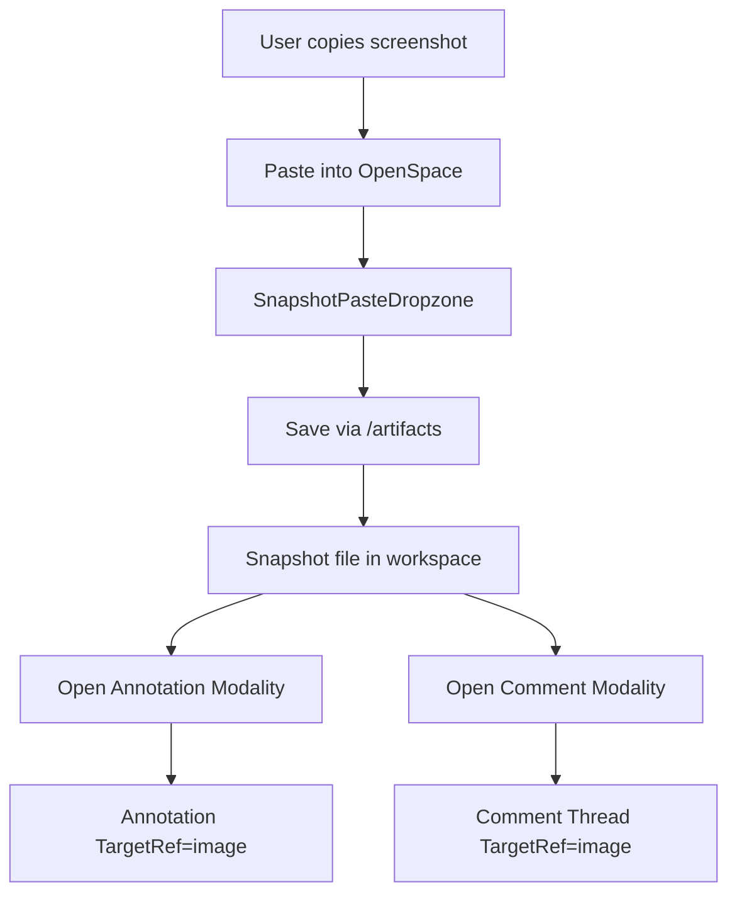

# Browser Preview Snapshot Implementation Guide

Status: Skeleton (intentional MVP)
Audience: Any coding agent implementing a minimal browser-preview workflow
Scope: Simple snapshot-first browser preview path with immediate annotation + comment enablement
Cross-cutting baseline: `docs/architecture/multi-modality-implementation-guide.md`.

---

## 1. Scope Decision

This guide is intentionally minimal.

In scope now:
1. Accept pasted image/screenshot from clipboard.
2. Save snapshot artifact.
3. Immediately open annotation + comment workflows on that snapshot.
4. Support snapshots from any source (web pages inside or outside OpenSpace).

Out of scope now:
1. Full live browser-preview environment.
2. Rich DOM inspection/debugger parity.
3. Deep external-page injection overlays.
4. Cross-origin live annotation overlays.

---

## 2. User Stories

### US-BRP-001 Paste Snapshot and Start Review Immediately
As a user, I can paste an image/screenshot and immediately annotate/comment on it.

Acceptance criteria:
- Paste image action is available in shell/chat/review entry point.
- Pasted image is persisted as snapshot artifact.
- Annotation and comment actions are immediately available.

### US-BRP-002 Review Any Webpage via Snapshot
As a user, I can review webpages outside OpenSpace by taking a screenshot and pasting it.

Acceptance criteria:
- Snapshot source is not limited to OpenSpace-owned pages.
- Workflow is identical regardless of image origin.

### US-BRP-003 Link Snapshot to Discussion
As a user, comments created from snapshot review preserve context for later discussion.

Acceptance criteria:
- Comment thread references snapshot path via `TargetRef`.
- Comment timeline remains accessible after session reload.

---

## 3. Requirements

## 3.1 Functional Requirements

### FR-BRP-001 Clipboard Image Intake
- Support paste intake for image MIME types (`image/png`, `image/jpeg`, `image/webp`, etc.).
- Ignore non-image clipboard payloads gracefully.

### FR-BRP-002 Snapshot Persistence
- Save pasted image under a deterministic path (for example `design/snapshots/<timestamp>.png`).
- Writes must go through runtime `/artifacts/*` + `ArtifactStore`.

### FR-BRP-003 Immediate Annotation Launch
- After successful paste/save, app can open annotation modality directly on snapshot target.

### FR-BRP-004 Immediate Comment Launch
- App can open comment composer/thread panel with snapshot `TargetRef` context.

### FR-BRP-005 Snapshot TargetRef Contract
- Minimum `TargetRef` for snapshot-driven review:
  - `targetType: "image"`
  - `path`
  - `sourceModality: "browser-preview" | "snapshot-review"`

### FR-BRP-006 Optional URL Metadata
- If user provides source URL manually, store as optional metadata (not required for MVP).

### FR-BRP-007 External Page Compatibility
- MVP must not depend on page injection permissions.
- External pages are supported via screenshot/paste flow only.

## 3.2 Non-Functional Requirements

### NFR-BRP-001 Simplicity
- Keep implementation minimal and robust; no heavy browser emulation stack.

### NFR-BRP-002 Reliability
- Paste->save->open-review flow should be deterministic.

### NFR-BRP-003 Cross-Modality Predictability
- Annotation/comment launches from snapshot use stable `TargetRef` payloads.

---

## 4. Minimal Architecture

## 4.1 Components
- `SnapshotPasteDropzone` (clipboard intake)
- `snapshot-path.ts` (path generation)
- `snapshot-target-ref.ts` (interop payload)
- existing annotation modality launcher
- existing comment modality launcher

## 4.2 Architecture Diagram (Mermaid)

---

## 5. Implementation Details

## 5.1 Files to Add

Client:
- `openspace-client/src/components/browser-preview/SnapshotPasteDropzone.tsx`
- `openspace-client/src/lib/browser-preview/snapshot-path.ts`
- `openspace-client/src/lib/browser-preview/snapshot-target-ref.ts`
- `openspace-client/src/lib/browser-preview/snapshot-target-ref.test.ts`
- `openspace-client/src/components/browser-preview/SnapshotPasteDropzone.test.tsx`

Docs:
- `docs/architecture/browser-preview-snapshot-implementation-guide.md`

## 5.2 Files to Modify

Client:
- `openspace-client/src/App.tsx` (mount paste entry point)
- `openspace-client/src/components/AgentConsole.tsx` (optional paste hint/action)

Runtime:
- none beyond existing `/artifacts` path

---

## 6. Task Plan

## Task 1: Clipboard Intake
1. Add image paste listener.
2. Validate MIME type and decode payload.
3. Add user feedback for unsupported paste payloads.

Expected tests:
- image paste accepted.
- text-only paste ignored gracefully.

## Task 2: Snapshot Save
1. Generate deterministic artifact path.
2. Save via `/artifacts` (base64 encoding path).
3. Return saved path + metadata.

Expected tests:
- save path format.
- save request payload shape.

## Task 3: Annotation + Comment Launch
1. Build `TargetRef` from saved snapshot.
2. Open annotation flow.
3. Open comment composer/thread with same target.

Expected tests:
- stable `TargetRef` mapping.
- launches succeed after paste-save.

## Task 4: E2E Smoke
1. Paste image fixture.
2. Confirm snapshot saved.
3. Confirm annotation and comment actions available/working.

Expected tests:
- complete workflow passes.

---

## 7. Definition of Done

Done when:
1. User can paste an image/screenshot.
2. Snapshot is persisted through ArtifactStore path.
3. Annotation and comment workflows can launch immediately from snapshot.
4. Flow works for screenshots from external web pages (via paste).
5. Minimal tests pass.

---

## 8. Future Expansion (Deferred)

1. Live browser preview panel.
2. URL capture + revisit metadata pipeline.
3. In-page annotation overlays for supported contexts.
4. Extension-based external page overlay support.
