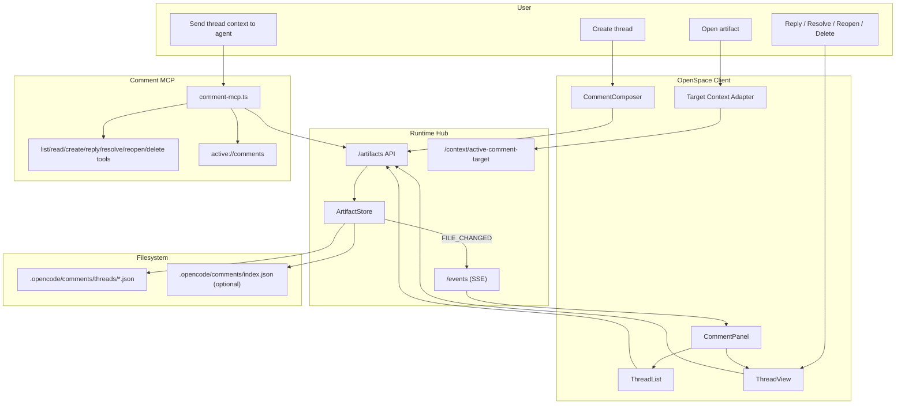

# Comment Modality Implementation Guide

Status: Ready for implementation  
Audience: Any coding agent implementing end-to-end  
Scope: Persistent threaded comments across artifacts (MVP + expansion path)
Cross-cutting baseline: `docs/architecture/multi-modality-implementation-guide.md`.

---

## 1. User Stories

### US-CMT-001 Create Persistent Comment Thread
As a user, I can create a comment thread on an artifact context, so feedback is durable and reviewable later.

Acceptance criteria:
- Comment thread is persisted to disk.
- Thread remains available after app restart.

### US-CMT-002 Reply and Discuss
As a user, I can reply inside a thread, so collaboration happens in one place.

Acceptance criteria:
- Replies are ordered by creation time.
- Each reply includes author and timestamp metadata.

### US-CMT-002A User and Agent Discuss in the Same Thread
As a user, I can have a back-and-forth discussion with the agent inside a comment thread, so decisions and rationale stay attached to artifact context.

Acceptance criteria:
- Thread supports both user and agent authored messages.
- Agent replies are persisted in the same timeline.
- User can continue discussion after agent responses.

### US-CMT-003 Resolve and Reopen Thread
As a user, I can resolve a thread and reopen it later, so review lifecycle is explicit.

Acceptance criteria:
- Thread has status: `open` or `resolved`.
- Status changes are persisted and auditable.

### US-CMT-003A Delete Thread
As a user, I can delete a thread to remove noise/chatter that is no longer useful.

Acceptance criteria:
- User can delete thread from thread view/list actions.
- Deletion is persisted.
- Deleted thread no longer appears in lists.

### US-CMT-004 Attach Comments to Different Surfaces
As a user, I can comment on different artifact types, so review is modality-agnostic.

Acceptance criteria:
- MVP supports at least presentations and code/files.
- Model supports expansion to PDF/image/diagram/diff.

### US-CMT-005 Annotation-to-Comment Bridge
As a user, when I create an annotation, the system can convert it into a structured comment thread and the agent can reply there, so visual feedback becomes persistent discussion without anchor complexity.

Acceptance criteria:
- Annotation snapshot/context can create a comment thread.
- Created thread stores link to annotation snapshot/reference.
- Agent can post first reply in the created thread.

### US-CMT-006 Send Comment Context to Agent
As a user, I can ask the agent to act on selected thread(s), so comments can drive implementation work.

Acceptance criteria:
- Selected thread context can be packaged and sent to model prompt.

---

## 2. Requirements

## 2.1 Functional Requirements

### FR-CMT-001 Persistent Storage
- Comments are stored in dedicated files under project workspace.
- Writes must go through runtime `ArtifactStore`.

### FR-CMT-002 Thread Model
- Required entities:
  - thread
  - message
  - status (`open`/`resolved`)
  - context pointer (target artifact + location metadata)

### FR-CMT-003 Context Mapping
- Each thread references a standardized `TargetRef`:
  - `targetType`
  - `path`
  - optional `location` object (target-type specific)
  - optional `sourceModality`

### FR-CMT-004 Basic Operations
- Create thread
- Add reply
- Resolve thread
- Reopen thread
- Delete thread
- List threads by target
- Read thread by id

### FR-CMT-005 Real-Time Sync
- Changes trigger runtime `FILE_CHANGED`.
- Active comment panels refresh via SSE updates.

### FR-CMT-006 Agent Interop
- Thread(s) can be serialized into prompt context.
- Optional tool actions for thread summarization or conversion to tasks.

### FR-CMT-007 Agent Participation in Timeline
- Thread messages support `author` roles: `user`, `agent`, `system`.
- Agent-authored replies are first-class messages in the same thread.
- UI distinguishes message role.

### FR-CMT-008 Annotation-to-Comment Conversion
- System supports thread creation from annotation context:
  - target path/type/location
  - annotation snapshot path
  - optional initial user text
- Optional policy can request immediate agent reply in the created thread.

### FR-CMT-009 Source-Open Interop Hook
- Comment modality must expose action payloads that target source modalities via `TargetRef`.
- For file targets this should map cleanly to editor `openFileAt(path, selection?)`.

## 2.2 Non-Functional Requirements

### NFR-CMT-001 Durability
- No data loss on normal writes; use ArtifactStore atomic write path.

### NFR-CMT-002 Determinism
- Stable thread IDs and deterministic file mapping.

### NFR-CMT-003 Simplicity
- Keep MVP to core discussion workflow; defer advanced moderation/workflow features.

### NFR-CMT-004 Testability
- Data model, storage mapping, and lifecycle operations must be unit-testable.

### NFR-CMT-005 Cross-Modality Predictability
- For same thread target, emitted source-open payloads must be deterministic.

---

## 3. Technology Architecture

## 3.1 Chosen Technologies (MVP)
- Storage format: JSON sidecar files under `.opencode/comments/`.
- Runtime API: existing `/artifacts/*` and `/events` in `runtime-hub`.
- MCP layer: dedicated `comment-mcp.ts` for agent access.
- Client UI: React panel component for thread list + thread view + composer.
- Tests:
  - Runtime: Vitest
  - Client: Vitest + Testing Library
  - E2E: Playwright

## 3.2 Architecture Components
- Runtime:
  - `comment-mcp.ts`
  - context endpoint for active comment target
  - ArtifactStore-backed writes
- Client:
  - `CommentPanel`
  - `ThreadList`
  - `ThreadView`
  - `CommentComposer`
  - context-aware launcher from presentation/editor/diff views
- Filesystem:
  - comment thread files
  - optional index file for quick lookup

## 3.3 Architecture Diagram (Mermaid)



## 3.4 End-to-End Flows

### Flow A: Create Thread
1. User selects context in surface (slide, file, diff hunk, etc.).
2. Comment panel opens with normalized `TargetRef`.
3. User submits first message.
4. Thread saved to `.opencode/comments/threads/<threadId>.json`.
5. Thread appears in list for target.

### Flow B: Reply + Resolve
1. User opens thread.
2. User adds reply.
3. User resolves thread.
4. State update persists and syncs to active views.

### Flow B2: Delete Thread
1. User opens thread or thread list menu.
2. User triggers delete action.
3. System removes thread artifact (or marks deleted, per implementation choice).
4. Thread disappears from list and active view.

### Flow C: Agent-Driven Action
1. User selects one or more threads.
2. Client sends thread context to agent.
3. Agent responds with plan/code/docs updates referencing thread IDs.

### Flow D: Annotation -> Comment -> Agent Discussion
1. User creates annotation snapshot in annotation modality.
2. User triggers convert-to-comment action (or policy auto-creates).
3. System creates thread with target context + snapshot link.
4. Agent posts reply in same thread.
5. User and agent continue discussion in-thread.

---

## 4. Data Structures and Contracts

## 4.1 Core Schema

```ts
type CommentTargetType = "presentation" | "file" | "diff" | "diagram" | "pdf" | "image" | "whiteboard";
type ThreadStatus = "open" | "resolved";

interface TargetRef {
  targetType: CommentTargetType;
  path: string;
  location?: Record<string, unknown>; // e.g. slideIndex, lineRange, diffHunkId
  sourceModality?: "presentation" | "editor" | "annotation" | "comment" | "whiteboard";
}

interface CommentThread {
  id: string;
  targetRef: TargetRef;
  status: ThreadStatus;
  title?: string;
  messages: CommentMessage[];
  createdAt: number;
  updatedAt: number;
  createdBy: string; // user id or "user"
  updatedBy: string;
  links?: {
    annotationRefId?: string; // future integration
    annotationSnapshotPath?: string; // annotation bridge
    requirementIds?: string[];
  };
}

interface CommentMessage {
  id: string;
  author: "user" | "agent" | "system";
  body: string;
  createdAt: number;
  editedAt?: number;
}
```

## 4.2 File Mapping
- Thread file:
  - `.opencode/comments/threads/<threadId>.json`
- Optional index:
  - `.opencode/comments/index.json`

Minimum index structure:

```ts
interface CommentIndex {
  byTargetPath: Record<string, string[]>; // targetPath -> threadIds
  updatedAt: number;
}
```

## 4.3 MCP Tool Schemas

### `list_comments`
Input:

```json
{ "targetPath": "optional", "status": "optional open|resolved" }
```

### `read_comment_thread`
Input:

```json
{ "threadId": "required" }
```

### `create_comment_thread`
Input:

```json
{
  "targetRef": {
    "targetType": "required",
    "path": "required",
    "location": {}
  },
  "title": "optional",
  "message": "required"
}
```

### `reply_comment_thread`
Input:

```json
{ "threadId": "required", "message": "required" }
```

### `resolve_comment_thread`
Input:

```json
{ "threadId": "required" }
```

### `reopen_comment_thread`
Input:

```json
{ "threadId": "required" }
```

### `delete_comment_thread`
Input:

```json
{ "threadId": "required" }
```

## 4.4 Active Resource
- Resource URI: `active://comments`
- Returns comments for currently active target context.

---

## 5. Exact Implementation Details

## 5.1 Files to Add

Runtime:
- `runtime-hub/src/mcp/comment-mcp.ts`
- `runtime-hub/src/mcp/lib/comment-store.ts`
- `runtime-hub/src/mcp/lib/comment-types.ts`
- `runtime-hub/src/mcp/comment-mcp.test.ts`

Client:
- `openspace-client/src/components/comments/CommentPanel.tsx`
- `openspace-client/src/components/comments/ThreadList.tsx`
- `openspace-client/src/components/comments/ThreadView.tsx`
- `openspace-client/src/components/comments/CommentComposer.tsx`
- `openspace-client/src/lib/comments/comment-client.ts`
- `openspace-client/src/lib/comments/comment-types.ts`
- `openspace-client/src/lib/comments/comment-target-ref.ts`
- `openspace-client/src/components/comments/CommentPanel.test.tsx`
- `openspace-client/src/lib/comments/comment-target-ref.test.ts`

Design/docs:
- `design/CommentModality.graph.mmd`
- `docs/architecture/comment-modality-implementation-guide.md`

## 5.2 Files to Modify

Runtime:
- `runtime-hub/src/hub-server.ts`
  - add active comment target endpoints:
    - `POST /context/active-comment-target`
    - `GET /context/active-comment-target`
- `runtime-hub/package.json`
  - add `"start:comments": "tsx src/mcp/comment-mcp.ts"`

Client:
- `openspace-client/src/context/LayoutContext.tsx`
  - add active comment target and panel visibility state.
- `openspace-client/src/App.tsx`
  - mount `CommentPanel`.
- `openspace-client/src/components/FileTree.tsx`
  - optional entry point to open comments for file targets.
- `openspace-client/opencode.json` and root `opencode.json`
  - register comments MCP server.
- `docs/architecture/presentation-modality-implementation-guide.md`
  - update deferred comment hooks to point to this modality guide.

## 5.3 MVP UX Behavior
- Comments panel can be opened from:
  - presentation controls (deferred hook already documented)
  - file/code context menu
  - diff view context menu
- Panel modes:
  - target overview (all threads for current target)
  - thread detail (messages + actions)

## 5.4 Storage Strategy Notes
- Start with one JSON per thread for simplicity and write safety.
- Optional index can be generated/updated for faster queries by target.
- All writes use ArtifactStore (atomic + history + event logging).

---

## 6. Task Plan with Build Instructions and Expected Tests

## Task 1: Comment Types and Store Helpers
Goal: define stable data model and read/write helpers.

Build:
1. Create `comment-types.ts`.
2. Implement `comment-store.ts`:
   - create thread
   - append message
   - resolve/reopen/delete
   - list by target/status

Expected tests:
- create thread writes valid schema.
- create thread validates/persists `targetRef`.
- reply appends message and bumps `updatedAt`.
- resolve/reopen toggles status correctly.
- delete removes thread from reads/lists.

## Task 2: Runtime Active Comment Target Context
Goal: enable active-context comment resource behavior.

Build:
1. Add context endpoints in `hub-server.ts`.
2. Keep active target in memory (same pattern as whiteboard context).

Expected tests:
- POST/GET context round trip.
- default null behavior.

## Task 3: Comment MCP Server
Goal: expose tooling to agent.

Build:
1. Implement `comment-mcp.ts`.
2. Register tools and `active://comments`.
3. Route all writes through `/artifacts`.

Expected tests:
- create/read/reply/resolve/reopen/delete tool calls.
- list by target and status filters.
- invalid thread ID returns error.

## Task 4: Client Comment Panel
Goal: user-facing discussion UI.

Build:
1. Build `CommentPanel`, `ThreadList`, `ThreadView`, `CommentComposer`.
2. Hook to runtime APIs and SSE refresh.

Expected tests:
- create thread flow.
- reply flow.
- resolve/reopen flow.
- delete thread flow.
- SSE update refreshes panel state.

## Task 5: Surface Integrations
Goal: context-aware comment launchers.

Build:
1. Add context launch from presentation surface.
2. Add context launch from file/code surfaces.
3. Add context launch from diff surface (if present).

Expected tests:
- launcher sets correct target context payload.
- created thread includes expected target metadata.

## Task 6: Agent Interop
Goal: send thread context to model.

Build:
1. Add UI action "Send thread(s) to agent".
2. Serialize selected threads into prompt text payload.

Expected tests:
- payload includes thread IDs and messages.
- empty selection handled with user feedback.

## Task 6A: Source-Open Interop Payload
Goal: launch source modality from thread target deterministically.

Build:
1. Implement `comment-target-ref.ts`.
2. Add UI action (for applicable target types) to emit source-open `TargetRef`.
3. For file targets, verify compatibility with editor `openFileAt(path, selection?)`.

Expected tests:
- file target emits path + selection mapping.
- repeated emits for same thread are identical.

## Task 7: Annotation-to-Comment Bridge
Goal: convert annotation output into persistent thread and enable agent reply.

Build:
1. Add bridge action endpoint from annotation flow.
2. Create thread with annotation snapshot link + target context.
3. Optional immediate agent reply using thread context.

Expected tests:
- bridge creates thread with `annotationSnapshotPath`.
- thread target context matches source artifact.
- agent reply (when enabled) stored as `author: "agent"`.

## Task 8: E2E Smoke Coverage
Goal: prove comment lifecycle end-to-end.

Build:
1. Add `e2e/comments.spec.ts`:
   - open target
   - create thread
   - reply
   - resolve
   - reopen
   - delete
   - annotation -> comment conversion
   - agent reply appears in thread
   - verify persistence after reload

Expected tests:
- flow passes in CI.

---

## 7. Test Matrix (Minimum Expected)

Runtime unit:
- `comment-mcp.test.ts`
  - tool behavior and error handling
  - storage helpers

Client unit/component:
- `CommentPanel.test.tsx`
  - create/reply/resolve/reopen/delete interactions
  - user+agent timeline rendering
  - annotation bridge flow
  - SSE sync behavior
- `comment-target-ref.test.ts`
  - source-open payload mapping.

E2E:
- `e2e/comments.spec.ts`
  - lifecycle, persistence, annotation bridge flow
  - source-open payload flow

Regression:
- Existing whiteboard/presentation/annotation workflows stay intact.

---

## 8. Definition of Done

Done when:
1. User can create persistent threads tied to artifact context.
2. User can reply, resolve, reopen, and delete threads.
3. Thread state persists across reload/restart.
4. Agent can read and act on comments via MCP tools.
5. Thread target uses standardized `TargetRef`.
6. Unit/component/e2e tests pass.
7. No regressions in existing modalities.

---

## 9. Explicit Non-Goals (Current Phase)

1. Full enterprise workflow (assignees, SLA, escalations).
2. Rich moderation/permissions matrix.
3. Real-time collaborative cursors/presence.
4. Advanced mention/notification infrastructure.
5. Full bidirectional annotation-comment automation (MVP includes one-way bridge only).

This modality focuses on persistent, actionable discussion as a first-class artifact.
