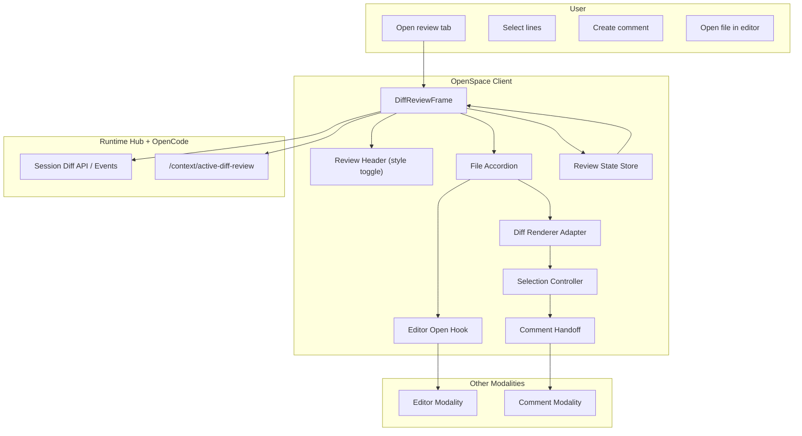

# Diff Review Modality Implementation Guide

Status: Ready for implementation
Audience: Any coding agent implementing end-to-end
Scope: First-class Diff Review modality for changed files/hunks, line selection, and review discussion handoff
Reference baseline: architecture patterns adapted from local `opencode` client review stack (`SessionReview`, diff renderer abstraction, review-state persistence), mapped to OpenSpace conventions.
Cross-cutting baseline: `docs/architecture/multi-modality-implementation-guide.md`.

---

## 1. User Stories

### US-DFR-001 Open Session Diff Review
As a user, I can open a dedicated diff-review surface for a session, so I can understand all changes in one place.

Acceptance criteria:
- Review surface lists changed files for active session/workspace context.
- Each file diff can be expanded/collapsed.

### US-DFR-002 Switch Diff Style (Unified/Split)
As a user, I can switch between unified and split diff views.

Acceptance criteria:
- Diff style toggle exists in review header.
- Selected style persists in layout/session state.

### US-DFR-003 Open File from Review
As a user, I can open a reviewed file directly in editor from the diff row.

Acceptance criteria:
- `View/Open file` action exists per file.
- Action opens editor at canonical file tab.

### US-DFR-004 Inline Line-Range Selection
As a user, I can select changed lines in a diff and target exact ranges for feedback.

Acceptance criteria:
- Line/range selection works in diff panel.
- Selection is stable across render updates.

### US-DFR-005 Add Review Comments from Selected Lines
As a user, I can create a comment thread directly from a selected diff range.

Acceptance criteria:
- Selected range can open comment composer.
- Created thread includes `TargetRef` with diff file + range metadata.

### US-DFR-006 Focus Existing Comment in Review
As a user, selecting a comment thread can focus and scroll to its line range in the diff.

Acceptance criteria:
- Focus action opens target file diff if collapsed.
- View scrolls to selected range/comment anchor.

### US-DFR-007 Preserve Review State During Navigation
As a user, when I move between tabs/modality views and return, review open files and scroll position are preserved.

Acceptance criteria:
- Expanded file list and scroll state restore correctly.
- Active file focus restores when possible.

### US-DFR-008 Review Binary Changes Safely
As a user, for non-text changed assets (image/audio), I still see meaningful review previews.

Acceptance criteria:
- Image and audio diffs render preview placeholders/previews.
- Unsupported binary types degrade gracefully.

### US-DFR-009 Incremental Performance on Large Diffs
As a user, review remains responsive on larger change sets.

Acceptance criteria:
- Diff rendering avoids UI lockups.
- Render strategy supports worker/off-main-thread computation or preloaded diff hydration.

### US-DFR-010 Agent-Aware Review Context
As a user, I can send review context (selected file/range or full review summary) to the agent.

Acceptance criteria:
- Agent prompt context includes normalized diff references.
- Review selection handoff is deterministic.

---

## 2. Requirements

## 2.1 Functional Requirements

### FR-DFR-001 First-Class Review Surface
- Diff review is a separate shell modality/pane, not hidden inside editor internals.
- It can coexist with editor and comment panes.

### FR-DFR-002 Diff Source Contract
- Review data can be loaded from session diff APIs/events.
- Minimum file diff payload:
  - `file`
  - `before`
  - `after`
  - `additions`
  - `deletions`
  - `status` (`added` | `modified` | `deleted`)

### FR-DFR-003 File Accordion Review Model
- Review surface groups diffs by file in expandable sections.
- Expand/collapse all action supported.

### FR-DFR-004 Diff Style Toggle
- Support `unified` and `split` modes.
- Selection persists per user/session layout preference.

### FR-DFR-005 Diff Renderer Abstraction
- Diff engine is abstracted behind provider/adapter boundary so implementation can be replaced.
- Renderer must support:
  - line selection callbacks
  - selected-line highlighting
  - comment-line highlighting

### FR-DFR-006 Line Selection Model
- Selected ranges include:
  - `start`
  - `end`
  - `side` (`additions` | `deletions`)
  - optional `endSide`
- Selection normalization handles reversed drag direction.

### FR-DFR-007 Comment Handoff Contract
- Creating comment from diff selection emits standardized `TargetRef`:
  - `targetType: "diff"`
  - `path`
  - `location.startLine`
  - `location.endLine`
  - optional side metadata
- Comment modality stores this reference without ad hoc shape.

### FR-DFR-008 Focus and Scroll Contract
- Diff review supports focus requests (`file + selection/commentId`).
- Focus auto-opens file section if needed and scrolls to line anchor.

### FR-DFR-009 Open-File Interop Hook
- File-level open action in review maps to editor `openFileAt(path, selection?)`.

### FR-DFR-010 Binary Preview Handling
- For image/audio file diffs:
  - show before/after or available artifact preview
  - fallback placeholders for missing content
- No crash on unsupported MIME/encoding.

### FR-DFR-011 Review State Persistence
- Persist and restore:
  - open file sections
  - review scroll position
  - selected diff style
  - focused comment (short-lived)

### FR-DFR-012 Active Review Context Endpoint
- Runtime supports:
  - `POST /context/active-diff-review`
  - `GET /context/active-diff-review`
- Context includes current session id and optionally focused file/range.

### FR-DFR-013 Session Event Integration
- Review listens to session diff update events.
- On new diff update, review refreshes with minimal state loss.

### FR-DFR-014 Review Snapshot for Agent Prompting
- Provide summarized review context serialization:
  - files changed
  - counts (+/-)
  - selected ranges/comments (optional)

### FR-DFR-015 Path and Payload Safety
- All path references in review are normalized under workspace root.
- Binary payload previews are size-bounded.

### FR-DFR-016 Renderer Hydration Optimization
- Support optional preloaded diff render output for faster first paint on larger review sets.

## 2.2 Non-Functional Requirements

### NFR-DFR-001 Responsiveness
- Diff review remains responsive on typical multi-file change sets.

### NFR-DFR-002 Determinism
- Same diff input + style + selection yields stable line mapping.

### NFR-DFR-003 Testability
- Selection normalization, focus mapping, and comment handoff are unit-testable.

### NFR-DFR-004 Failure Transparency
- Invalid diff payload or rendering failure surfaces clear error states.

### NFR-DFR-005 Cross-Modality Predictability
- `TargetRef` open/comment payloads are deterministic.

### NFR-DFR-006 Memory Discipline
- Large diff artifacts are virtualized/cached with bounds.

---

## 3. Technology Architecture

## 3.1 Chosen Technologies (MVP)
- Review UI: React components in client shell.
- Diff rendering: renderer adapter abstraction (initial implementation can use existing JS diff library/component).
- Session diff data: OpenCode session diff API/event stream.
- State/persistence: layout/session state store (same persistence discipline as editor/review).
- Runtime context: hub endpoints for active review context.
- Comments integration: existing comment modality via `TargetRef`.

## 3.2 Architecture Components
- Client:
  - `DiffReviewFrame`
  - `DiffReviewHeader`
  - `DiffFileAccordion`
  - `DiffFileSection`
  - `DiffSelectionController`
  - `DiffCommentOverlay`
  - `DiffReviewStateStore`
  - `diff-target-ref.ts`
  - `diff-focus.ts`
  - `diff-style-store.ts`
  - `DiffRendererProvider` (adapter boundary)
- Runtime:
  - active diff review context endpoints
- Integrations:
  - editor open hook (`openFileAt`)
  - comment modality create/focus hooks

## 3.3 Architecture Diagram (Mermaid)



## 3.4 End-to-End Flows

### Flow A: Open and Render Review
1. User opens diff-review modality.
2. Review loads session diff payload.
3. File accordion renders changed files.
4. Selected diff style (`split`/`unified`) is applied.
5. Open/scroll state restored from persisted view state.

### Flow B: Select Lines and Comment
1. User drags/selects diff lines in a file section.
2. Selection controller normalizes range + side.
3. Comment composer opens for selected range.
4. Comment creation emits `TargetRef` with diff metadata.
5. Comment modality persists thread and reflects highlights back in review.

### Flow C: Focus Comment from Comment Modality
1. User selects comment thread tied to diff range.
2. Diff review receives focus payload (`file`, `commentId`, `range`).
3. Target file section auto-expands.
4. Review scrolls to anchor and opens inline comment bubble.

### Flow D: Open Reviewed File in Editor
1. User clicks `View/Open file` from file diff header.
2. Review emits editor open request.
3. Editor opens canonical tab and optional line selection.

---

## 4. Data Structures and Contracts

## 4.1 Core Diff Types

```ts
type DiffStyle = "unified" | "split";

type DiffFile = {
  file: string;
  status: "added" | "modified" | "deleted";
  additions: number;
  deletions: number;
  before?: string;
  after?: string;
};

type SelectedLineRange = {
  start: number;
  end: number;
  side?: "additions" | "deletions";
  endSide?: "additions" | "deletions";
};
```

## 4.2 Diff Review State

```ts
type DiffReviewState = {
  openFiles: string[];
  diffStyle: DiffStyle;
  scroll: { x: number; y: number };
  focusedFile?: string;
  focusedComment?: { file: string; id: string } | null;
};
```

## 4.3 TargetRef Contract (Diff)

```ts
type TargetRef = {
  targetType: "diff";
  path: string;
  location?: {
    startLine?: number;
    endLine?: number;
    side?: "additions" | "deletions";
  };
  sourceModality?: "diff-review";
};
```

## 4.4 Active Context Contract
- `POST /context/active-diff-review` body:
```json
{
  "sessionId": "abc123",
  "focusedFile": "src/app.ts",
  "selection": { "startLine": 20, "endLine": 28 }
}
```

- `GET /context/active-diff-review` response:
```json
{
  "activeDiffReview": {
    "sessionId": "abc123",
    "focusedFile": "src/app.ts"
  }
}
```

---

## 5. Exact Implementation Details

## 5.1 Files to Add

Client:
- `openspace-client/src/components/diff-review/DiffReviewFrame.tsx`
- `openspace-client/src/components/diff-review/DiffReviewHeader.tsx`
- `openspace-client/src/components/diff-review/DiffFileAccordion.tsx`
- `openspace-client/src/components/diff-review/DiffFileSection.tsx`
- `openspace-client/src/components/diff-review/DiffCommentOverlay.tsx`
- `openspace-client/src/context/DiffRendererContext.tsx`
- `openspace-client/src/hooks/useDiffReviewDomain.ts`
- `openspace-client/src/lib/diff-review/diff-target-ref.ts`
- `openspace-client/src/lib/diff-review/diff-focus.ts`
- `openspace-client/src/lib/diff-review/diff-selection.ts`
- `openspace-client/src/lib/diff-review/diff-style-store.ts`
- `openspace-client/src/lib/diff-review/diff-state-store.ts`
- `openspace-client/src/lib/diff-review/diff-selection.test.ts`
- `openspace-client/src/lib/diff-review/diff-focus.test.ts`
- `openspace-client/src/lib/diff-review/diff-target-ref.test.ts`
- `openspace-client/src/components/diff-review/DiffReviewFrame.test.tsx`

Runtime:
- `runtime-hub/src/routes/diff-review-context-routes.ts`
- `runtime-hub/src/routes/diff-review-context-routes.test.ts`

E2E:
- `openspace-client/e2e/diff-review.spec.ts`

Docs/design:
- `design/DiffReviewModality.graph.mmd`
- `docs/architecture/diff-review-modality-implementation-guide.md`

## 5.2 Files to Modify

Client:
- `openspace-client/src/App.tsx` (mount diff review panel/modality)
- `openspace-client/src/context/LayoutContext.tsx` (diff review open/style state)
- `openspace-client/src/components/AgentConsole.tsx` (review launch action)
- `openspace-client/src/hooks/useSessionEvents.ts` (session diff refresh hook)

Runtime:
- `runtime-hub/src/hub-server.ts` (register active diff review context endpoints)

## 5.3 Behavior Rules

1. Review surface independence:
- Diff review remains a separate pane/modality, even if editor also supports diff rendering.

2. Renderer abstraction:
- Diff renderer implementation is pluggable behind provider context.

3. Comment-first ranges:
- Selection and comment linkage are first-class, not optional add-ons.

4. View-file interop:
- Review never edits files directly; it delegates to editor modality.

5. Persisted review UX:
- Open files, style, and scroll restore predictably.

---

## 6. Task Plan with Build Instructions and Expected Tests

## Task 1: Diff Review Domain Foundation
Goal: establish separate diff-review modality state and render flow.

Build:
1. Create `useDiffReviewDomain`.
2. Wire session diff loading + refresh.
3. Add file accordion + style store.

Expected tests:
- diff load/refresh behavior.
- style persistence.

## Task 2: Diff Renderer Adapter and Selection
Goal: support unified/split view and line selection.

Build:
1. Add `DiffRendererContext` abstraction.
2. Implement initial renderer adapter.
3. Add selection normalization and callbacks.

Expected tests:
- range normalization.
- renderer callback correctness.

## Task 3: Comment Integration
Goal: line-range comments from diff.

Build:
1. Add inline comment draft overlay.
2. Emit `TargetRef` to comment modality.
3. Highlight commented ranges.

Expected tests:
- comment payload mapping.
- range highlight behavior.

## Task 4: Focus and Scroll Restoration
Goal: make review navigation durable and predictable.

Build:
1. Persist open files + scroll state.
2. Implement focused comment/file navigation.
3. Auto-expand target file section.

Expected tests:
- focus scroll behavior.
- restore behavior after tab switch.

## Task 5: Editor Open Hook
Goal: open reviewed file in editor seamlessly.

Build:
1. Add per-file `open in editor` action.
2. Integrate with editor `openFileAt`.
3. Validate path normalization.

Expected tests:
- view-file routing.
- path safety checks.

## Task 6: Binary Preview Support
Goal: handle image/audio diffs safely.

Build:
1. Add MIME/extension detection.
2. Render preview when possible.
3. Show placeholders/fallbacks when unavailable.

Expected tests:
- image/audio preview paths.
- fallback behavior.

## Task 7: Runtime Context Endpoints
Goal: expose active diff-review context for tools/modality handoff.

Build:
1. Add `POST/GET /context/active-diff-review`.
2. Validate payload and sanitize context.
3. Add route tests.

Expected tests:
- set/get endpoint behavior.
- invalid input handling.

## Task 8: E2E Review Flow
Goal: validate complete diff review workflow.

Build:
1. Add `e2e/diff-review.spec.ts`:
   - open review
   - toggle style
   - select lines
   - create comment
   - open file in editor

Expected tests:
- end-to-end flow stability.

---

## 7. Test Matrix (Minimum Expected)

Unit/component:
- `diff-selection.test.ts`
- `diff-focus.test.ts`
- `diff-target-ref.test.ts`
- `DiffReviewFrame.test.tsx`

Runtime:
- `diff-review-context-routes.test.ts`

E2E:
- `e2e/diff-review.spec.ts`
  - unified/split toggle
  - line selection
  - comment handoff
  - open-file interop

Regression:
- editor/comment/annotation/presentation/drawing flows unaffected.

---

## 8. Definition of Done

Done when:
1. Diff review exists as separate modality surface.
2. Session diff files render with unified/split toggle.
3. Line selection and comment handoff work with deterministic `TargetRef`.
4. `Open file` integrates with editor.
5. Review state persistence (open files/scroll/style) works.
6. Active diff-review context endpoint is implemented.
7. Unit/runtime/e2e tests pass.

---

## 9. Explicit Non-Goals (Current Phase)

1. GitHub PR API integration and remote review syncing.
2. Automatic code suggestion application from review threads.
3. Multi-reviewer real-time collaboration presence.
4. Semantic merge conflict resolution tooling.

---

## 10. Future Diff Review Backlog

1. Hunk-level approve/reject workflows.
2. Batch navigation by unresolved comments.
3. Side-by-side blame/history overlays.
4. Review dashboards across sessions/branches.
5. AI-generated review summaries per file/hunk.
