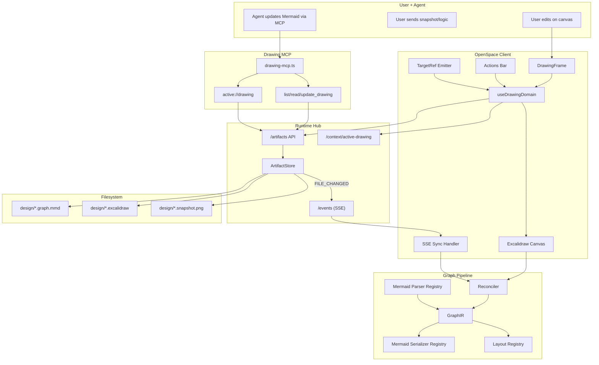

# Drawing Modality Implementation Guide

Status: Ready for implementation and porting  
Audience: Any coding agent implementing or refactoring end-to-end  
Scope: First-class Drawing modality for diagram authoring with Mermaid + Excalidraw  
Cross-cutting baseline: `docs/architecture/multi-modality-implementation-guide.md`.

---

## Part I: Target Architecture (Aligned with Current Modality Philosophy)

## 1. User Stories

### US-DRW-001 Open Drawing Artifact
As a user, I can open a drawing artifact from the workspace and enter a dedicated drawing surface.

Acceptance criteria:
- Clicking `.graph.mmd` or `.excalidraw` opens drawing modality.
- The drawing surface loads current logical + visual state.

### US-DRW-002 Edit Visually and Save Reliably
As a user, I can edit diagrams visually and know my changes are safely saved.

Acceptance criteria:
- Dirty changes are autosaved.
- Saves go through runtime ArtifactStore path.
- Reload shows the latest saved state.

### US-DRW-003 Collaborate with Agent Through Mermaid Logic
As a user, I can ask the agent to update diagram logic, and my canvas updates without losing manual layout and styling.

Acceptance criteria:
- Agent updates `.graph.mmd`.
- Client receives update via SSE and reconciles canvas.
- Existing node geometry/style is preserved when possible.

### US-DRW-004 Send Diagram Context to Agent
As a user, I can send a visual snapshot and logical Mermaid to the agent from the drawing surface.

Acceptance criteria:
- One action sends PNG snapshot plus Mermaid text context.
- Agent receives both parts in a prompt payload.

### US-DRW-005 Diagram-Type Aware Editing
As a user, I can work on different diagram families without losing semantic intent.

Acceptance criteria:
- MVP fully supports: flowchart, sequence, class.
- Additional families are explicit as partial/deferred and tested accordingly.

### US-DRW-006 Inter-Modality Handoff
As a user, drawing actions can open related editor/comment/annotation contexts.

Acceptance criteria:
- Drawing modality emits standardized `TargetRef` payloads.
- Payload maps to editor/comment/annotation launch points.

### US-DRW-007 Restore Session Context
As a user, reopening the app restores active drawing context quickly.

Acceptance criteria:
- Active drawing path can be restored.
- Last known canvas opens without manual re-selection.

---

## 2. Requirements

## 2.1 Functional Requirements

### FR-DRW-001 Canonical Artifact Model
- Canonical logical source is `design/<name>.graph.mmd`.
- Visual state sidecar is `design/<name>.excalidraw`.
- Snapshot artifact is `design/<name>.snapshot.png`.

### FR-DRW-002 Reconciliation Pipeline
- System must reconcile canonical Mermaid logic with existing Excalidraw elements.
- Preserve node/edge IDs and geometry where topology permits.
- Preserve unmanaged user elements where safe.

### FR-DRW-003 Single Writer Discipline
- Client and MCP writes must go through runtime `/artifacts/*` only.
- No direct filesystem writes from client.

### FR-DRW-004 Active Context Contract
- Runtime supports:
  - `POST /context/active-drawing`
  - `GET /context/active-drawing`
- MCP resource `active://drawing` returns active Mermaid content.

### FR-DRW-005 MCP Tooling
- Drawing MCP exposes:
  - `list_drawings`
  - `read_drawing`
  - `update_drawing`
- Tools default to active drawing when name/path is omitted.

### FR-DRW-006 Auto-Save Contract
- Auto-save persists:
  - `.excalidraw` scene JSON
  - synchronized `.graph.mmd` (when semantic conversion is valid)
  - `.snapshot.png` (best-effort)
- Failures are surfaced clearly.

### FR-DRW-007 Real-Time Update Contract
- Client subscribes to runtime `/events`.
- On `FILE_CHANGED` for active `.graph.mmd` by non-user actor, reconcile and refresh canvas.

### FR-DRW-008 Diagram Strategy Registry
- Parser/serializer/layout logic is strategy-driven by diagram type.
- Unsupported diagram families fail explicitly instead of silently degrading.

### FR-DRW-009 TargetRef Interop
- Drawing modality emits standardized `TargetRef` for:
  - Open source in editor
  - Create/open comment thread
  - Open annotation overlay
- Minimum mapping:
  - `targetType: "diagram"`
  - `path`
  - optional `location` (`nodeId`, `edgeId`, `selection`)
  - `sourceModality: "drawing"`

### FR-DRW-010 Path Safety
- All drawing read/write paths are normalized and validated under workspace root.
- MCP name/path inputs must not allow path traversal.

### FR-DRW-011 Deterministic Command Surface
- Same input Mermaid + same prior scene should produce deterministic structural output (excluding random visual seeds where unavoidable).

## 2.2 Non-Functional Requirements

### NFR-DRW-001 Robustness Under Frequent Edits
- Editing and autosave remain responsive on medium diagrams.

### NFR-DRW-002 Determinism and Repeatability
- Reconcile and serialization behavior is predictable and testable.

### NFR-DRW-003 Testability
- Parser/serializer/diff/layout/reconcile remain mostly pure and unit-testable.

### NFR-DRW-004 Failure Transparency
- Parse or conversion failures produce actionable UI/tool errors.

### NFR-DRW-005 Cross-Modality Predictability
- Inter-modality payload emission is deterministic for repeated actions.

---

## 3. Technology Architecture

## 3.1 Chosen Technologies (Target)
- Canvas/editor: `@excalidraw/excalidraw`.
- Logical source: Mermaid text (`.graph.mmd`).
- Runtime write/read path: hub `/artifacts/*` backed by `ArtifactStore`.
- Agent integration: MCP server (`@modelcontextprotocol/sdk`).
- Realtime: hub `/events` SSE.
- Graph pipeline: `GraphIR` + parse/serialize/diff/layout/reconcile modules.
- Tests:
  - Unit: Vitest
  - Component: Vitest + Testing Library
  - E2E: Playwright

## 3.2 Architecture Components (Target)
- Client:
  - `DrawingFrame`
  - `DrawingToolbar`
  - `DrawingActionsBar`
  - `useDrawingDomain`
  - `drawing-target-ref.ts`
  - `drawing-context.ts` (active drawing publication + session restore)
  - `drawing-sync.ts` (SSE + reload policy)
- Domain:
  - `graph-ir/types.ts`
  - `graph-ir/parser-registry.ts`
  - `graph-ir/serializer-registry.ts`
  - `graph-ir/layout-registry.ts`
  - `graph-ir/reconcile.ts`
- Runtime:
  - active drawing context endpoints
  - existing `ArtifactStore`
- MCP:
  - `drawing-mcp.ts` resource + tools

## 3.3 Architecture Diagram (Mermaid)



## 3.4 End-to-End Flows (Target)

### Flow A: Open Drawing
1. User opens `.graph.mmd` or `.excalidraw` from tree.
2. Domain normalizes path and resolves canonical pair (`.graph.mmd`, `.excalidraw`).
3. Domain loads sidecar scene and Mermaid logic.
4. Reconciler builds current scene and mounts Excalidraw.
5. Domain publishes active drawing context.

### Flow B: User Edit + Auto-Save
1. User edits canvas.
2. Domain applies local update and debounce.
3. Save pipeline writes `.excalidraw`.
4. If conversion succeeds, writes `.graph.mmd`.
5. Snapshot export writes `.snapshot.png`.

### Flow C: Agent Update + Reconcile
1. Agent calls `update_drawing`.
2. MCP writes `.graph.mmd` via `/artifacts`.
3. SSE `FILE_CHANGED` reaches client.
4. Domain reloads Mermaid, reconciles against current elements.
5. Canvas updates with preserved geometry where possible.

### Flow D: Inter-Modality Launch
1. User clicks `Edit`, `Comment`, or `Annotate` from drawing controls.
2. Drawing modality emits `TargetRef`.
3. Destination modality opens focused context.

---

## 4. Data Structures and Contracts

## 4.1 Core IR

```ts
type DiagramType =
  | "flowchart"
  | "sequence"
  | "class"
  | "state"
  | "er"
  | "c4"
  | "gantt"
  | "mindmap"
  | "unknown";

interface GraphIR {
  type: DiagramType;
  direction: "TD" | "LR" | "RL" | "BT";
  nodes: GraphNode[];
  edges: GraphEdge[];
  groups: GraphGroup[];
}
```

## 4.2 Drawing TargetRef Contract

```ts
type TargetRef = {
  targetType: "diagram";
  path: string;
  location?: {
    nodeId?: string;
    edgeId?: string;
    selection?: "canvas" | "logic";
  };
  sourceModality?: "drawing";
};
```

## 4.3 Active Context Contract
- `POST /context/active-drawing` body:
```json
{ "filePath": "design/AuthFlow.graph.mmd" }
```
- `GET /context/active-drawing` response:
```json
{ "activeDrawing": "design/AuthFlow.graph.mmd" }
```

## 4.4 Save Contract
- `.excalidraw`: serialized scene JSON.
- `.graph.mmd`: serialized Mermaid logic (diagram type aware).
- `.snapshot.png`: flattened snapshot image.

---

## 5. Exact Implementation Details (Target)

## 5.1 Files to Add

Client:
- `openspace-client/src/components/drawing/DrawingFrame.tsx`
- `openspace-client/src/components/drawing/DrawingToolbar.tsx`
- `openspace-client/src/components/drawing/DrawingActionsBar.tsx`
- `openspace-client/src/hooks/useDrawingDomain.ts`
- `openspace-client/src/lib/drawing/drawing-path.ts`
- `openspace-client/src/lib/drawing/drawing-target-ref.ts`
- `openspace-client/src/lib/drawing/drawing-sync.ts`
- `openspace-client/src/lib/drawing/graph-ir/parser-registry.ts`
- `openspace-client/src/lib/drawing/graph-ir/serializer-registry.ts`
- `openspace-client/src/lib/drawing/graph-ir/layout-registry.ts`
- `openspace-client/src/lib/drawing/graph-ir/reconcile.ts`
- `openspace-client/src/components/drawing/DrawingFrame.test.tsx`
- `openspace-client/src/lib/drawing/drawing-target-ref.test.ts`
- `openspace-client/src/lib/drawing/graph-ir/reconcile.test.ts`

Runtime:
- `runtime-hub/src/mcp/drawing-mcp.ts`
- context endpoint rename/add in `runtime-hub/src/hub-server.ts`
- `runtime-hub/src/mcp/drawing-mcp.test.ts`

Docs/design:
- `design/DrawingModality.graph.mmd`
- `docs/architecture/drawing-modality-implementation-guide.md`

## 5.2 Files to Modify

Client:
- `openspace-client/src/context/LayoutContext.tsx`
- `openspace-client/src/components/FileTree.tsx`
- `openspace-client/src/components/AgentConsole.tsx`
- `openspace-client/src/App.tsx`
- `openspace-client/opencode.json` (MCP server key rename from `whiteboard` to `drawing`, with backward alias option)

Runtime:
- `runtime-hub/src/hub-server.ts` (active drawing context endpoint and backward compatibility alias)

## 5.3 Behavioral Rules

1. Canonical source of truth:
- Logical truth is `.graph.mmd`.
- `.excalidraw` is visual sidecar for layout/style continuity.

2. Reconcile priority:
- Keep user geometry/style first.
- Apply agent logic deltas second.

3. Type strategy:
- If parser for type is incomplete, return explicit warning/error.
- Do not silently serialize to wrong diagram family.

4. Interop:
- All mode-switch actions use `TargetRef`.

5. Save safety:
- Every write stays within workspace-root normalized path.

---

## 6. Task Plan with Build Instructions and Expected Tests

## Task 1: Domain Extraction and Naming Alignment
Goal: move whiteboard-specific orchestration into drawing domain with stable contracts.

Build:
1. Create `useDrawingDomain` as orchestration boundary.
2. Move file-pair resolution, load, save, and SSE handling out of UI component.
3. Keep `WhiteboardFrame` as compatibility wrapper until migration completes.

Expected tests:
- domain load and save pipeline behavior.
- active context publication and restore.

## Task 2: GraphIR Strategy Registry
Goal: formalize per-diagram parser/serializer/layout strategy.

Build:
1. Add parser/serializer/layout registries.
2. Register full implementations for `flowchart`, `sequence`, `class`.
3. Mark partial types explicitly as deferred/partial.

Expected tests:
- registry resolves strategy by type.
- unsupported type returns deterministic error.

## Task 3: Reconciliation Reliability
Goal: deterministic reconcile with geometry preservation.

Build:
1. Keep existing diff/layout logic and isolate random-seed side effects.
2. Add deterministic ID policy for managed nodes/edges.
3. Improve conflict/failure messaging for parse/serialize failures.

Expected tests:
- geometry preserved for unchanged nodes.
- added node layout is stable.
- invalid Mermaid produces actionable failure.

## Task 4: Runtime + MCP Contract Upgrade
Goal: align runtime/MCP naming and safety with modality standards.

Build:
1. Add `/context/active-drawing` (keep `/context/active-whiteboard` as compatibility alias temporarily).
2. Add `drawing-mcp.ts` with `list/read/update_drawing`.
3. Validate/normalize tool input paths under workspace root.

Expected tests:
- MCP tool path validation and error paths.
- active context read/write.

## Task 5: Inter-Modality Hooks
Goal: make drawing launch editor/comment/annotation via shared contract.

Build:
1. Implement `drawing-target-ref.ts`.
2. Add UI actions to emit payloads.
3. Ensure deterministic payload mapping.

Expected tests:
- `TargetRef` generation by selection context.
- open handoff behavior for file-level target.

## Task 6: UI Integration and Backward Compatibility
Goal: migrate shell routing while preserving existing user flow.

Build:
1. Update `FileTree` and command routing from whiteboard alias to drawing modality.
2. Keep legacy command alias (`/whiteboard`) mapped to drawing open.
3. Keep side-by-side layout until multi-pane shell refactor.

Expected tests:
- `.graph.mmd` and `.excalidraw` open drawing frame.
- legacy command path still works.

## Task 7: End-to-End Validation
Goal: verify full user and agent workflow.

Build:
1. Add `e2e/drawing.spec.ts`:
   - open drawing
   - edit canvas
   - autosave writes artifacts
   - agent update reflects via SSE
   - send snapshot to agent

Expected tests:
- stable workflow under repeated edits and remote updates.

---

## 7. Test Matrix (Minimum Expected)

Unit/component:
- `reconcile.test.ts` and parser/serializer tests.
- `drawing-target-ref.test.ts`.
- `DrawingFrame.test.tsx`.

Runtime/MCP:
- `drawing-mcp.test.ts`.
- active drawing context endpoint tests.

E2E:
- `e2e/drawing.spec.ts`.

Regression:
- editor/presentation/annotation/comment unaffected.

---

## 8. Definition of Done

Done when:
1. Drawing modality is first-class in shell and context model.
2. Save pipeline is reliable and ArtifactStore-only.
3. Agent updates reconcile into canvas with preserved layout where possible.
4. MCP tools are available with validated path handling.
5. `TargetRef` interop hooks exist and are deterministic.
6. Unit/component/runtime/e2e tests pass.
7. Legacy whiteboard entry points remain functional until cleanup phase.

---

## 9. Explicit Non-Goals (Current Phase)

1. Collaborative multi-user live cursors.
2. Full semantic support for every Mermaid family.
3. Rich comments/annotations embedded directly on drawing surface.
4. Git-diff-aware diagram traceability.

---

## 10. Future Backlog

1. Dedicated diagram viewers for non-Excalidraw contexts.
2. Diagram lint and validation panel.
3. Slide-linked diagram embeddings.
4. Structured comment anchors on diagram entities.

---

## Part II: Current Implementation (As-Is) and Porting Guide

## 11. Current Implementation Snapshot (What Exists Today)

## 11.1 Entry Points and Shell Placement
- Drawing is currently named and routed as `whiteboard`.
- File tree opens whiteboard for `.graph.mmd` and `.excalidraw`.
- Agent console supports `/whiteboard <name>` command, opening `design/<name>.graph.mmd`.
- Shell renders whiteboard as right half panel next to `AgentConsole`.

Current files:
- `openspace-client/src/components/FileTree.tsx`
- `openspace-client/src/components/AgentConsole.tsx`
- `openspace-client/src/context/LayoutContext.tsx`
- `openspace-client/src/App.tsx`

## 11.2 Whiteboard Frame Runtime Behavior
- `WhiteboardFrame` derives paired paths:
  - input `.excalidraw` -> canonical `.graph.mmd`
  - canonical `.graph.mmd` -> sidecar `.excalidraw`
- Load sequence:
  1. Read `.excalidraw` (if exists).
  2. Read `.graph.mmd`.
  3. `reconcileGraph(mermaid, savedElements)`.
  4. Render Excalidraw with reconciled elements.
- Publishes active context to `/context/active-whiteboard`.
- Subscribes to `/events` SSE and reloads on non-user updates to active `.graph.mmd`.

Current file:
- `openspace-client/src/components/whiteboard/WhiteboardFrame.tsx`

## 11.3 Save Pipeline
- Debounced save (1 second) writes:
  1. `.excalidraw` JSON (`serializeAsJSON`)
  2. `.graph.mmd` (`excalidrawToMermaid`) when conversion succeeds
  3. `.snapshot.png` (`exportToBlob`, base64 upload)
- All writes go to runtime `/artifacts`.

Current file:
- `openspace-client/src/components/whiteboard/useDebouncedSave.ts`

## 11.4 GraphIR/Reconcile Engine
- Graph bridge exists and is substantial:
  - Mermaid parser (multi-family detection)
  - Mermaid serializer (full + compact)
  - Excalidraw parser/generator
  - diff + layout + reconcile pipeline
- Fully exercised families are strongest for:
  - flowchart
  - sequence
  - class
- Some families are currently partial/stubbed (for example `gantt`, `mindmap` parse stubs).

Current files:
- `openspace-client/src/lib/whiteboard/types.ts`
- `openspace-client/src/lib/whiteboard/mermaid-parser.ts`
- `openspace-client/src/lib/whiteboard/mermaid-serializer.ts`
- `openspace-client/src/lib/whiteboard/excalidraw-parser.ts`
- `openspace-client/src/lib/whiteboard/excalidraw-generator.ts`
- `openspace-client/src/lib/whiteboard/diff.ts`
- `openspace-client/src/lib/whiteboard/layout.ts`
- `openspace-client/src/lib/whiteboard/reconcile.ts`

## 11.5 MCP + Runtime Integration
- Runtime hub:
  - `/artifacts/*` read/write via `ArtifactStore`
  - `/events` SSE broadcasts `FILE_CHANGED`
  - `/context/active-whiteboard` in-memory context
- MCP server:
  - resource: `active://whiteboard`
  - tools: `list_whiteboards`, `read_whiteboard`, `update_whiteboard`
  - writes `.graph.mmd` via runtime hub
- MCP server is configured in client `opencode.json` under key `whiteboard`.

Current files:
- `runtime-hub/src/hub-server.ts`
- `runtime-hub/src/services/ArtifactStore.ts`
- `runtime-hub/src/mcp/whiteboard-mcp.ts`
- `openspace-client/opencode.json`

## 11.6 Test Coverage Present Today
- Component:
  - `WhiteboardFrame.test.tsx` (regression around update stability)
- Library:
  - `reconcile.test.ts`
  - `reconcile.error.test.ts`
- Gaps:
  - no direct MCP contract tests
  - no drawing E2E spec validating full save/reload/agent-update loop

Current files:
- `openspace-client/src/components/whiteboard/WhiteboardFrame.test.tsx`
- `openspace-client/src/lib/whiteboard/reconcile.test.ts`
- `openspace-client/src/lib/whiteboard/reconcile.error.test.ts`

---

## 12. Gap Analysis: Current vs Target

### Gap 1: Naming and Contract Consistency
- Current: `whiteboard` naming in UI context, endpoints, and MCP.
- Target: modality-level `drawing` naming with compatibility alias.
- Porting impact: medium, mostly routing and contract renames.

### Gap 2: Domain Layer Separation
- Current: orchestration (load/save/SSE/context) is concentrated inside `WhiteboardFrame`.
- Target: explicit `useDrawingDomain` + smaller UI components.
- Porting impact: medium-high refactor, low user-visible risk if behavior retained.

### Gap 3: Inter-Modality Contract
- Current: no standardized `TargetRef` emission.
- Target: deterministic `TargetRef` for editor/comment/annotation launches.
- Porting impact: medium, enables future modalities to integrate cleanly.

### Gap 4: Diagram Type Contract Clarity
- Current: parser detects many types, but implementation depth varies by family.
- Target: explicit strategy registry + declared support matrix + explicit failures.
- Porting impact: medium, improves predictability.

### Gap 5: Path Safety Hardening in MCP Inputs
- Current: tooling works, but path normalization/validation contract is implicit.
- Target: explicit path safety checks under workspace root.
- Porting impact: low-medium, important correctness/security hardening.

### Gap 6: Test Surface Completeness
- Current: strong unit tests for graph pipeline, limited runtime/MCP/E2E tests.
- Target: modality-level e2e and MCP contract tests.
- Porting impact: medium, high confidence payoff.

---

## 13. Porting Plan (Practical Migration Sequence)

## Phase P0: Compatibility Envelope
1. Keep existing `whiteboard` behavior working.
2. Add `drawing` aliases (context endpoint + MCP key + open command alias).

## Phase P1: Extract Drawing Domain
1. Introduce `useDrawingDomain` and move load/save/SSE/context logic out of frame component.
2. Keep existing `WhiteboardFrame` as wrapper around the new domain.

## Phase P2: Interop and Contracts
1. Add `drawing-target-ref.ts`.
2. Add `Edit`, `Comment`, `Annotate` hook points and payload emission.

## Phase P3: MCP and Runtime Hardening
1. Introduce `drawing-mcp.ts` and path validation.
2. Keep `whiteboard-mcp.ts` as compatibility shim until deprecation window ends.

## Phase P4: Test Completion
1. Add runtime/MCP tests.
2. Add `e2e/drawing.spec.ts` for the full flow.

## Phase P5: Cleanup
1. Remove deprecated names once all callers migrate.
2. Keep adapters only if external dependencies still require legacy names.

---

## 14. Porting Success Criteria

Porting is successful when:
1. Existing whiteboard user flows continue to work during migration.
2. New drawing contracts align with the multi-modality baseline.
3. Inter-modality handoff uses shared `TargetRef`.
4. Runtime/MCP/path safety and test coverage are materially improved.
