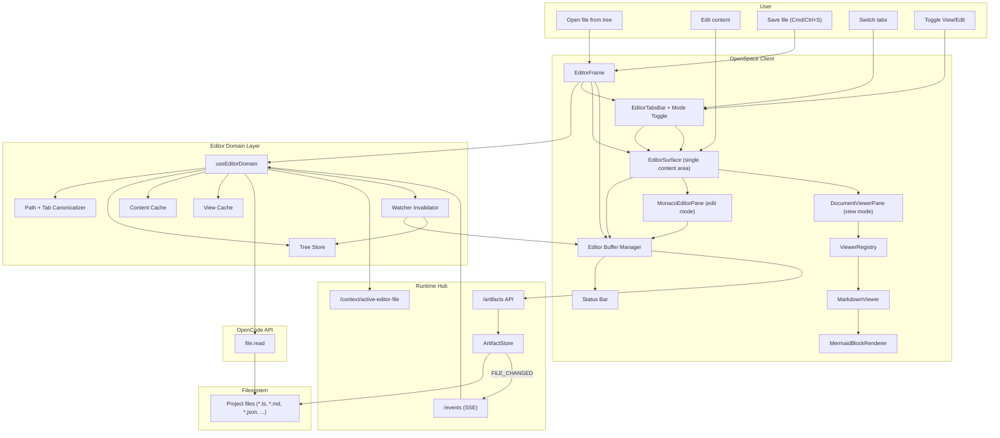

# Editor Modality Implementation Guide

Status: Ready for implementation  
Audience: Any coding agent implementing end-to-end  
Scope: First-class Editor + Viewer modality for text/code/markdown files (comments/annotations/diff excluded)
Reference baseline: architecture choices informed by analysis of local `opencode` web/desktop clients, adapted to OpenSpace requirements (especially edit/save through ArtifactStore).
Cross-cutting baseline: `docs/architecture/multi-modality-implementation-guide.md`.

---

## 1. User Stories

### US-EDT-001 Open File in Editor Surface
As a user, I can open a file from the workspace tree into a dedicated editor surface.

Acceptance criteria:
- Clicking supported file opens editor modality.
- Editor loads current file content.

### US-EDT-002 Edit and Save
As a user, I can modify file content and save.

Acceptance criteria:
- Dirty state is visible.
- Save persists through runtime write path.
- Save completion clears dirty state.

### US-EDT-003 Multi-Tab Editing
As a user, I can keep multiple files open and switch tabs.

Acceptance criteria:
- Multi-tab support exists.
- Per-tab cursor/scroll is preserved.

### US-EDT-004 External Change Handling
As a user, if a file changes externally, I get clear update behavior.

Acceptance criteria:
- SSE change detection for open files.
- Clean tabs auto-reload.
- Dirty tabs show conflict prompt.

### US-EDT-005 Language-Aware Edit Experience
As a user, I get syntax highlighting for code/text formats.

Acceptance criteria:
- Monaco language inferred by extension.

### US-EDT-006 Session Restore
As a user, open tabs and positions are restored on session reload.

Acceptance criteria:
- Tabs, active tab, cursor, scroll restored.

### US-EDT-007 Markdown View/Edit Toggle
As a user, when working on `.md`, I can switch between Edit mode and View mode from the title bar.

Acceptance criteria:
- Toggle button appears for markdown files.
- Edit mode is markdown text editor.
- View mode is rendered markdown viewer.

### US-EDT-008 Native Markdown Viewer with Mermaid
As a user, markdown view mode renders diagrams (Mermaid) inline, so docs feel native and instantaneous.

Acceptance criteria:
- Fenced `mermaid` blocks render as diagrams.
- Other markdown blocks render with readable styling.

### US-EDT-009 Extensible Viewer Architecture
As a user, future file types can get dedicated viewers without rewriting editor core.

Acceptance criteria:
- Viewer selection uses registry layer.
- New viewer can be added with isolated adapter.

### US-EDT-010 Stable Navigation and Restore
As a user, opening files from tree/search/context should always resolve to one canonical tab and preserve UI state across switches.

Acceptance criteria:
- File paths are normalized to one canonical tab key.
- Reopening an existing tab focuses it instead of duplicating.
- Scroll/cursor/viewer scroll are restored when returning to a tab.

---

## 2. Requirements

## 2.1 Functional Requirements

### FR-EDT-001 First-Class Modality
- Editor/Viewer is a standalone modality in shell layout and session state.

### FR-EDT-002 Supported Target Types (MVP)
- Text-like files:
  - code
  - markdown
  - config/text
- Binary files are out of scope for this modality.

### FR-EDT-003 Load/Save Path
- Read via OpenCode `file.read`.
- Persist writes through runtime `/artifacts/*` + ArtifactStore.

### FR-EDT-004 Dirty Tracking
- Dirty state tracked per tab.
- Reset on successful save/reload.

### FR-EDT-005 Tab State
- Track per-tab cursor/scroll/language/content hash.

### FR-EDT-006 External Change Policy
- Subscribe to `/events` and process `FILE_CHANGED`.
- Clean: auto-reload.
- Dirty: conflict prompt.

### FR-EDT-007 Active File Context
- Runtime endpoints:
  - `POST /context/active-editor-file`
  - `GET /context/active-editor-file`

### FR-EDT-008 Keyboard UX
- Save, close tab, switch tab shortcuts.

### FR-EDT-009 Viewer Subsystem
- Editor modality includes dual modes:
  - `edit` (Monaco)
  - `view` (dedicated viewer)
- Mode toggle shown in title bar when viewer available.

### FR-EDT-010 Markdown Viewer
- `.md` files support dedicated viewer mode.
- Render markdown with GFM support.
- Render Mermaid code fences as diagrams.

### FR-EDT-011 Viewer Registry
- Viewer choice is not hardcoded in editor frame.
- Registry resolves viewer by file type and capability.

### FR-EDT-012 File Domain Service Layer
- File concerns are centralized in a dedicated domain layer (not spread across UI components):
  - path normalization / tab-key mapping
  - file tree state + lazy directory loading
  - file content read cache
  - per-file view state (scroll/cursor/selection)

### FR-EDT-013 Tree Loading Discipline
- Directory listing must avoid redundant fetches and preserve responsiveness:
  - root loads once on entry
  - nested directories load on expand
  - in-flight requests are deduplicated

### FR-EDT-014 Watcher Invalidation Policy
- Runtime file watcher events must invalidate the correct file/tree nodes:
  - open file: reload file content
  - loaded parent directory: refresh directory listing
  - ignore `.git/*` noise

### FR-EDT-015 Canonical Tab Identity
- Tabs for files must use a canonical key derived from normalized file path.
- Any open action (tree/search/context jump) must reuse existing canonical tab.

### FR-EDT-016 External Context Open Hook
- Editor domain exposes an `openFileAt(path, selection?)` entrypoint for future comment/diff modalities.
- This hook is required even if comment UI is out of current scope.

### FR-EDT-017 TargetRef Interop Input
- Editor must accept cross-modality `TargetRef` for open/focus requests.
- Minimum supported mapping:
  - `targetType: "file"`
  - `path`
  - optional line selection (`startLine`, `endLine`).

### FR-EDT-018 Path Safety for Interop Opens
- Any inter-modality path open must be normalized and validated under workspace root before load.

## 2.2 Non-Functional Requirements

### NFR-EDT-001 Stability
- Responsive editing and viewing on typical project files.

### NFR-EDT-002 Single Writer Discipline
- No direct filesystem writes from client.

### NFR-EDT-003 Deterministic Restore
- Session restore reproduces tab order + mode + active tab.

### NFR-EDT-004 Testability
- Buffer/conflict/viewer-registry logic mostly pure and unit-testable.

### NFR-EDT-005 Native Feel
- Mode switch (edit/view) should feel immediate, not modal-heavy.

### NFR-EDT-006 Memory Discipline
- Content/view caches must be bounded (LRU or capped maps) so long sessions do not grow unbounded.

### NFR-EDT-007 Cross-Modality Predictability
- `openFileAt` behavior must be deterministic for repeated `TargetRef` inputs.

---

## 3. Technology Architecture

## 3.1 Chosen Technologies (MVP)
- Edit mode: Monaco (`@monaco-editor/react`, `monaco-editor`).
- Markdown view mode: `react-markdown` (already present).
- Mermaid rendering: `mermaid` (already present).
- Read API: OpenCode `file.read`.
- Save API: runtime `/artifacts/*`.
- Change notifications: runtime `/events` SSE.
- State model: dedicated file-domain service + layout tab state + persisted view cache.

## 3.2 Architecture Components
- Client:
  - `EditorFrame`
  - `EditorTabsBar` (includes view/edit toggle)
  - `EditorSurface` (single active content area in frame)
  - `MonacoEditorPane` (edit mode content)
  - `DocumentViewerPane` (view mode content)
  - `MarkdownViewer` (first dedicated viewer)
  - `MermaidBlockRenderer` (for markdown fenced mermaid)
  - `ViewerRegistry` (resolve viewer by file type)
  - `EditorStatusBar`
  - `editor-buffer.ts` (dirty/original hash/save pipeline)
  - `editor-path.ts` (normalize path + canonical tab key mapping)
  - `editor-tree-store.ts` (tree listing + expand/collapse + inflight dedupe)
  - `editor-content-cache.ts` (bounded file-content cache)
  - `editor-view-cache.ts` (per-file view state persistence)
  - `editor-watcher-invalidator.ts` (watcher event routing to file/tree refresh)
  - `viewer-registry.ts`
  - `useEditorDomain.ts` (single hook/context exposing editor domain operations)
- Runtime:
  - active editor file context endpoints
  - existing `/artifacts` write path
  - existing `/events` stream

Architecture clarification:
- `EditorFrame` is the single container.
- `EditorSurface` is the single area where content appears.
- In `edit` mode, `EditorSurface` renders `MonacoEditorPane`.
- In `view` mode, `EditorSurface` renders `DocumentViewerPane`.
- `MarkdownViewer` and `MermaidBlockRenderer` are internal renderer components used by `DocumentViewerPane` (not separate top-level frames).
- UI does not talk to file APIs directly; `EditorFrame` goes through `useEditorDomain` for load/tree/watch/cache operations.

## 3.3 Architecture Diagram (Mermaid)



Save path (explicit): `User Save` -> `EditorFrame` -> `Editor Buffer Manager` -> `Runtime /artifacts` -> `ArtifactStore` -> `Filesystem`.

## 3.4 End-to-End Flows

### Flow A: Open + Edit + Save
1. Open file from tree.
2. `useEditorDomain` normalizes path and resolves canonical tab key.
3. Domain layer loads content via `file.read` and hydrates caches.
4. Edit in Monaco updates `editor-buffer`.
5. Save through runtime `/artifacts`.

### Flow B: Markdown View/Edit Toggle
1. Open `.md` file.
2. Use title-bar toggle to switch `EditorSurface` to `view`.
3. `DocumentViewerPane` uses `ViewerRegistry` to resolve `MarkdownViewer`.
4. Markdown renders, including Mermaid blocks.
5. Toggle back to `edit` switches `EditorSurface` to `MonacoEditorPane` with same buffer state.

### Flow C: External Change
1. Runtime emits `FILE_CHANGED`.
2. `editor-watcher-invalidator` routes event to file reload and/or tree refresh.
3. Clean tab auto-reloads.
4. Dirty tab marks conflict.

## 3.5 Reference-Informed Decisions (from opencode study)

Adopt:
1. Shared platform-independent app core, with web/desktop adapters only at platform boundary.
2. Centralized file domain service layer instead of UI-scattered file logic.
3. Explicit watcher invalidation helper for deterministic event handling.
4. Bounded persisted view/cache stores for long-session stability.
5. Canonical file-tab identity to prevent duplicate tabs from different open sources.

Do not copy directly:
1. Review-only viewer architecture as the main editor experience.
2. Comment-embedded UI inside editor MVP (kept as future integration point).

Rationale:
- OpenSpace editor modality is edit/save-first, so we keep Monaco + buffer/save as the primary path while reusing the proven state-management patterns.

---

## 4. Data Structures and Contracts

## 4.1 Core Types

```ts
type EditorMode = "edit" | "view";
type ViewerType = "markdown" | "text" | "code";

interface EditorTabState {
  path: string;
  tabKey: string;
  content: string;
  originalContentHash: string;
  dirty: boolean;
  language: string;
  mode: EditorMode;
  viewerType?: ViewerType;
  cursor?: { line: number; column: number };
  scroll?: { top: number; left: number };
  selectedLines?: { start: number; end: number } | null;
  viewerScroll?: { top: number };
  conflict?: { hasConflict: boolean; diskHash?: string; reason?: string };
}

interface EditorModalityState {
  tabs: EditorTabState[];
  activePath?: string;
}
```

## 4.2 Viewer Registry Contract

```ts
interface ViewerAdapter {
  id: string;
  canHandle(path: string, language: string): boolean;
  render(props: { path: string; content: string }): React.ReactNode;
}

interface ViewerRegistry {
  register(adapter: ViewerAdapter): void;
  resolve(path: string, language: string): ViewerAdapter | null;
}
```

## 4.3 Active Context Contract
- `POST /context/active-editor-file` body:
```json
{ "filePath": "src/main.tsx" }
```
- `GET /context/active-editor-file` response:
```json
{ "activeEditorFile": "src/main.tsx" }
```

## 4.4 Watcher Invalidation Contract

```ts
type FileWatcherEvent = {
  type: "file.watcher.updated";
  properties: {
    file: string;
    event: "change" | "add" | "unlink";
  };
};
```

Policy:
- `change`: reload open file; refresh directory only if target is loaded directory.
- `add`/`unlink`: refresh loaded parent directory.
- ignore `.git/*`.

---

## 5. Exact Implementation Details

## 5.1 Files to Add

Client:
- `openspace-client/src/components/editor/EditorFrame.tsx`
- `openspace-client/src/components/editor/EditorTabsBar.tsx`
- `openspace-client/src/components/editor/EditorSurface.tsx`
- `openspace-client/src/components/editor/MonacoEditorPane.tsx`
- `openspace-client/src/components/editor/DocumentViewerPane.tsx`
- `openspace-client/src/components/editor/viewers/MarkdownViewer.tsx`
- `openspace-client/src/components/editor/viewers/MermaidBlockRenderer.tsx`
- `openspace-client/src/components/editor/EditorStatusBar.tsx`
- `openspace-client/src/context/EditorDomainContext.tsx`
- `openspace-client/src/hooks/useEditorDomain.ts`
- `openspace-client/src/lib/editor/editor-buffer.ts`
- `openspace-client/src/lib/editor/editor-path.ts`
- `openspace-client/src/lib/editor/editor-tree-store.ts`
- `openspace-client/src/lib/editor/editor-content-cache.ts`
- `openspace-client/src/lib/editor/editor-view-cache.ts`
- `openspace-client/src/lib/editor/editor-watcher-invalidator.ts`
- `openspace-client/src/lib/editor/editor-target-ref.ts`
- `openspace-client/src/lib/editor/language-map.ts`
- `openspace-client/src/lib/editor/viewer-registry.ts`
- `openspace-client/src/components/editor/EditorFrame.test.tsx`
- `openspace-client/src/lib/editor/editor-buffer.test.ts`
- `openspace-client/src/lib/editor/editor-path.test.ts`
- `openspace-client/src/lib/editor/editor-tree-store.test.ts`
- `openspace-client/src/lib/editor/editor-watcher-invalidator.test.ts`
- `openspace-client/src/lib/editor/editor-target-ref.test.ts`
- `openspace-client/src/lib/editor/viewer-registry.test.ts`

Design/docs:
- `design/EditorModality.graph.mmd`
- `docs/architecture/editor-modality-implementation-guide.md`

## 5.2 Files to Modify

Client:
- `openspace-client/package.json`
  - add `@monaco-editor/react`
  - add `monaco-editor`
  - optional add: `remark-gfm` (if GFM features needed)
- `openspace-client/src/context/LayoutContext.tsx`
  - add `activeEditorFilePath`.
- `openspace-client/src/components/FileTree.tsx`
  - route text/code/markdown files to editor open.
- `openspace-client/src/App.tsx`
  - mount `EditorFrame` as first-class pane.

Runtime:
- `runtime-hub/src/hub-server.ts`
  - add active editor file context endpoints.

## 5.3 Behavior Rules

1. Toggle visibility:
- Show mode toggle only when a viewer exists for active tab.
- For MVP: only markdown has dedicated view mode.

2. Markdown view:
- Render markdown body.
- Detect fenced `mermaid` blocks and render with Mermaid renderer.

3. Save behavior:
- Save always comes from current tab buffer (independent of mode).

4. Conflict behavior:
- Same clean/dirty policy in both modes.

5. Canonical tabs:
- Always normalize to canonical tab key before open/activate.
- Opening same normalized path focuses existing tab.

6. Watcher invalidation:
- `change` reloads open file content.
- `add`/`unlink` refresh loaded parent directory node.

## 5.4 Deferred Viewer Integrations
- CSV/XLS table viewer.
- HTML browser-like preview.
- JSON tree viewer.
- YAML structured viewer.
- Log/trace viewer with filters.
- Notebook-like viewer.

---

## 6. Task Plan with Build Instructions and Expected Tests

## Task 1: Editor Domain Foundation
Goal: centralize file tree/read/cache/watch concerns behind one API.

Build:
1. Implement `editor-path.ts` for path normalization + canonical tab key.
2. Implement `editor-tree-store.ts` with lazy list + in-flight dedupe.
3. Implement `editor-content-cache.ts` and `editor-view-cache.ts` with bounded limits.
4. Implement `editor-watcher-invalidator.ts` and wire SSE events.
5. Expose `useEditorDomain` via `EditorDomainContext`.

Expected tests:
- path normalization/canonical tab identity.
- tree fetch discipline (root once, expanded on demand, dedupe).
- watcher invalidation behavior (`change`/`add`/`unlink`).

## Task 2: Monaco + Buffer + Save Pipeline
Goal: editor core with open/edit/save/dirty through ArtifactStore path.

Build:
1. Add Monaco dependencies.
2. Implement `editor-buffer.ts` for original hash + dirty tracking.
3. Wire read (`file.read`) through domain layer into active tab.
4. Wire save to runtime `/artifacts`.

Expected tests:
- open/edit/save basics.
- dirty flag and original hash correctness.
- save clears dirty and updates original hash.

## Task 3: Tab Model and Canonical Open Flow
Goal: eliminate duplicate tabs and preserve user position.

Build:
1. Integrate canonical tab key into `EditorTabsBar` + `EditorFrame`.
2. Ensure open actions from tree/search/context reuse existing tab.
3. Implement `TargetRef` -> editor open mapping in `editor-target-ref.ts`.
4. Expose `openFileAt(path, selection?)` in domain API.
5. Persist/restore per-tab scroll/cursor/viewer-scroll.

Expected tests:
- duplicate-open resolves to same tab.
- `TargetRef` mapping resolves file+line selection correctly.
- `openFileAt` opens/focuses target tab and applies selection.
- close/switch preserves per-tab state.
- restore reproduces active tab and positions.

## Task 4: Viewer Registry Infrastructure
Goal: extensible viewer architecture.

Build:
1. Implement `viewer-registry.ts`.
2. Add `DocumentViewerPane` integration in `EditorSurface`.

Expected tests:
- registry resolves markdown viewer for `.md`.
- unsupported types return null (edit-only).

## Task 5: Markdown Viewer
Goal: first dedicated viewer mode.

Build:
1. Implement `MarkdownViewer`.
2. Add style/scroll handling.
3. Add title-bar mode toggle.

Expected tests:
- toggle switches edit/view.
- markdown renders correctly.
- mode is preserved per tab.

## Task 6: Mermaid Block Rendering
Goal: inline diagram support in markdown view.

Build:
1. Implement `MermaidBlockRenderer`.
2. Integrate with markdown fenced code block mapping.
3. Add graceful fallback on parse error.

Expected tests:
- mermaid code block renders diagram container.
- invalid mermaid shows safe error block.

## Task 7: External Change + Conflict Policy
Goal: resilient behavior with external writes.

Build:
1. SSE subscribe.
2. Clean auto-reload + dirty conflict.
3. Conflict prompt actions.

Expected tests:
- clean tab reload.
- dirty tab conflict prompt.

## Task 8: FileTree + App Integration
Goal: editor modality first-class in shell.

Build:
1. Route text/code/markdown files to editor.
2. Mount editor pane.
3. Ensure coexistence with whiteboard/presentation.

Expected tests:
- `.md`, `.ts`, `.json` open in editor.
- existing modality routing unchanged.

## Task 9: Active Editor Context Endpoints
Goal: runtime context publication.

Build:
1. Add `POST/GET /context/active-editor-file`.
2. Notify on active tab change.

Expected tests:
- context reflects active file.

## Task 10: E2E Smoke
Goal: validate core and viewer workflow.

Build:
1. Add `e2e/editor.spec.ts`:
   - open md
   - edit/save
   - switch to viewer
   - verify markdown+mermaid render
   - simulate external change

Expected tests:
- flow stable and fast.

---

## 7. Test Matrix (Minimum Expected)

Unit/component:
- `editor-buffer.test.ts`
- `editor-path.test.ts`
- `editor-tree-store.test.ts`
- `editor-watcher-invalidator.test.ts`
- `editor-target-ref.test.ts`
- `viewer-registry.test.ts`
- `EditorFrame.test.tsx`
- `MarkdownViewer` + Mermaid rendering tests

E2E:
- `e2e/editor.spec.ts`
  - edit/save/toggle/view/render/conflict flow
  - `TargetRef` open/focus handoff flow

Regression:
- Whiteboard/presentation/annotation/comment flows unaffected.

---

## 8. Definition of Done

Done when:
1. Editor is first-class for text/code/markdown.
2. Save path works through runtime and ArtifactStore.
3. Markdown mode toggle works (edit/view).
4. Markdown viewer renders Mermaid blocks.
5. Viewer registry supports future extensions cleanly.
6. Canonical tab identity prevents duplicate file tabs.
7. Watcher invalidation updates open file/tree deterministically.
8. Unit/component/e2e tests pass.
9. Existing modalities are not regressed.

---

## 9. Explicit Non-Goals (Current Phase)

1. Diff-mode editor features.
2. Comments/annotations integrations in editor UI.
3. Collaborative editing.
4. Advanced LSP features (rename/refactor/code actions).
5. Full dedicated viewers beyond markdown (planned via registry).

---

## 10. Future Dedicated Viewers to Consider

Priority candidates:
1. CSV/XLS table viewer (sortable/filterable grid).
2. HTML live preview viewer.
3. JSON tree viewer (collapsible).
4. YAML structured viewer.
5. Mermaid standalone `.mmd` viewer.
6. Log viewer with levels/search/timeline.
7. API response viewer (pretty-print + schema hints).
8. Notebook-style rich text + code viewer.

Architecture rule: each new viewer ships as an adapter registered via `ViewerRegistry`, not via special cases in `EditorFrame`.
