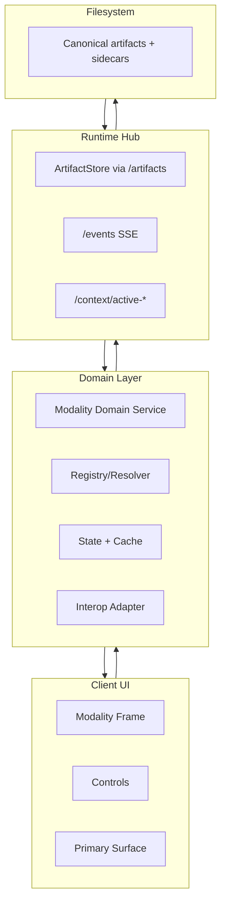

# Multi-Modality Implementation Guide

Status: Baseline for implementation  
Audience: Any coding agent implementing or extending a modality  
Scope: Cross-cutting architecture, contracts, and design patterns shared by all modalities

Related modality guides:
- `docs/architecture/editor-modality-implementation-guide.md`
- `docs/architecture/drawing-modality-implementation-guide.md`
- `docs/architecture/presentation-modality-implementation-guide.md`
- `docs/architecture/annotation-modality-implementation-guide.md`
- `docs/architecture/comment-modality-implementation-guide.md`
- `docs/architecture/voice-modality-implementation-guide.md`
- `docs/architecture/diff-review-modality-implementation-guide.md`
- `docs/architecture/browser-preview-snapshot-implementation-guide.md`

---

## 1. Purpose

This guide defines shared implementation rules so each modality can evolve independently while still interoperating cleanly.

Goals:
1. Keep all modalities consistent in runtime behavior.
2. Reduce duplicate infrastructure code.
3. Make cross-modality actions predictable (`Edit`, `Comment`, `Annotate`, `Open at location`).
4. Improve reliability through common contracts and tests.

---

## 2. Modalities in Scope

Current:
1. Whiteboard / drawing
2. Presentation
3. Editor
4. Annotation
5. Comment
6. Voice
7. Diff review

Future candidates:
1. Rich document viewers (PDF/table/html)
2. Task workflow/dashboard
3. Browser preview (full live mode beyond snapshot MVP)

---

## 3. Shared Design Principles

1. Local-first and filesystem-centric.
2. Single writer discipline through runtime ArtifactStore.
3. Domain-first architecture:
   - UI components render state.
   - Domain services own file/state logic.
4. Deterministic canonical artifacts:
   - Each modality has a canonical source representation.
   - Projection/render caches are derived.
5. Progressive disclosure for agent context:
   - summary first
   - detail/snapshot on demand
6. Inter-modality decoupling with explicit contracts:
   - no direct component-to-component coupling across modalities.

---

## 4. Standard Architecture Pattern

Each modality should follow the same layered pattern.



Mandatory characteristics:
1. UI never writes filesystem directly.
2. Domain layer is the only place with modality file logic.
3. Runtime emits `FILE_CHANGED`; domain decides invalidation/reload behavior.

---

## 5. Shared Contracts

## 5.1 Artifact Contract

All write operations:
1. Go through runtime `/artifacts/*`.
2. Are atomic and serialized.
3. Produce event entries for downstream refresh.

## 5.2 Event Contract

All modalities must handle:
1. `FILE_CHANGED` for active artifact.
2. source-of-change behavior:
   - self update (no disruptive reload)
   - external/agent update (refresh or conflict flow)

## 5.3 Active Context Contract

Each modality should expose:
1. `POST /context/active-<modality>`
2. `GET /context/active-<modality>`

Purpose:
1. lets tools and agent read current focus
2. enables clean inter-modality launch and jump behavior

## 5.4 TargetRef Contract (Cross-Modality Navigation)

All inter-modality launches should pass a common `TargetRef`.

```ts
type TargetType = "file" | "presentation" | "slide" | "diagram" | "pdf" | "image" | "diff" | "whiteboard";

type TargetRef = {
  targetType: TargetType;
  path: string;
  location?: {
    startLine?: number;
    endLine?: number;
    slideIndex?: number;
    page?: number;
    objectId?: string;
  };
  sourceModality?: "editor" | "presentation" | "annotation" | "comment" | "whiteboard";
};
```

Notes:
1. location is optional by design.
2. each modality can map only the fields it understands.

---

## 6. Shared State and Identity Rules

1. Canonical IDs:
   - stable keys for tabs, threads, slides, diagram nodes where applicable.
2. Canonical path normalization:
   - avoid duplicate references to same artifact.
3. Bounded cache policy:
   - all caches are capped by count and/or size.
4. Session restore policy:
   - restore active target and key view state.

---

## 7. Shared Interoperability Flows

## 7.1 Presentation -> Editor
1. Presentation control `Edit` creates `TargetRef` for deck file.
2. Editor `openFileAt` opens canonical tab and optional location.

## 7.2 Annotation -> Comment
1. Annotation sends snapshot + `TargetRef`.
2. Comment modality creates persistent thread with snapshot metadata.

## 7.3 Comment -> Source Modality
1. Comment click emits `TargetRef`.
2. Target modality opens and focuses relevant location.

## 7.4 Any Modality -> Agent Context
1. Serialize artifact context with lightweight summary.
2. Attach detailed content/snapshot only when needed.

---

## 8. Shared Testing Strategy

Every modality should have:
1. Unit tests for pure domain helpers (path mapping, parser, invalidation, reducers).
2. Contract tests for runtime endpoint payloads and event handling.
3. Component tests for mode switches and key user interactions.
4. E2E smoke for:
   - open artifact
   - update/save/send
   - external change refresh
5. Cross-modality regression smoke for launch handoffs using `TargetRef`.

---

## 9. Shared Observability and Reliability

Minimum telemetry/log events:
1. modality opened/closed
2. artifact loaded/saved
3. external change handled
4. cross-modality launch success/failure

Reliability rules:
1. user-facing operations should return actionable errors.
2. destructive actions should require explicit confirmation.
3. all sidecar schemas should be versioned (`schemaVersion`).

---

## 10. Shared Security and Scope Rules

1. Path safety:
   - normalize and validate artifact paths under workspace root.
2. No uncontrolled runtime commands from modality UI.
3. Limit binary payload sizes and rendering dimensions (especially image/PDF).

---

## 11. Modality Implementation Checklist

Before declaring a modality ready:
1. Canonical artifact format defined.
2. Domain layer implemented.
3. Runtime read/write/event contracts implemented.
4. Active context endpoint implemented.
5. `TargetRef` open behavior implemented.
6. Bounded cache and restore behavior implemented.
7. Unit + integration + E2E coverage added.
8. Cross-modality regression scenario added.

---

## 12. Topics to Apply Immediately to Existing Guides

Recommended immediate alignment work:
1. Editor:
   - explicitly reference this guide as cross-cutting baseline.
   - retain `openFileAt(path, selection?)` as required interop hook.
2. Presentation:
   - formalize `TargetRef` payload for `Edit/Comment/Annotate` buttons.
3. Annotation:
   - store `TargetRef` alongside snapshot output metadata.
4. Comment:
   - use `TargetRef` as thread context pointer instead of modality-specific ad hoc fields.
