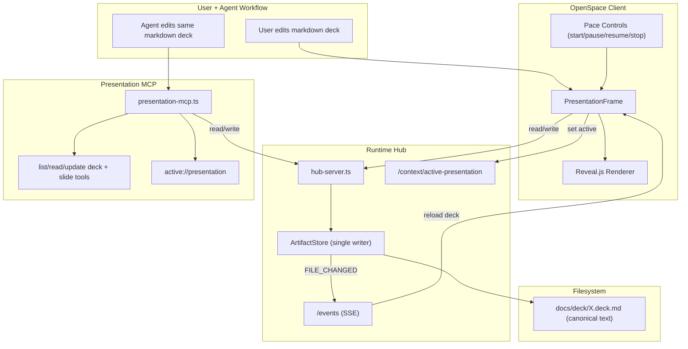

# Presentation Modality Implementation Guide

Status: Ready for implementation  
Audience: Any coding agent implementing the first version end-to-end  
Scope: Markdown-first presentation modality (no visual WYSIWYG editor)
Cross-cutting baseline: `docs/architecture/multi-modality-implementation-guide.md`.

---

## 1. User Stories

### US-PRES-001 Generate Deck from Existing Artifacts
As a user, I can ask the agent to generate a presentation deck from current project artifacts (whiteboard, requirements, chat context), so I can quickly produce a structured presentation.

Acceptance criteria:
- Agent can create `docs/deck/<name>.deck.md`.
- File appears in workspace file tree.
- User can open it in presentation view.

### US-PRES-002 User + Agent Co-Edit Same Text Deck
As a user, I can edit deck markdown directly, and the agent can edit the same file, so collaboration is simple and transparent.

Acceptance criteria:
- User edits are saved through runtime artifact path.
- Agent edits are visible to user without reload (SSE-driven refresh).
- Last write wins (MVP conflict policy).

### US-PRES-003 Slide-Level Agent Updates
As a user, I can ask the agent to modify one slide only, so I keep control of the rest of the deck.

Acceptance criteria:
- Agent can read/update slide by index.
- Unchanged slides remain unchanged.
- Errors are returned for out-of-range index.

### US-PRES-004 Agent-Led Presentation with Pace
As a user, I can run presentation playback with configurable pace, so the deck can be presented automatically.

Acceptance criteria:
- User can set seconds-per-slide.
- Start/pause/resume/stop controls exist.
- UI exposes state: `running | paused | stopped`.

### US-PRES-005 Future Narration Compatibility
As a user, I can later enable narration without changing deck format, so phase-2 voice integration is straightforward.

Acceptance criteria:
- Deck format includes notes/script conventions now.
- Playback model separates pacing from narration toggles.

### US-PRES-006 Export Deck
As a user, I can export the deck, so I can share with external audiences.

Acceptance criteria:
- MVP export path is defined and implemented (PDF first).
- Export errors are surfaced clearly.

### US-PRES-007 (Deferred) Switch from Presentation to Source Editing
As a user, when viewing slides, I want an `Edit` action in the presentation controls that switches to the underlying markdown source file, so I can quickly fix content and return to presenting.

Acceptance criteria (future phase):
- Control panel includes `Edit` button.
- `Edit` opens/focuses the canonical `.deck.md` in the editor modality.
- User can switch back to presentation mode without losing current context.

### US-PRES-008 (Deferred) Comment/Annotate Entry Points
As a user, when viewing slides, I want `Comment` and `Annotate` actions in the presentation controls, so I can create review notes and visual feedback tied to the deck.

Acceptance criteria (future phase):
- Control panel includes `Comment` and `Annotate` buttons.
- Buttons route into comment/annotation modalities once implemented.
- Deck context (file path + slide index) is passed to those modalities.

---

## 2. Requirements

## 2.1 Functional Requirements

### FR-PRES-001 Canonical Deck File
- Canonical artifact path: `docs/deck/<name>.deck.md`.
- Slide delimiter: `---`.
- Optional YAML frontmatter for deck metadata.

### FR-PRES-002 Presentation Rendering
- Render canonical markdown deck in-client using Reveal.js.
- Support basic markdown slide content and speaker notes.

### FR-PRES-003 Active Context for Agent
- Runtime supports:
  - `POST /context/active-presentation`
  - `GET /context/active-presentation`
- MCP resource `active://presentation` returns active deck content.

### FR-PRES-004 MCP Tooling
- Required tools:
  - `list_presentations`
  - `read_presentation`
  - `update_presentation`
  - `read_slide`
  - `update_slide`
- Tools operate on canonical markdown files only.

### FR-PRES-005 Realtime Sync
- Presentation view subscribes to runtime `/events`.
- On `FILE_CHANGED` for active deck where actor != `user`, view reloads.

### FR-PRES-006 Playback Control
- Local playback state machine supports:
  - `stopped`, `running`, `paused`
- Timer-driven auto-advance using configured pace.

### FR-PRES-007 Export
- Provide export action for PDF (Reveal print pipeline or browser print route).

### FR-PRES-008 (Deferred) Presentation Control Panel Mode Actions
- Control panel should be designed to host:
  - navigation (`next`, `back`)
  - playback controls
  - `Edit`, `Comment`, `Annotate` actions
- In MVP, `Edit/Comment/Annotate` may render as hidden or disabled feature flags.

### FR-PRES-009 TargetRef Interop Emission
- Presentation modality emits cross-modality `TargetRef` payloads for:
  - `Edit` action (to editor modality)
  - `Comment` action (to comment modality)
  - `Annotate` action (to annotation modality)
- Slide-scoped actions include `location.slideIndex`.

## 2.2 Non-Functional Requirements

### NFR-PRES-001 Single Writer Discipline
- All writes must go through runtime `ArtifactStore`.
- No direct filesystem writes from client.

### NFR-PRES-002 Determinism
- Slide read/update logic must be deterministic for same markdown input.

### NFR-PRES-003 Failure Transparency
- Tool responses and UI messages must include actionable errors.

### NFR-PRES-004 Minimal Cognitive Overhead
- Keep format text-native; do not introduce `DeckIR` in MVP.

### NFR-PRES-005 Test Coverage
- Unit tests for parser/manipulation and MCP tools.
- UI tests for playback and SSE refresh.
- E2E smoke for open/edit/agent-update/playback.

### NFR-PRES-006 Cross-Modality Predictability
- Repeated action clicks for the same deck + slide must emit identical `TargetRef`.

---

## 3. Technology Architecture

## 3.1 Chosen Technologies (MVP)
- Renderer: Reveal.js (web).
- Canonical format: Markdown + frontmatter.
- Runtime API: existing hub server (`/artifacts`, `/events`) plus active presentation context endpoints.
- MCP stack: `@modelcontextprotocol/sdk` in runtime-hub.
- Tests:
  - Runtime: Vitest.
  - Client unit/component: Vitest + Testing Library.
  - E2E: Playwright.

## 3.2 Architecture Components
- Client:
  - `PresentationFrame` component.
  - Playback controls + state.
  - SSE listener for remote updates.
- Runtime hub:
  - Active presentation context in-memory store.
  - Existing `ArtifactStore` as write spine.
- MCP server:
  - Presentation MCP with resource + tools.
- Filesystem:
  - Canonical deck files under `docs/deck/`.

## 3.3 Architecture Diagram (Mermaid)



## 3.4 End-to-End Flows

### Flow A: User Opens Deck
1. User selects `.deck.md` in file tree.
2. App sets active presentation path.
3. `PresentationFrame` reads content via OpenCode client file API.
4. Frame posts active context to runtime.
5. Reveal renders slides.

### Flow B: Agent Updates Deck
1. Agent calls `update_presentation` or `update_slide`.
2. MCP writes via runtime `/artifacts`.
3. `ArtifactStore` emits `FILE_CHANGED`.
4. Client SSE listener reloads deck content.
5. Reveal re-renders.

### Flow C: Auto-Advance Presentation
1. User sets pace (seconds).
2. User presses Start.
3. Timer advances slides using Reveal API.
4. Pause/resume/stop manipulate timer and state.

---

## 4. Data Structures and Contracts

## 4.1 Deck Metadata (frontmatter)

```yaml
---
title: "Quarterly Architecture Review"
theme: "black"
paceSeconds: 30
transition: "slide"
---
```

Notes:
- All fields optional.
- Unknown keys allowed and preserved.

## 4.2 In-Client State

```ts
type PlaybackStatus = "stopped" | "running" | "paused";

interface PresentationState {
  filePath: string;               // docs/deck/<name>.deck.md
  markdown: string;               // full canonical content
  slideCount: number;
  currentSlideIndex: number;
  playback: {
    status: PlaybackStatus;
    paceSeconds: number;          // default 30
    startedAt?: number;
    timerId?: number;
  };
  connection: {
    sseConnected: boolean;
  };
}
```

## 4.3 Slide Section Manipulation Contract

Helper functions (pure):

```ts
interface DeckSections {
  frontmatter?: string;
  slides: string[]; // each slide markdown block
}

function parseDeckSections(markdown: string): DeckSections;
function serializeDeckSections(sections: DeckSections): string;
function readSlide(markdown: string, index: number): string;
function updateSlide(markdown: string, index: number, slideMarkdown: string): string;
```

Behavior:
- Index is 0-based.
- Preserve frontmatter and unchanged slide content exactly.
- Throw clear error for invalid index.

## 4.4 MCP Tool Schemas

### `list_presentations`
Input: none  
Output: text list of deck names from `docs/deck/*.deck.md`.

### `read_presentation`
Input:

```json
{ "name": "optional deck name without extension" }
```

Output: full markdown.

### `update_presentation`
Input:

```json
{ "name": "optional", "markdown": "full deck markdown" }
```

Output: success + effective path.

### `read_slide`
Input:

```json
{ "name": "optional", "index": 2 }
```

Output: markdown for requested slide.

### `update_slide`
Input:

```json
{ "name": "optional", "index": 2, "markdown": "# Updated Slide\n..." }
```

Output: success + updated index + path.

## 4.5 Active Resource Contract
- Resource URI: `active://presentation`
- Read behavior:
  - If active deck exists: return markdown with mime `text/markdown`.
  - Else: return plain text message `"No presentation is currently active in the user's view."`.

## 4.6 TargetRef Emission Contract

```ts
type TargetRef = {
  targetType: "file" | "slide";
  path: string;
  location?: { slideIndex?: number };
  sourceModality?: "presentation";
};
```

Mappings:
- `Edit`: `{ targetType: "file", path: deckPath, location: { slideIndex } }`
- `Comment`: `{ targetType: "slide", path: deckPath, location: { slideIndex } }`
- `Annotate`: `{ targetType: "slide", path: deckPath, location: { slideIndex } }`

---

## 5. Exact Implementation Details

## 5.1 Files to Add

Runtime:
- `runtime-hub/src/mcp/presentation-mcp.ts`
- `runtime-hub/src/mcp/lib/deck-sections.ts` (shared parser/updater helpers for MCP tools)
- `runtime-hub/src/mcp/presentation-mcp.test.ts`

Client:
- `openspace-client/src/components/presentation/PresentationFrame.tsx`
- `openspace-client/src/components/presentation/PresentationControls.tsx`
- `openspace-client/src/components/presentation/presentation-deck.ts` (parse/update helpers)
- `openspace-client/src/components/presentation/presentation-target-ref.ts`
- `openspace-client/src/components/presentation/PresentationFrame.test.tsx`
- `openspace-client/src/components/presentation/presentation-deck.test.ts`
- `openspace-client/src/components/presentation/presentation-target-ref.test.ts`

Docs/design:
- `docs/deck/README.md` (deck format + conventions)

## 5.2 Files to Modify

Runtime:
- `runtime-hub/src/hub-server.ts`
  - add active presentation context endpoints.
- `runtime-hub/package.json`
  - add script: `"start:presentation": "tsx src/mcp/presentation-mcp.ts"`

Client:
- `openspace-client/package.json`
  - add reveal.js dependency.
- `openspace-client/src/context/LayoutContext.tsx`
  - add `activePresentationPath` state and setter.
- `openspace-client/src/components/FileTree.tsx`
  - route `.deck.md` clicks to presentation path.
- `openspace-client/src/App.tsx`
  - split right pane handling for whiteboard vs presentation.
- `openspace-client/opencode.json` and root `opencode.json`
  - register presentation MCP server.

## 5.3 Dependency Additions

Client:
- `reveal.js`
- optional: `gray-matter` (if frontmatter parsing helper is preferred)

Runtime:
- no required new runtime dependency for MVP parser; plain string parser is enough.

## 5.4 UI Integration Pattern

In `App.tsx`:
- Keep current whiteboard behavior.
- Add presentation pane with mutually exclusive display:
  - if `activeWhiteboardPath` show whiteboard.
  - else if `activePresentationPath` show presentation.

In `FileTree.tsx`:
- Existing whiteboard extensions remain.
- Add `.deck.md` detection:
  - `setActivePresentationPath(node.path)`.

## 5.5 Playback Implementation

`PresentationFrame` should expose:
- `startPlayback(paceSeconds)`
- `pausePlayback()`
- `resumePlayback()`
- `stopPlayback()`

Timer logic:
- Use `window.setInterval`.
- On each tick:
  - if not last slide: Reveal `next()`
  - else stop and set `stopped`.

Pause behavior:
- clear timer, keep current slide.

Resume behavior:
- restart timer from current slide.

## 5.6 Notes/Narration Convention (Phase-Ready)

Inside slide markdown:
- Speaker notes via standard reveal notes format:
  - `Note:` block or notes separator depending renderer setup.

MVP:
- Preserve notes text.
- Do not synthesize voice yet.

---

## 6. Task Plan with Build Instructions and Tests

## Task 1: Deck Text Utility Module
Goal: deterministic parse/read/update slide operations.

Build:
1. Add `presentation-deck.ts` in client and `deck-sections.ts` in runtime-hub (same logic or shared package later).
2. Implement:
   - frontmatter split
   - slide split by `\n---\n` with edge-case handling
   - index-safe read/update

Expected tests:
- Parses deck with and without frontmatter.
- Reads correct slide index.
- Throws on negative/out-of-range index.
- Updates one slide and preserves others exactly.
- Round-trip serialize/parse consistency.

Test files:
- `openspace-client/src/components/presentation/presentation-deck.test.ts`
- `runtime-hub/src/mcp/presentation-mcp.test.ts` (utility unit tests can live here too)

## Task 2: Runtime Active Presentation Context
Goal: runtime tracks active deck path.

Build:
1. Modify `hub-server.ts`:
   - add `activePresentation: string | null`.
   - add `POST /context/active-presentation`.
   - add `GET /context/active-presentation`.

Expected tests:
- POST stores path.
- GET returns latest value.
- Null default before set.

## Task 3: Presentation MCP Server
Goal: full MCP surface for deck operations.

Build:
1. Add `presentation-mcp.ts` mirroring whiteboard MCP server structure.
2. Implement resource:
   - `active://presentation`.
3. Implement tools:
   - list/read/update presentation
   - read/update slide
4. Resolve file path rules:
   - named deck: `docs/deck/<name>.deck.md`
   - unnamed: use active presentation context.

Expected tests:
- List returns only `.deck.md` names.
- Read missing file returns isError.
- Update writes and returns success.
- Read/update slide works and preserves deck shape.
- Active resource behavior for active/missing context.

## Task 4: Register Presentation MCP in Config
Goal: expose tools to agent runtime.

Build:
1. Update root `opencode.json`.
2. Update `openspace-client/opencode.json`.
3. Add npm script in runtime-hub package for local run.

Expected tests/checks:
- Config JSON valid.
- MCP server starts and lists tools.

## Task 5: Presentation Layout State in Client
Goal: support opening presentation pane.

Build:
1. Extend `LayoutContext.tsx` with:
   - `activePresentationPath: string | null`
   - setter.
2. Update consumers (`App.tsx`, `FileTree.tsx`).

Expected tests:
- Context provides new state.
- Toggling updates visible pane selection.

## Task 6: File Tree Routing for Deck Files
Goal: clicking deck file opens presentation view.

Build:
1. In `FileTree.tsx`, detect `.deck.md`.
2. Set active presentation path.
3. Ensure whiteboard and presentation openings are not conflicting.

Expected tests:
- Clicking `.deck.md` calls `setActivePresentationPath`.
- Existing `.graph.mmd` behavior unchanged.

## Task 7: PresentationFrame + Reveal Renderer
Goal: render markdown slides and sync with runtime.

Build:
1. Add `PresentationFrame.tsx`.
2. On mount:
   - read deck markdown using OpenCode file API.
   - post active context to runtime.
   - connect SSE and reload on remote change.
3. Render with Reveal.js.
4. Show basic error/loading states.

Expected tests:
- Loads markdown and renders first slide.
- Handles missing file gracefully.
- SSE event for same file triggers reload.
- SSE event for other file ignored.

## Task 8: Playback Controls
Goal: pace-driven presentation mode.

Build:
1. Add `PresentationControls.tsx`.
2. Wire to `PresentationFrame` playback methods.
3. Default pace from frontmatter `paceSeconds` or fallback `30`.
4. Display state chip (`running`, `paused`, `stopped`).

Expected tests:
- Start sets running and schedules timer.
- Pause stops timer without resetting slide.
- Resume restarts timer.
- Stop resets state and clears timer.
- End-of-deck auto-stops.

## Task 8A: TargetRef Interop Actions
Goal: deterministic cross-modality launch payloads.

Build:
1. Implement `presentation-target-ref.ts`.
2. Map active deck + current slide index to `TargetRef`.
3. Wire control panel action handlers (`Edit`, `Comment`, `Annotate`) to emit the mapped payload.

Expected tests:
- emitted `Edit` payload targets canonical deck file.
- emitted `Comment` and `Annotate` payloads target same slide index.
- same deck+slide emits stable payload on repeated clicks.

## Task 9: App Shell Integration
Goal: show presentation pane in main layout.

Build:
1. Update `App.tsx` right-pane logic.
2. Ensure close button exists for presentation pane (parallel to whiteboard UX).
3. Keep terminal and sidebars behavior unchanged.

Expected tests:
- Pane shows when `activePresentationPath` is set.
- Closing pane clears path.
- Whiteboard pane still works.

## Task 10: Export (PDF MVP)
Goal: shareable output.

Build:
1. Add export action in `PresentationControls`.
2. Implement initial PDF path:
   - Reveal print mode + browser print or headless export route.
3. Surface errors to user toast.

Expected tests:
- Export action triggers expected flow.
- Errors display user feedback.

## Task 11: E2E Smoke Coverage
Goal: confidence in full flow.

Build:
1. Add Playwright spec:
   - create/open deck
   - render preview
   - trigger simulated agent update (write via runtime endpoint)
   - verify UI refresh
   - start/pause/stop playback
   - verify `TargetRef` payload emission from action handlers

Expected tests:
- Entire path passes on CI.

---

## 7. Test Matrix (Minimum Expected)

Runtime unit:
- `presentation-mcp.test.ts`
  - tools, resource, errors, slide operations.

Client unit/component:
- `presentation-deck.test.ts`
  - parse/update determinism.
- `PresentationFrame.test.tsx`
  - load, SSE sync, state transitions.
- `PresentationControls` tests
  - user control behavior.
- `presentation-target-ref.test.ts`
  - action payload mapping stability.

E2E:
- `e2e/presentation.spec.ts`
  - open/edit/update/playback smoke.
  - interop action payload flow.

Regression:
- Existing whiteboard tests must continue passing.

---

## 8. Definition of Done

Implementation is done when all are true:

1. User can open `.deck.md` and render slides.
2. Agent can list/read/update deck and slides via MCP.
3. UI reflects agent deck updates through SSE.
4. Playback pace controls function correctly.
5. Export path works for at least PDF.
6. Interop actions emit deterministic `TargetRef` payloads.
7. Unit/component/e2e tests pass.
8. No regressions in whiteboard modality flows.

---

## 9. Explicit Non-Goals (Current Phase)

1. No visual WYSIWYG slide editor.
2. No `DeckIR` or complex canonical/projection dual-model.
3. No advanced collaborative merge/conflict resolution.
4. No narration synthesis in MVP (only phase-ready conventions).
5. No implemented `Edit/Comment/Annotate` presentation actions yet (only reserved UX hooks).

This keeps delivery aligned with the current decision: **markdown-first presentation collaboration with reliable runtime + MCP integration**.

---

## 10. Deferred UX Note: Presentation Control Panel Extensions

When editor/comment/annotation modalities are available, extend presentation controls with:

1. `Edit`:
- Switch from presentation mode to editor mode on the canonical deck file.
- Preserve presentation context (current slide index) for return navigation.

2. `Comment`:
- Open comment modality scoped to current deck + slide.
- Attach context payload:
  - `filePath`
  - `slideIndex`
  - `slideTitle` (if available)

3. `Annotate`:
- Open annotation modality scoped to current slide surface.
- Pass same context payload as comments plus viewport metadata if available.

Implementation timing: post-MVP, after dedicated comment/annotation modalities are implemented.
