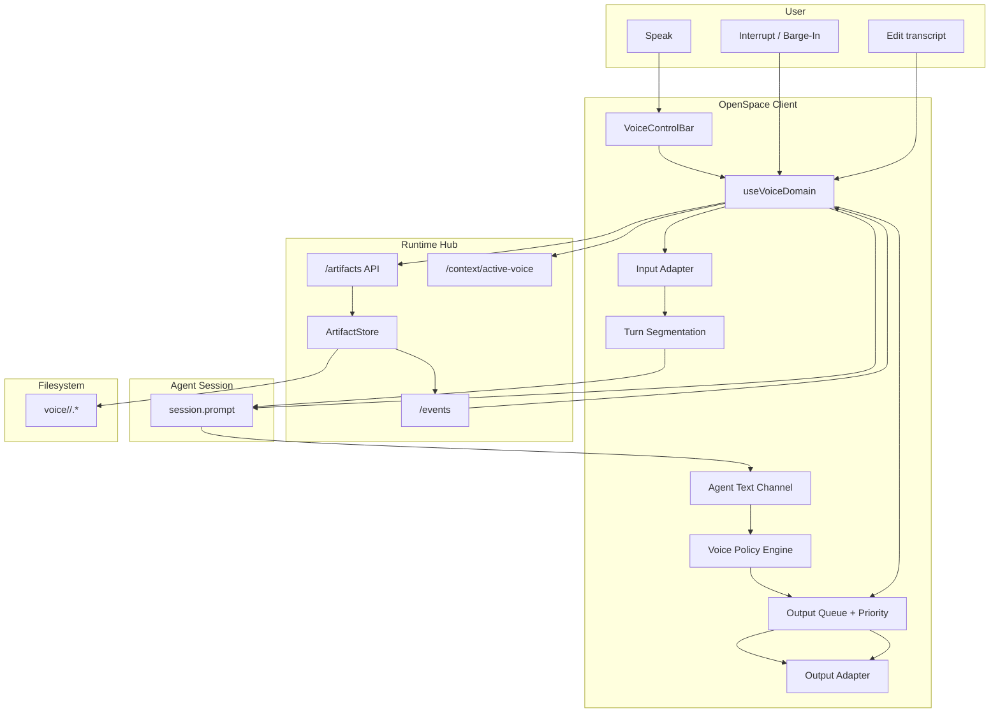

# Voice Modality Implementation Guide

Status: Ready for implementation
Audience: Any coding agent implementing end-to-end
Scope: First-class voice input + voice output (TTS/narration), including interruption, streaming, and cross-modality integration
Cross-cutting baseline: `docs/architecture/multi-modality-implementation-guide.md`.

---

## 1. User Stories

### US-VOI-001 Start/Stop Voice Input Quickly
As a user, I can start and stop voice capture quickly, so voice feels like a native input method instead of a slow add-on.

Acceptance criteria:
- Voice input has explicit controls (`start`, `stop`, `interrupt`).
- UI shows live status (`idle`, `listening`, `processing`, `error`).
- Starting/stopping does not require leaving current modality.

### US-VOI-002 See and Correct Transcript Before Send
As a user, I can review and edit transcript text before sending it to the agent.

Acceptance criteria:
- Interim and final transcript states are visible.
- User can edit final transcript before submit.
- Submit action sends the edited text, not raw interim text.

### US-VOI-003 Send Voice Prompt to Active Session
As a user, I can speak a prompt and send it to the active chat session.

Acceptance criteria:
- Final transcript is sent through existing session prompt path.
- Optional audio attachment can be included by policy.
- Failure states are actionable and non-silent.

### US-VOI-004 Keep Audio + Transcript as Durable Artifacts
As a user, voice interactions are preserved as artifacts, so non-text truth is not lost.

Acceptance criteria:
- Audio file is saved when capture policy requires it.
- Transcript artifact is saved and linked to the audio artifact.
- Artifacts are discoverable in workspace/project context.

### US-VOI-005 Hear Agent Responses by Configurable Policy
As a user, I can choose when the agent should speak (`off`, `on-demand`, `on-completion`, `on-error`, `always`).

Acceptance criteria:
- Policy is configurable and persisted.
- TTS follows configured policy deterministically.
- Policy can be changed at runtime without restart.

### US-VOI-006 Interrupt Speech Instantly
As a user, I can interrupt current TTS playback immediately (button/shortcut), so voice never traps interaction flow.

Acceptance criteria:
- Interrupt command stops current playback within low latency bounds.
- Queue behavior after interrupt is predictable.

### US-VOI-007 Get Brief Narrator-Style Summaries by Default
As a user, when TTS is enabled, spoken responses are concise by default and point to deeper artifacts when needed.

Acceptance criteria:
- Default spoken output is short and summary-oriented.
- Long-form narration requires explicit user choice or mode.

### US-VOI-008 Choose Input/Output Devices and Language
As a user, I can configure mic/output device and language so voice works with my setup.

Acceptance criteria:
- Voice settings support language/device selection.
- Invalid/unavailable device selection produces clear fallback behavior.

### US-VOI-009 Use Voice During Presentation Playback (Future-Compatible)
As a user, presentation modality can later request narration from voice output without changing deck format.

Acceptance criteria:
- Voice output API supports paced chunk playback.
- Presentation can call voice output through stable interface.

### US-VOI-010 Cross-Modality Invocation
As a user, I can invoke voice capture/output while remaining in editor/presentation/drawing contexts.

Acceptance criteria:
- Voice controls are shell-level and modality-independent.
- Voice does not require modality context switches.

### US-VOI-011 User Barge-In (Interrupt TTS by Speaking)
As a user, I can start speaking while the AI is talking, and the system immediately stops TTS and switches to listening.

Acceptance criteria:
- While TTS is active, detected user speech can interrupt playback.
- TTS interruption is fast and deterministic.
- System transitions to voice input state without manual button press (when barge-in is enabled).

### US-VOI-012 Agent Mid-Turn Interruption (Conversational Clarification)
As a user, while I am giving a long voice input, the AI can interrupt with a short clarification question, so we can have a natural back-and-forth conversation.

Acceptance criteria:
- During active voice input, agent can issue an interrupt prompt.
- User recording is paused/segmented safely (no data loss).
- Conversation timeline preserves both segments and interruption event metadata.

### US-VOI-013 Streaming Conversation (No Full-Wait Turns)
As a user, voice interaction feels immediate: my speech is transmitted in chunks while I speak, and AI speech starts as soon as the first TTS chunks are ready.

Acceptance criteria:
- Input audio/transcript chunks are streamed during capture, not only after full stop.
- TTS playback can start from early chunks before full response synthesis completes.
- End-to-end turn latency is reduced versus full-buffer behavior.

### US-VOI-014 Voice-Over as a Concise Narrator for Text Responses
As a user, when the main agent response is in text, the voice channel can provide short summaries/status cues instead of reading full text verbatim.

Acceptance criteria:
- Voice output can use a concise narrator style while text remains detailed.
- Narrator speech can include progress/status phrasing (for example, "short version" updates).
- User can choose this behavior via voice output policy/mode.

---

## 2. Requirements

## 2.1 Functional Requirements

### FR-VOI-001 First-Class Modality
- Voice is a first-class modality in shell state (not a plugin-only afterthought).
- Voice controls are available globally in active workspace sessions.

### FR-VOI-002 Voice Input Lifecycle
- Required input operations:
  - `start()`
  - `stop()`
  - `interrupt()`
  - status query (`idle | listening | processing | error`)
- Input lifecycle must be observable in UI and test harness.

### FR-VOI-003 Transcript Lifecycle
- Support interim transcript updates and finalized transcript output.
- Support user edit step before submit (configurable bypass allowed).
- Final submitted content must be explicit and auditable.

### FR-VOI-004 Session Prompt Integration
- Final transcript submits through existing session prompt path.
- Optional attachment path for captured audio (`file` part) is supported.

### FR-VOI-005 Voice Artifact Persistence
- Voice capture can persist:
  - raw audio artifact
  - transcript artifact
  - metadata link between them
- Writes must go through runtime `/artifacts/*` + `ArtifactStore`.

### FR-VOI-006 Voice Output Lifecycle
- Required output operations:
  - `speak(content, options?)`
  - `enqueue(chunk, metadata?)`
  - `pause()`
  - `resume()`
  - `interrupt()`
  - status query (`idle | speaking | paused | error`)

### FR-VOI-007 Output Policy Engine
- Implement output policy modes:
  - `off`
  - `on-demand`
  - `on-completion`
  - `on-error`
  - `always`
- Policy decides if/when a given assistant response is spoken.

### FR-VOI-008 Output Priority and Queueing
- Output queue supports priorities (`low | normal | high | critical`).
- `critical` may preempt lower-priority audio according to deterministic rules.

### FR-VOI-009 Brevity and Narration Modes
- Default mode speaks concise summaries.
- Long-form narration is explicit mode (presentation/focus mode), not default.

### FR-VOI-010 Configuration Surface
- Persisted configuration includes:
  - language
  - mic device
  - output device
  - speech rate/pitch/volume
  - output policy
  - optional auto-send behavior

### FR-VOI-011 Active Voice Context Endpoint
- Runtime supports:
  - `POST /context/active-voice`
  - `GET /context/active-voice`
- Context contains current voice mode/config snapshot (sanitized).

### FR-VOI-012 Adapter-Based Engine Abstraction
- Voice input and output are adapter-driven behind stable interfaces.
- MVP adapters can be browser-native; higher-quality adapters are pluggable.

### FR-VOI-013 Presentation Narration Hook (Phase-Ready)
- Presentation modality can request paced narration through voice output API.
- Integration contract is stable even if narration is not fully enabled in MVP.

### FR-VOI-014 TargetRef-Ready Cross-Modality Launch
- Voice-originated actions that open other modalities emit standardized `TargetRef`.
- At minimum support file-level opens for editor follow-up workflows.

### FR-VOI-015 Path and Data Safety
- Artifact paths are normalized/validated under workspace root.
- Sensitive payloads (raw audio/transcripts) are not logged unsafely.

### FR-VOI-016 User Voice Barge-In Policy
- Voice modality supports configurable user barge-in while TTS is speaking:
  - `disabled` (default-safe)
  - `enabled`
- When enabled, speech activity while TTS is active triggers:
  1. immediate TTS interrupt
  2. input state transition to `listening`
  3. creation of a new input segment linked to the interrupted output event.

### FR-VOI-017 Agent Interruption During User Input
- Voice modality supports optional agent-driven interruption during long user input.
- Interruption behavior:
  - user input stream is paused or segment-closed with metadata
  - agent interruption utterance is spoken with high priority
  - user can resume speaking into a new segment after interruption
- Interruption guardrails must exist:
  - minimum input duration before interruption
  - cooldown between interruptions
  - max interruptions per user turn.

### FR-VOI-018 Turn Segmentation and Timeline Metadata
- Voice conversation timeline must persist segment boundaries and interruption markers.
- Minimum metadata per segment:
  - `segmentId`
  - `speaker` (`user` | `agent`)
  - `startedAt`, `endedAt`
  - `interruptedBy` (optional)
  - `continuedFromSegmentId` (optional)

### FR-VOI-019 Streaming Voice Input Transport
- Voice input supports chunked transport while user is speaking.
- System may stream:
  - audio chunks
  - incremental transcript chunks
- Streaming is resilient to partial chunk loss/retry without corrupting final turn assembly.

### FR-VOI-020 Streaming TTS Output Playback
- Voice output supports incremental/chunked playback.
- Playback can begin before full text-to-audio conversion of the complete response.
- Queue and interruption semantics remain deterministic under streaming mode.

### FR-VOI-021 Dual-Channel Response Strategy (Text vs Voice)
- Voice output content strategy is decoupled from text response body.
- For the same assistant turn:
  - text channel may contain full detailed response
  - voice channel may contain concise summary/status narration
- Mapping policy is configurable (for example: `verbatim`, `summary`, `status-only`).

### FR-VOI-022 Narrator Content Safety
- Concise voice summaries must not materially contradict the detailed text response.
- When details are omitted in voice, narration should clearly indicate it is a summary.
- If confidence in summary fidelity is low, fallback is `status-only` cue directing user to text.

## 2.2 Non-Functional Requirements

### NFR-VOI-001 Latency
- Start/stop/interrupt must feel immediate.
- TTS start latency should be low enough for conversational use.

### NFR-VOI-002 Reliability and Fallback
- If primary voice engine fails, system surfaces clear fallback and recovery options.
- Voice failure must not block text-based workflows.

### NFR-VOI-003 Determinism
- Output policy decisions are deterministic for same config + event input.

### NFR-VOI-004 Single Writer Discipline
- No direct filesystem writes from client voice components.

### NFR-VOI-005 Privacy and Local-First Defaults
- Prefer local processing/storage for MVP where possible.
- Explicit user action required for sending voice artifacts externally.

### NFR-VOI-006 Testability
- Input/output adapters are mockable.
- Policy engine and queue logic are unit-testable.
- End-to-end flows are automatable.

### NFR-VOI-007 Accessibility
- Full keyboard support for core voice controls.
- Clear visual indicators for listening/speaking/error states.

### NFR-VOI-008 Cross-Modality Predictability
- Voice actions that launch other modalities produce stable `TargetRef` payloads.

### NFR-VOI-009 Interruption Latency
- Barge-in interrupt path (`speech detected -> TTS stop`) must be low-latency and consistent enough for conversational feel.

### NFR-VOI-010 Conversation Safety
- Interruption features must never discard captured user audio/transcript silently.
- If interruption transition fails, system falls back to non-interrupt flow with explicit user feedback.

### NFR-VOI-011 Stream-First Responsiveness
- Voice pipeline is stream-first by default (input and output).
- System avoids full-buffer waits unless explicitly configured for compatibility/debug.

### NFR-VOI-012 Incremental Playback Smoothness
- Chunked TTS playback should avoid audible gaps/stutter at chunk boundaries under normal network/CPU conditions.

### NFR-VOI-013 Channel Consistency
- Dual-channel behavior must remain predictable: users should understand that voice may be summary-level while text is canonical detail.

---

## 3. Technology Architecture

## 3.1 Chosen Technologies (MVP)
- Input capture: browser `MediaDevices` + `MediaRecorder` chunking.
- Input transcription adapter:
  - MVP: browser recognition adapter with interim results.
  - Upgrade path: local streaming STT adapter (for better chunk semantics/quality).
- Output synthesis adapter:
  - MVP: browser speech synthesis adapter.
  - Upgrade path: local chunked audio synthesis adapter.
- Runtime spine: existing hub `/artifacts/*`, `/events`, `ArtifactStore`.
- Session integration: existing session prompt pipeline.
- State model: dedicated voice domain service + queue/policy/segmentation controllers.

## 3.2 Architecture Components
- Client:
  - `VoiceControlBar`
  - `VoiceSettingsPanel`
  - `VoiceTranscriptPanel`
  - `useVoiceDomain`
  - `voice-turn-manager.ts`
  - `voice-policy-engine.ts`
  - `voice-output-queue.ts`
  - `voice-segmentation.ts`
  - `voice-target-ref.ts`
  - adapters:
    - `WebSpeechInputAdapter`
    - `WebSpeechOutputAdapter`
- Runtime:
  - active voice context endpoints
  - artifact persistence via `ArtifactStore`
- Optional MCP (phase-2):
  - voice artifact listing/reading helpers
  - active voice resource projection

## 3.3 Architecture Diagram (Mermaid)



## 3.4 End-to-End Flows

### Flow A: Streaming Voice Input to Agent
1. User presses `start`.
2. Input adapter captures audio chunks.
3. Transcript panel receives interim transcript chunks.
4. Turn manager accumulates chunk timeline.
5. User presses `stop` (or auto-stop policy triggers).
6. User optionally edits final transcript.
7. Voice domain sends transcript (and optional audio artifact reference) to active session.

### Flow B: Dual-Channel Agent Response
1. Agent emits detailed text response.
2. Policy engine selects voice channel mode (`summary`/`status-only`/`verbatim`).
3. Voice summary payload is generated.
4. Output queue schedules chunked TTS playback.
5. User hears concise narration while full detail remains in text panel.

### Flow C: User Barge-In During TTS
1. TTS playback is active.
2. Barge-in detector sees user speech onset.
3. Output queue interrupts active speech.
4. Input state transitions to listening.
5. New user segment starts with interruption metadata.

### Flow D: Agent Mid-Turn Clarification Interrupt
1. User is speaking long turn.
2. Interruption policy allows agent clarification.
3. User segment is paused/closed safely.
4. Agent clarification is spoken at high priority.
5. User resumes into a linked continuation segment.

---

## 4. Data Structures and Contracts

## 4.1 Turn and Segment Types

```ts
type VoiceSpeaker = "user" | "agent";

type VoiceSegment = {
  segmentId: string;
  speaker: VoiceSpeaker;
  startedAt: number;
  endedAt?: number;
  transcriptDelta?: string;
  audioChunkRefs?: string[];
  interruptedBy?: "user" | "agent";
  continuedFromSegmentId?: string;
};

type VoiceTurn = {
  turnId: string;
  sessionId: string;
  segments: VoiceSegment[];
  finalTranscript?: string;
  status: "active" | "submitted" | "cancelled" | "error";
};
```

## 4.2 Voice Policy Contract

```ts
type VoiceOutputPolicy =
  | "off"
  | "on-demand"
  | "on-completion"
  | "on-error"
  | "always";

type VoiceChannelMode = "verbatim" | "summary" | "status-only";

type BargeInMode = "disabled" | "enabled";
```

## 4.3 Voice Artifact Contract

```ts
interface VoiceArtifactManifest {
  schemaVersion: 1;
  turnId: string;
  sessionId: string;
  createdAt: number;
  inputAudioPath?: string;
  transcriptPath?: string;
  outputAudioPath?: string;
  segments: Array<{
    segmentId: string;
    speaker: "user" | "agent";
    startedAt: number;
    endedAt?: number;
    interruptedBy?: "user" | "agent";
    continuedFromSegmentId?: string;
  }>;
}
```

## 4.4 Active Context Contract
- `POST /context/active-voice` body:
```json
{
  "sessionId": "abc123",
  "status": "listening",
  "outputPolicy": "on-completion",
  "channelMode": "summary"
}
```

- `GET /context/active-voice` response:
```json
{
  "activeVoice": {
    "sessionId": "abc123",
    "status": "idle",
    "outputPolicy": "on-completion",
    "channelMode": "summary"
  }
}
```

## 4.5 TargetRef Contract (Voice-Originated Opens)

```ts
type TargetRef = {
  targetType: "file" | "presentation" | "slide" | "diagram";
  path: string;
  location?: {
    startLine?: number;
    endLine?: number;
    slideIndex?: number;
    objectId?: string;
  };
  sourceModality?: "voice";
};
```

---

## 5. Exact Implementation Details

## 5.1 Files to Add

Client:
- `openspace-client/src/components/voice/VoiceControlBar.tsx`
- `openspace-client/src/components/voice/VoiceSettingsPanel.tsx`
- `openspace-client/src/components/voice/VoiceTranscriptPanel.tsx`
- `openspace-client/src/hooks/useVoiceDomain.ts`
- `openspace-client/src/lib/voice/voice-turn-manager.ts`
- `openspace-client/src/lib/voice/voice-policy-engine.ts`
- `openspace-client/src/lib/voice/voice-output-queue.ts`
- `openspace-client/src/lib/voice/voice-segmentation.ts`
- `openspace-client/src/lib/voice/voice-artifact-path.ts`
- `openspace-client/src/lib/voice/voice-target-ref.ts`
- `openspace-client/src/lib/voice/adapters/WebSpeechInputAdapter.ts`
- `openspace-client/src/lib/voice/adapters/WebSpeechOutputAdapter.ts`
- `openspace-client/src/lib/voice/voice-turn-manager.test.ts`
- `openspace-client/src/lib/voice/voice-policy-engine.test.ts`
- `openspace-client/src/lib/voice/voice-output-queue.test.ts`
- `openspace-client/src/lib/voice/voice-segmentation.test.ts`
- `openspace-client/src/components/voice/VoiceControlBar.test.tsx`

Runtime:
- `runtime-hub/src/voice-context.ts`
- `runtime-hub/src/routes/voice-context-routes.ts`
- `runtime-hub/src/routes/voice-artifact-routes.ts` (optional helper endpoint)
- `runtime-hub/src/routes/voice-context-routes.test.ts`

E2E:
- `openspace-client/e2e/voice.spec.ts`

Docs/design:
- `design/VoiceModality.graph.mmd`
- `docs/architecture/voice-modality-implementation-guide.md`

## 5.2 Files to Modify

Client:
- `openspace-client/src/App.tsx` (mount voice controls at shell level)
- `openspace-client/src/context/LayoutContext.tsx` (voice UI state)
- `openspace-client/src/components/AgentConsole.tsx` (voice send integration and dual-channel hooks)
- `openspace-client/src/services/OpenCodeClient.ts` (voice helper wrappers if needed)

Runtime:
- `runtime-hub/src/hub-server.ts` (register `active-voice` context routes)

## 5.3 Behavior Rules

1. Stream-first default:
- Input and output are chunk-first unless explicit compatibility mode is enabled.

2. Canonical channel rule:
- Text is canonical detailed response.
- Voice may be summary/status per policy.

3. Interrupt safety:
- Any interruption creates segment boundary metadata before switching states.

4. Policy determinism:
- Same policy + same event type -> same speak/skip decision.

5. Path safety:
- Voice artifact paths normalized under workspace root only.

---

## 6. Task Plan with Build Instructions and Expected Tests

## Task 1: Voice Domain Foundation
Goal: establish deterministic state machine for input/output/interrupt lifecycle.

Build:
1. Implement `useVoiceDomain` with explicit states.
2. Add event reducer for start/stop/pause/resume/interrupt.
3. Wire domain status to shell-level controls.

Expected tests:
- legal state transitions.
- invalid transition guards.

## Task 2: Input Streaming + Transcript Assembly
Goal: stream audio/transcript chunks while speaking.

Build:
1. Implement input adapter with chunk callbacks.
2. Build transcript assembler (interim + final).
3. Add optional user edit-before-send step.

Expected tests:
- interim/final transcript behavior.
- chunk ordering and assembly correctness.

## Task 3: Output Streaming + Queue
Goal: incremental TTS playback with priority queueing.

Build:
1. Implement output queue and chunk scheduling.
2. Support `speak`, `enqueue`, `pause`, `resume`, `interrupt`.
3. Add `critical` preemption behavior.

Expected tests:
- priority ordering.
- preemption determinism.
- pause/resume correctness.

## Task 4: Barge-In and Agent Interruption
Goal: support both user->agent and agent->user interruption flows.

Build:
1. Implement barge-in detection gate and policy toggle.
2. Implement agent interruption policy with cooldown/limits.
3. Persist segment boundaries and interruption markers.

Expected tests:
- barge-in stops TTS and starts listening.
- agent interrupt segments user turn safely.
- no silent data loss on failed transitions.

## Task 5: Dual-Channel Narrator Policy
Goal: decouple text detail from spoken summary/status.

Build:
1. Implement channel strategy mapper (`verbatim`, `summary`, `status-only`).
2. Integrate with assistant message lifecycle.
3. Add contradiction safety fallback.

Expected tests:
- policy mapping determinism.
- `status-only` fallback when summary confidence is low.

## Task 6: Artifact Persistence
Goal: persist audio/transcript/manifest via runtime single-writer path.

Build:
1. Implement artifact path helper and manifest writer.
2. Save input audio and transcript artifacts.
3. Link segment metadata in manifest.

Expected tests:
- manifest schema integrity.
- persisted paths valid and normalized.

## Task 7: Runtime Voice Context Endpoints
Goal: expose active voice status/config to tools and other modalities.

Build:
1. Add `POST/GET /context/active-voice`.
2. Validate/sanitize payload.
3. Add route tests.

Expected tests:
- context set/get roundtrip.
- invalid payload handling.

## Task 8: Shell UI Integration
Goal: make voice controls always available across modalities.

Build:
1. Mount `VoiceControlBar` in shell frame.
2. Add `VoiceSettingsPanel` and `VoiceTranscriptPanel`.
3. Wire keyboard shortcuts for start/interrupt.

Expected tests:
- controls visible regardless of active modality.
- shortcuts execute expected actions.

## Task 9: Presentation Narration Hook
Goal: keep voice output ready for paced presentation narration.

Build:
1. Add simple API in voice domain for paced chunk playback.
2. Add adapter call contract used by presentation frame.
3. Keep integration behind feature flag in MVP.

Expected tests:
- paced chunk enqueue behavior.
- no regression in normal chat voice mode.

## Task 10: E2E Voice Smoke
Goal: validate end-to-end behavior from capture to playback.

Build:
1. Add `e2e/voice.spec.ts`:
   - start voice
   - stream interim transcript
   - stop and send
   - receive agent text + narrator summary
   - barge-in during TTS

Expected tests:
- full flow stable and deterministic.

---

## 7. Test Matrix (Minimum Expected)

Unit/component:
- `voice-turn-manager.test.ts`
- `voice-policy-engine.test.ts`
- `voice-output-queue.test.ts`
- `voice-segmentation.test.ts`
- `VoiceControlBar.test.tsx`

Runtime:
- `voice-context-routes.test.ts`

E2E:
- `e2e/voice.spec.ts`
  - stream input
  - dual-channel output
  - barge-in
  - interruption safety

Regression:
- editor/presentation/drawing/comment/annotation flows unaffected.

---

## 8. Definition of Done

Done when:
1. Voice input and output are first-class shell features.
2. Stream-first input/output behavior works reliably.
3. Dual-channel response strategy is configurable and deterministic.
4. Barge-in and agent interruption flows are implemented with safe segmentation.
5. Voice artifacts persist via ArtifactStore path.
6. Active voice context endpoints are implemented.
7. Unit/component/runtime/e2e tests pass.

---

## 9. Explicit Non-Goals (Current Phase)

1. Emotion detection as a hard dependency.
2. Multi-language translation pipeline.
3. Multi-user shared voice channels.
4. Cloud-only voice provider lock-in.

---

## 10. Future Voice Backlog

1. Advanced VAD and diarization.
2. Provider marketplace for STT/TTS adapters.
3. Voice analytics and quality scoring.
4. Voice-driven command grammar for modality switching.
5. Team conversation timeline with participant separation.
