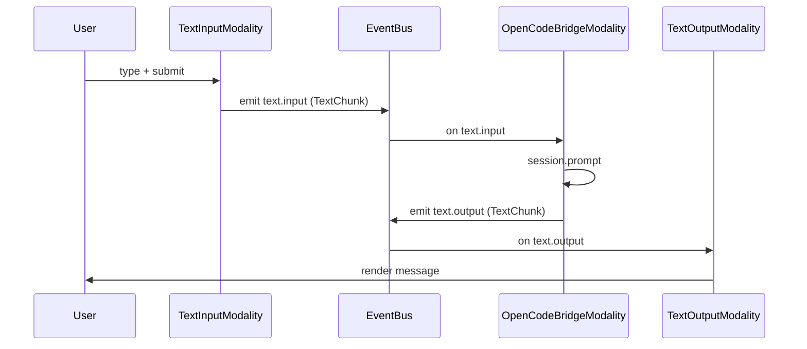
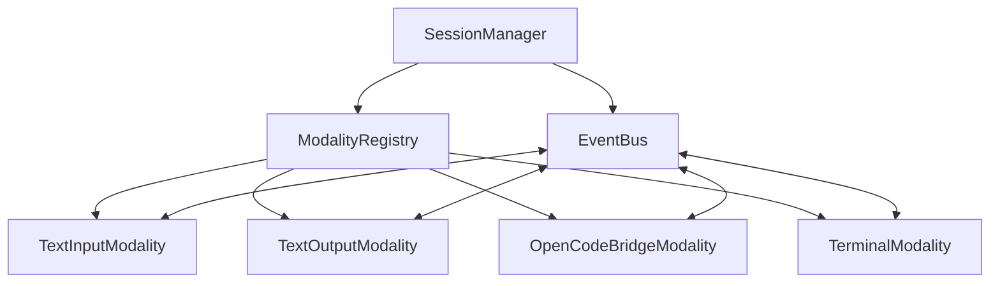

# Plan: OpenSpace Architecture Refactor (Shell + Bus + Modalities)

This plan defines the concrete interfaces, events, and module boundaries needed to implement the architecture in `@openspace-client/`. It is intended to be directly executed by an implementation agent.

## Goals
- Implement Shell + Bus + Modality lifecycle from `docs/tech/ARCHITECTURE.md`.
- Introduce stable text modality contracts with streaming payloads.
- Move OpenCode API calls into a bridge modality/adapter.
- Keep UI components as renderers mounted by modalities, not as system controllers.

## Target Folder Structure (new)
- `openspace-client/src/core/bus/`
  - `EventBus.ts`
  - `events.ts`
  - `types.ts`
- `openspace-client/src/core/shell/`
  - `SessionManager.ts`
  - `ModalityRegistry.ts`
- `openspace-client/src/core/modality/`
  - `BaseModality.ts`
  - `ProcessorChain.ts`
- `openspace-client/src/modalities/text/`
  - `TextInputModality.ts`
  - `TextOutputModality.ts`
  - `types.ts`
- `openspace-client/src/modalities/terminal/`
  - `TerminalModality.ts`
- `openspace-client/src/modalities/opencode/`
  - `OpenCodeBridgeModality.ts`
- `openspace-client/src/ui/` (optional extraction, not required for correctness)
  - `AgentConsoleView.tsx`
  - `MessageListView.tsx`
  - `PromptInputView.tsx`

## 1) Core Contracts (Interfaces + Types)

### 1.1 IModality updates (if needed)
Keep current `openspace-client/src/interfaces/IModality.ts`, but ensure all modalities implement:
- `initialize(config: ModalityConfig): Promise<void>`
- `dispose(): Promise<void>`
- `getState(): TState`
- `setState(state: TState): Promise<void>`
- `getCapabilities(): TCapabilities`
- `on(event, cb)` / `off(event, cb)` (event subscription)

### 1.2 Text modality contract (new)
Create `openspace-client/src/modalities/text/types.ts` and update `ITextInput.ts` / `ITextOutput.ts` to use these types.

Required types:
```ts
export type TextSource = "user" | "agent" | "system";

export interface TextMetadata {
  sessionId?: string;
  messageId?: string;
  requirementIds?: string[];
  toolName?: string;
  tokens?: { input?: number; output?: number; reasoning?: number; cacheRead?: number; cacheWrite?: number };
  attachments?: Array<{ mime: string; name?: string; url: string }>;
}

export interface TextChunk {
  id: string;
  content: string;
  isFinal: boolean;
  timestamp: number;
  source: TextSource;
  metadata?: TextMetadata;
}

export interface TextMessage {
  id: string;
  source: TextSource;
  createdAt: number;
  chunks: TextChunk[];
  metadata?: TextMetadata;
}
```

Update interfaces:
```ts
export interface ITextInput extends IModality<ITextInputState, ITextInputCapabilities> {
  send(chunk: TextChunk): Promise<void>;
  registerProcessor(processor: IModalityProcessor<TextChunk, TextChunk>): void;
}

export interface ITextOutput extends IModality<ITextOutputState, ITextOutputCapabilities> {
  display(chunk: TextChunk): void;
  registerProcessor(processor: IModalityProcessor<TextChunk, TextChunk>): void;
}
```

## 2) Bus (Global Event Bus)

### 2.1 EventBus API
Create `openspace-client/src/core/bus/EventBus.ts`:
```ts
export type BusHandler<T> = (payload: T) => void;

export class EventBus {
  on<T>(event: string, handler: BusHandler<T>): void;
  off<T>(event: string, handler: BusHandler<T>): void;
  emit<T>(event: string, payload: T): void;
  clear(): void;
}
```

### 2.2 Event Definitions
Create `openspace-client/src/core/bus/events.ts` with string constants and payload types:
- `text.input` → `TextChunk`
- `text.output` → `TextChunk`
- `text.message` → `TextMessage` (optional for aggregated message flow)
- `terminal.input` → `{ data: string; sessionId?: string }`
- `terminal.output` → `{ data: string; sessionId?: string }`
- `session.created` → `{ sessionId: string }`
- `session.selected` → `{ sessionId: string }`
- `modality.ready` → `{ id: string; type: string }`
- `modality.error` → `{ id: string; error: string }`

## 3) Shell (SessionManager + Modality Registry)

### 3.1 ModalityRegistry
Create `openspace-client/src/core/shell/ModalityRegistry.ts`:
```ts
export class ModalityRegistry {
  register(modality: IModality): void;
  unregister(id: string): void;
  get(id: string): IModality | undefined;
  list(): IModality[];
}
```

### 3.2 SessionManager implementation
Create `openspace-client/src/core/shell/SessionManager.ts` implementing `ISessionManager`:

Required behavior:
- `registerModality(modality)` calls `initialize()` with `ModalityConfig` (client, initialState, settings, linkedRequirementIds).
- On `saveCurrentSession`, call `getState()` of each modality and store in a local JSON map keyed by modality id.
- On `loadSession(id)`, set current session id, fetch persisted state (local store or OpenCode session), then call `setState()` on each registered modality.
- `broadcast(event, data)` proxies to EventBus.

Recommended local persistence (Phase 0):
- `localStorage` key `openspace.session.<id>` → `{ info, modalityStates }`.

## 4) Modality Base + Processor Chain

### 4.1 BaseModality
Create `openspace-client/src/core/modality/BaseModality.ts`:
```ts
export abstract class BaseModality<TState, TCapabilities> implements IModality<TState, TCapabilities> {
  readonly id: string;
  readonly type: string;
  readonly name: string;
  protected bus: EventBus;
  protected processors: ProcessorChain<unknown, unknown>;

  constructor(id: string, type: string, name: string, bus: EventBus);
  initialize(config: ModalityConfig): Promise<void>;
  dispose(): Promise<void>;
  getState(): TState;
  setState(state: TState): Promise<void>;
  getCapabilities(): TCapabilities;
  on(event: string, cb: (data: unknown) => void): void;
  off(event: string, cb: (data: unknown) => void): void;
  registerProcessor(processor: IModalityProcessor<unknown, unknown>): void;
}
```

### 4.2 ProcessorChain
Create `openspace-client/src/core/modality/ProcessorChain.ts`:
```ts
export class ProcessorChain<TIn, TOut> {
  register(processor: IModalityProcessor<TIn, TOut>): void;
  process(data: TIn, metadata?: unknown): Promise<{ data: TOut; metadata?: unknown }>;
}
```

## 5) Modalities (Concrete Implementations)

### 5.1 TextInputModality
File: `openspace-client/src/modalities/text/TextInputModality.ts`

Responsibilities:
- Owns prompt state and emits `text.input` events.
- Mounts `PromptInput` (or `PromptInputView`) in `mount()`.

Required methods:
- `initialize(config)` sets initial buffer if provided.
- `send(chunk: TextChunk)`
  - `const processed = await processors.process(chunk)`
  - `bus.emit("text.input", processed.data)`
- `getState()` returns `{ currentBuffer }`
- `setState()` restores buffer

### 5.2 TextOutputModality
File: `openspace-client/src/modalities/text/TextOutputModality.ts`

Responsibilities:
- Renders messages from `text.output` or `text.message` events.
- Mounts `MessageList` (or `MessageListView`) in `mount()`.

Required methods:
- `initialize()` subscribes to `bus.on("text.output", handler)`
- Handler logic:
  - accumulate chunks into `TextMessage[]`
  - store in state (`history`)
  - call `display(chunk)` to update view
- `getState()` returns `{ history }`
- `setState()` rehydrates history

### 5.3 OpenCodeBridgeModality
File: `openspace-client/src/modalities/opencode/OpenCodeBridgeModality.ts`

Responsibilities:
- Converts `text.input` events into OpenCode `session.prompt` API calls.
- Converts OpenCode SSE events into `text.output` chunks.

Required methods and calls:
- `initialize(config)`
  - store `openCodeService` client from `config.client`
  - subscribe to `bus.on("text.input", handleTextInput)`
  - subscribe to OpenCode SSE using existing `openCodeService.client.event.subscribe`
- `handleTextInput(chunk: TextChunk)`
  - ensure session id (use selected session or create via `openCodeService.client.session.create`)
  - map chunk + metadata to OpenCode `session.prompt` parts
  - call `openCodeService.client.session.prompt(...)`
- SSE handler
  - for `message.part.updated` events: map to `TextChunk` (source: "agent")
  - emit `bus.emit("text.output", chunk)`
  - for tool/output parts, include `metadata.toolName` and serialize

Mapping rules (required):
- OpenCode `Part.type === "text"` → `TextChunk.content = part.text`
- `messageID` → `metadata.messageId`
- `sessionID` → `metadata.sessionId`
- `Part.type === "tool"` → `TextChunk.content` = summary string, `metadata.toolName = part.tool`

### 5.4 TerminalModality
File: `openspace-client/src/modalities/terminal/TerminalModality.ts`

Responsibilities:
- Wraps the current `useTerminal` logic into a modality.
- Emits `terminal.output` for read data if needed.

Required methods:
- `initialize()` creates PTY via `openCodeService.pty.create` and opens WebSocket
- On websocket message: `bus.emit("terminal.output", { data })`
- `receive()` can accept `terminal.input` and send over websocket
- `dispose()` closes socket and disposes xterm

## 6) UI Rewire (minimal)

### 6.1 AgentConsole container
Replace direct OpenCode calls in `openspace-client/src/components/AgentConsole.tsx`.

New responsibilities:
- Compose and mount modalities via `SessionManager`.
- Provide a container element for `TextInputModality` and `TextOutputModality`.

Concrete changes:
- Remove direct `openCodeService.client.session.*` calls.
- Remove `useMessages` and `useSessionEvents` from AgentConsole.
- Instead, listen to modality state or bus events for UI updates (through modality-controlled view components).

### 6.2 PromptInput and MessageList
- Convert to "dumb" view components that accept props and callbacks from modalities.
- No API access or session logic inside these components.

## 7) Data Flow (text)

### 7.1 User → Agent
1. `TextInputModality` captures user input
2. `TextInputModality.send(chunk)`
3. `processors.process` (optional)
4. `bus.emit("text.input", chunk)`
5. `OpenCodeBridgeModality` receives event
6. `openCodeService.client.session.prompt(...)`

### 7.2 Agent → User
1. OpenCode SSE `message.part.updated`
2. `OpenCodeBridgeModality` converts to `TextChunk`
3. `bus.emit("text.output", chunk)`
4. `TextOutputModality` aggregates and renders

## 8) Implementation Steps (ordered)

1. Add `EventBus` + `events.ts`.
2. Add `ProcessorChain` + `BaseModality`.
3. Add `ModalityRegistry` + `SessionManager`.
4. Add `TextChunk` types and update `ITextInput`/`ITextOutput`.
5. Implement `TextInputModality`.
6. Implement `TextOutputModality`.
7. Implement `OpenCodeBridgeModality`.
8. Implement `TerminalModality` (optional if focusing on text).
9. Refactor `AgentConsole` to initialize SessionManager + modalities and remove direct OpenCode calls.
10. Adjust UI components to be view-only.

## 9) Acceptance Criteria
- No direct OpenCode API calls in UI components.
- `SessionManager` can persist and restore `TextOutputModality` history.
- `TextInputModality.send` routes to bus, which triggers OpenCode prompt.
- SSE events render in `MessageList` via `TextOutputModality`.
- Modality lifecycle calls `initialize()` and `dispose()` correctly during app mount/unmount.

## 10) Integration Notes
- Keep existing OpenCode `Message`/`Part` types for rendering, but bridge them into `TextChunk` early in `OpenCodeBridgeModality`.
- Avoid large refactors to CSS or layout in this phase.
- Use ASCII-only edits in new files.

## 11) Handoff Checklist (Execution Order)
- [ ] Add core bus files: `EventBus.ts`, `events.ts`, `types.ts`.
- [ ] Add core modality files: `BaseModality.ts`, `ProcessorChain.ts`.
- [ ] Add shell files: `ModalityRegistry.ts`, `SessionManager.ts`.
- [ ] Add text types: `modalities/text/types.ts`.
- [ ] Update `interfaces/ITextInput.ts` and `interfaces/ITextOutput.ts` to use `TextChunk`.
- [ ] Implement `TextInputModality.ts` with `send()` -> bus.
- [ ] Implement `TextOutputModality.ts` with bus subscription + history.
- [ ] Implement `OpenCodeBridgeModality.ts` with prompt + SSE mapping.
- [ ] Refactor `AgentConsole.tsx` to mount modalities and remove direct OpenCode calls.
- [ ] Convert `PromptInput.tsx` + `MessageList.tsx` to view-only components.
- [ ] Verify persistence: `SessionManager.saveCurrentSession()` rehydrates text history.

## 12) Diagrams (Appendix)

### 12.1 Text Flow (Bus)


### 12.2 Shell Orchestration

