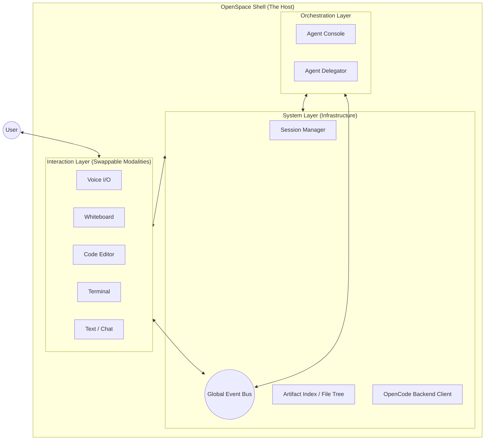
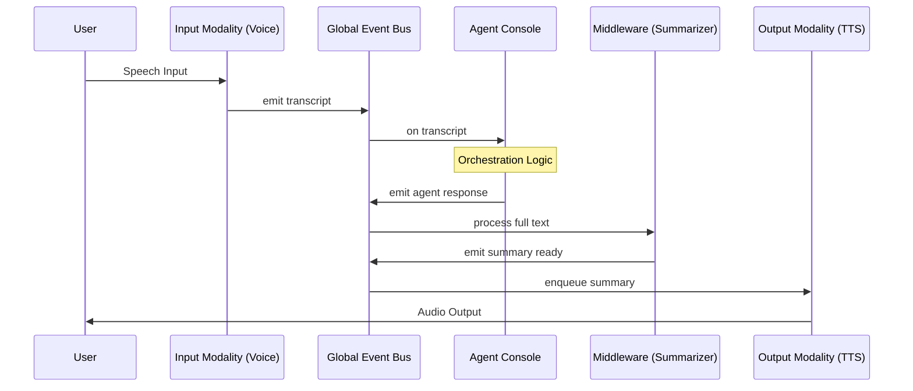
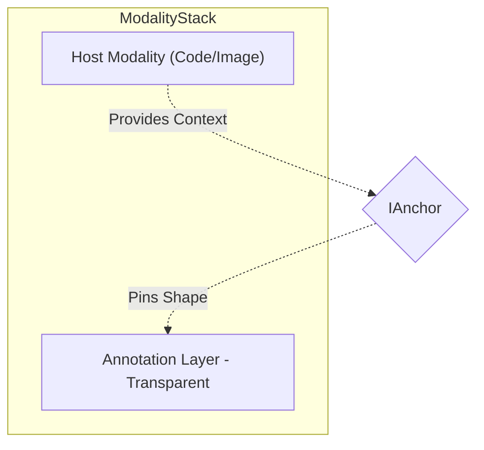

# OpenSpace Technical Architecture

## Overview
OpenSpace is a shell-first, multi-modal development environment. It breaks away from traditional "Editor Gravity" by treating voice, visual artifacts (whiteboards, presentations), and requirements as first-class citizens.

## Core Principles
1. **Shell-First**: Everything happens in a session. The editor is just one way to view and modify artifacts.
2. **Modality Agnostic**: Every major subsystem (Voice, Whiteboard, Terminal, Editor) communicates through a stable interface.
3. **Dynamic Delegation**: The system can dynamically spawn sub-agents with specific skills and MCP toolsets to solve complex tasks.
4. **Swappability**: Libraries can be swapped (e.g., Web Speech API -> Kokoro TTS) without rewriting the core application.

## System Architecture

### Component Interaction Map
The OpenSpace Shell is the **Host Environment**. It provides the infrastructure (Persistence, Navigation, Communication) in which all Modalities and Agents reside.



### 1. The Modality Contract (`IModality`)
All major subsystems (including sub-agents and processors) implement the `IModality` interface. This ensures lifecycle consistency and enables full session recovery through explicit state objects.

```typescript
export interface IModality<TState = any, TCapabilities = any> {
  readonly id: string;
  readonly type: string;
  readonly name: string;
  initialize(config: ModalityConfig): Promise<void>;
  mount?(container: HTMLElement): void;
  dispose(): Promise<void>;
  getState(): TState;
  setState(state: TState): Promise<void>;
  getCapabilities(): TCapabilities;
  registerProcessor?(processor: IModalityProcessor<any, any>): void;
  linkRequirement?(requirementId: string): void;
  getLinkedRequirements?(): string[];
}
```

### 2. Dynamic Delegation (`IAgentDelegator`)
The `IAgentDelegator` is a core system modality that manages the lifecycle of specialized sub-agents. It tracks active sessions and allows for "hotplugging" MCP tools on the fly.

- **Dynamic Skills**: Skills (like `Librarian` or `Technical Analysis`) are injected into the sub-agent's prompt.
- **MCP Hotplugging**: Sub-agents are only given the tools (MCP servers) they need for the specific task.
- **Context Scoping**: Sub-agents receive a pruned context focused on relevant artifacts.

### 3. Modality Middleware (`IModalityProcessor`)
The architecture supports **Process Blocks** that can be chained between modalities. These are themselves managed as modalities, allowing them to persist their own configuration (e.g., summarization depth).

- **Transformers**: A summarizer can sit between the `AgentConsole` and `VoiceOutput`, condensing 500 words of text into a 20-word voice summary while the full text remains on screen.
- **Emotion Enrichment**: An `EmotionProcessor` can analyze user voice input and attach metadata like `frustrated: 0.8`. The Agent can then use this to choose a "calming" response tone.
- **Barge-in Logic**: The `IAgentDelegator` can trigger `IVoiceInput.interrupt()` if the agent needs to cut off the user.

```typescript
export interface IModalityProcessor<TIn = any, TOut = any> extends IModality {
  process(data: TIn, metadata?: VoiceMetadata): Promise<{ data: TOut, metadata?: VoiceMetadata }>;
}
```

## Data Flow
The OpenSpace data flow is designed for low latency and high semantic fidelity.



1. **User Input**: Captured via a Modality (e.g., Voice transcript + Emotion metadata).
2. **Streaming & Interruption**: Raw audio chunks can be streamed for real-time analysis. The agent can trigger an `interrupt()` signal to stop user input (Barge-in).
3. **Orchestration**: The Agent Console analyzes the input and current emotional state.
4. **Delegation**: If complex, a sub-agent is spawned via `IAgentDelegator` with specific skills and MCP tools.
5. **Processing**: Output is piped through registered `IModalityProcessors` (e.g., Summarizers).
6. **Multi-Modal Feedback**: High-bandwidth data (full text) goes to `CodeEditor/Console`, while optimized data (summaries + emotion-tinted audio) goes to `VoiceOutput`.


### 4. Dual-Mode Coordinate System & Scaling
To handle both fixed-size artifacts (like images) and infinite canvases, visual modalities support two projection modes:

- **Projection Modes**:
  - `normalized`: Coordinates are 0-10000. Used for **Annotation Layers** where annotations must stay pinned to a fixed target (Image, Code file).
  - `world`: Absolute coordinates used for **Infinite Whiteboards**.
- **Spatial Awareness**: Modalities provide `getViewport()` to the Agent, allowing it to understand what the user is currently looking at and spawn objects in the visible area.
- **Fractional Indexing**: Shapes use a `string` based `index` (e.g., `a1`, `a2`) to allow high-performance z-ordering without full list rewrites.

```typescript
export interface IGeometry {
  x: number; y: number;
  width: number; height: number;
  rotation: number;
}

export interface IShape {
  id: string;
  type: 'path' | 'rect' | 'ellipse' | 'arrow' | 'text' | 'image' | 'group';
  geometry: IGeometry;
  data: {
    points?: Array<[x: number, y: number, pressure: number]>;
    text?: string;
    image?: { src: string; naturalWidth: number; naturalHeight: number; };
    style: IShapeStyle;
  };
  index: string; // z-order
}
```

### 5. Universal Annotation (`IAnnotationLayer`)
Annotations are treated as a specialized transparent whiteboard layer that can be overlaid on any other modality.



- **Anchoring**: Annotations can be "pinned" to underlying content (e.g., specific lines of code) via an `IAnchor`.
- **Image Support**: Images are first-class artifacts. They can be placed on a whiteboard, annotated in `normalized` mode, or grouped with other shapes to represent complex requirements.
- **Semantic Grouping**: Multiple shapes can be grouped into a single logical unit. This creates a "Visual AST" that the Agent can manipulate (e.g., "Refactor this group of shapes into a 'Login Form' component").

### 6. Stateful Presentations (`IPresentation`)
Presentations are not just passive renderers; they are active modalities that project artifacts into a narrative state machine.

- **Artifact Projection**: Slides are generated from Markdown/YAML, where thematic breaks (`---`) define slide boundaries.
- **Requirement Traceability**: Each slide can be linked to one or more requirements (`REQ-XXX`), allowing the Agent to navigate the presentation based on functional scope.
- **Agent-Driven Narrative**: The Agent can control the deck (`goto`, `next`) and access speaker notes to provide context-aware narration.

### 7. Semantic Artifact Indexing (`IArtifactIndex`)
Beyond raw file trees, OpenSpace maintains a semantic map of the project.

- **Multi-Dimensional Classification**: Artifacts are indexed by type, feature, flow stage, and linked requirements.
- **Contextual Filtering**: The UI can toggle between a "Global View" and a "Contextual View" (e.g., only showing artifacts relevant to the current debugging session).

### 8. Session Orchestration (`ISessionManager`)
The Session Manager is the "Brain" of the OpenSpace shell infrastructure.

- **State Hydration**: Orchestrates the `getState()` and `setState()` calls to ensure full session recovery.
- **Global Event Bus**: Provides the `broadcast()` mechanism for cross-modality communication.
- **Instance Management**: Tracks all active modality instances, ensuring they are properly initialized and disposed of.

### 9. Component Sandboxing (`IComponentPreview`)
A specialized modality for rendering AI-generated UI components.

## Lifecycle vs. Communication
The distinction between the Shell and the Bus is based on the separation of **Existence** and **Conversation**:

1. **The Shell (Governance)**: Manages **Lifecycle** (init/dispose) and **Persistence** (get/set state). It owns the infrastructure like the **File Tree** and the **Session Manager**.
2. **The Bus (Flow)**: Manages **Communication**. Modalities emit semantic events (e.g., `transcript`, `shape_added`), and the Agent Console listens and responds.

## Data Modality Analogy
OpenSpace treats different modalities with the same level of atomic rigor:
- **Text Modality**: Stream of characters -> Semantic Tokens -> Meaning.
- **Graphic Modality**: Stream of Geometries (Shapes/Deltas) -> Semantic Groups -> Meaning.

By treating a "Rectangle + Text" on a whiteboard as a "Semantic Component," the Agent can manipulate visual designs with the same precision it uses for source code.

## Current Modalities
- **Voice**: 
  - **Input**: Streaming STT with emotion detection and barge-in (interruption) support.
  - **Output**: Priority-based streaming TTS with emotional prosody and middleware (processor) support.
- **Visual**: 
  - **Whiteboard**: Dual-mode (freehand + structured) using logical coordinates.
  - **Annotation Layer**: Universal redlining with element anchoring.
  - **Presentations**: Stateful slide decks with requirement linking and agent narration.
  - **Component Preview**: Safe sandbox for visual verification of AI-generated code.
- **Text**:
  - **Input**: Standard text input for chat and commands.
  - **Output**: Markdown-rendered agent responses and tool logs.
- **Data & Navigation**:
  - **File Tree**: VSCode-standard unified view.
  - **Artifact Index**: Semantic project map with multi-dimensional filtering.
- **Shell & Code**:
  - **Code Editor**: Monaco surface with LSP and redline support.
  - **Terminal**: xterm.js bridge to OpenCode PTY.
  - **Agent Console**: The primary command, control, and delegation center.

## Architectural Guidelines

1. **Interface-First**: No implementation should be started without first defining and auditing the interface contract in `src/interfaces/`.
2. **Lifecycle Symmetry**: All managed components MUST implement `initialize` and `dispose`. Failure to dispose of hardware resources (Mic, GPU) or WebSockets is considered a critical bug.
3. **Serializability**: Modality state returned by `getState()` MUST be serializable to JSON. This ensures session persistence and "memento" patterns work out of the box.
4. **Middleware-Friendly**: Modalities that produce or consume high-level data (Text, Speech, Geometry) should support `IModalityProcessor` registration to allow non-destructive transformation.
5. **Low Latency by Design**: Prefer streaming (chunks/events) over bulk data transfers. Use `isProcessing` status to keep the UI responsive.
6. **Conflict Resolution (CRDT-First)**: For stateful visual modalities, implementations should prefer CRDT-based state management (e.g., Yjs) to handle simultaneous Agent/User edits without locks.
7. **Permission-Aware**: Delegated sub-agents operate on a "Least Privilege" model. MCP hotplugging must be accompanied by explicit user authorization for high-risk tools.

## Implementation Status
- Phase 0: Foundation (In Progress)
- Phase 1: Voice Modality (Planned)
- Phase 2: Visual Modalities (Planned)
- Phase 3: Polish & Persistence (Planned)
