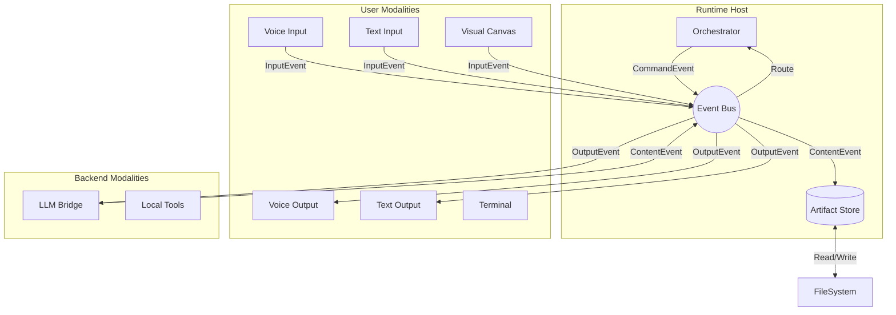

# OpenSpace Technical Architecture

## Overview
OpenSpace is a multimodal, shell-first development environment. It orchestrates interactions between a user and AI agents through a unified **Event Bus**, treating all inputs (Voice, Text, Sketch) and outputs (TTS, Terminal, Canvas, Backend AI) as swappable **Modalities**.

This architecture prioritizes **Modality Decoupling** (REQ-CORE-001) and **Artifact Fidelity** (REQ-CORE-017), ensuring that non-text "truth" (audio, sketches) is preserved and referenced, not just transiently converted to text.

---

## Core Principles
1.  **Everything is a Modality**: The User Interface *and* the AI Backend are peers. The Runtime manages them equally.
2.  **Unified Data Schema**: All events carry a `MultimodalContent` payload (Text + Media References). The Orchestrator routes content, it doesn't transcode it.
3.  **State as Truth**: The Artifact Store is the single source of truth. Session state is just a specialized artifact.
4.  **Workflow as Code**: The Orchestrator's logic is data-driven, loaded from `AGENTS.md` and `PROCESS.md` (REQ-CORE-005).

---

## System Architecture

### High-level Structure
The system is composed of the **Runtime Core** and a collection of **Plugins (Modalities)**.

1.  **Runtime Host**: Manages the lifecycle of plugins and the Event Bus.
2.  **Event Bus**: A typed, async message broker.
3.  **Orchestrator**: A workflow engine that routes events based on the active `PROCESS.md` state.
4.  **Artifact Store**: A unified file system indexer that handles mixed content (Code + Media + Metadata).

### Component Interaction Map


---

## The Unified Data Schema (Crucial for Multimodality)

To support REQ-CORE-017 (Non-text Truth), we strictly define the data passing through the bus. We do not pass raw binary data on the bus; we pass **References**.

### `MultimodalContent`
```ts
type ContentBlock = 
  | { type: 'text'; value: string; format: 'markdown' | 'plain' }
  | { type: 'audio'; url: string; duration?: number; transcript?: string }
  | { type: 'image'; url: string; alt?: string; metadata?: VisualMetadata }
  | { type: 'tool_call'; id: string; name: string; args: Record<string, any> }
  | { type: 'tool_result'; id: string; result: string; is_error: boolean };

interface IEventPayload {
  sessionId: string;
  timestamp: number;
  senderId: string; // Modality ID
  content: ContentBlock[];
  context?: {
    activeArtifact?: string; // URI
    selection?: Range;
  };
}
```

---

## Core Services

### 1. Runtime Manager
**Responsibility**: The "Kernel". It boots the system, loads configuration, and mounts Modalities.
**Interface**:
```ts
interface IRuntime {
  register(modality: IModality): void;
  start(): Promise<void>;
  shutdown(): Promise<void>;
}
```

### 2. Orchestrator (The Workflow Engine)
**Responsibility**: Determines *who* handles an event. It does not contain hardcoded business logic. Instead, it loads a **State Machine** defined in `PROCESS.md`.
**Logic**:
- On `InputEvent`:
    1. Check active state in `PROCESS.md`.
    2. Check active agent in `AGENTS.md`.
    3. Determine if immediate response (Simulated) or Backend (LLM) is needed.
    4. Emit `IntentEvent` to target Modality.

### 3. Artifact Store (The Memory)
**Responsibility**: Indexes the project. Handles the "File Tree vs. Metadata" problem (REQ-CORE-029).
**Strategy**:
- **Code/Text**: Uses YAML Frontmatter for metadata (`status`, `priority`, `tags`).
- **Binary/Media**: Uses a directory-level `_manifest.json` to store metadata for images/audio to avoid file clutter.
- **Indexing**: Lazy. Indexes on read or file-watcher event.

---

## Modality Contract
A Modality is any plugin that can Input or Output data.

```ts
interface IModality {
  id: string;
  type: 'user_input' | 'user_output' | 'backend' | 'tool';
  
  // Lifecycle
  initialize(bus: IEventBus, config: any): Promise<void>;
  dispose(): Promise<void>;

  // Capabilities
  capabilities: {
    supportsStreaming: boolean;
    supportedMimeTypes: string[];
  };
}
```

### Key Modalities

#### A. Voice Modality (Input/Output)
- **Input**: Listens to microphone. Uses local VAD (Voice Activity Detection). Emits `audio` blocks.
- **Output**: Subscribes to `OutputEvent`. If block is `text`, uses TTS. If block is `audio`, plays directly.
- **Config**: Honors `voice_enabled` flag (REQ-CORE-034).

#### B. Visual Canvas (Input/Output)
- **Input**: Emits `image` blocks (snapshots) or `vector` blocks (strokes).
- **Output**: Renders `component_preview` blocks.

#### C. LLM Bridge (Backend)
- **Input**: Subscribes to `IntentEvent`.
- **Output**: Emits `ContentEvent` (streamed).
- **Role**: It acts as the "Brain", but to the Runtime, it's just another I/O device.

---

## Implementation Plan (Revised)

### Phase 1: The Spinal Cord (Bus & Runtime)
**Goal**: A working CLI that can echo text back to the user via the Event Bus.
1.  Define `IEventBus` and `MultimodalContent` schema.
2.  Implement in-memory Bus.
3.  Implement `RuntimeHost`.
4.  Create `StdIOModality` (Terminal Input/Output).

### Phase 2: The Brain (Orchestrator & Backend)
**Goal**: Connect to an LLM and have a conversation.
1.  Implement `Orchestrator` with a hardcoded "Echo" workflow.
2.  Implement `LLMModality` (Mock first, then Real).
3.  Update Orchestrator to route `StdIO` -> `LLM` -> `StdIO`.

### Phase 3: The Memory (Artifact Store)
**Goal**: Save the conversation to files.
1.  Implement `ArtifactStore`.
2.  Create `SessionManager` service (listens to Bus, writes Markdown transcripts).
3.  Implement Frontmatter parsing.

### Phase 4: The Senses (Voice & Vision)
**Goal**: Add Voice and Canvas without changing the Core.
1.  Implement `WebAudioModality` (Browser-based STT/TTS).
2.  Implement `CanvasModality`.
3.  Update `PROCESS.md` to allow parallel inputs.

### Phase 5: The Workflow (Configurable Logic)
**Goal**: User-defined workflows.
1.  Implement `WorkflowParser` for `AGENTS.md` / `PROCESS.md`.
2.  Replace hardcoded Orchestrator logic with the State Machine.

---

## Requirements Mapping
| Feature | Architecture Solution |
| :--- | :--- |
| **Decoupled Modalities** (REQ-CORE-001) | Event Bus + `MultimodalContent` schema separates Producer from Consumer. |
| **Non-Text Truth** (REQ-CORE-017) | `ContentBlock.type = 'audio'/'image'` preserves original fidelity. |
| **Configurable Workflow** (REQ-CORE-005) | Orchestrator loads `PROCESS.md` at runtime. |
| **Artifact Metadata** (REQ-CORE-031) | Artifact Store abstracts Frontmatter/Manifests. |
| **Swappable Renderer** (REQ-CORE-037) | Presentation is just another `OutputEvent` handled by a `PresentationModality`. |
