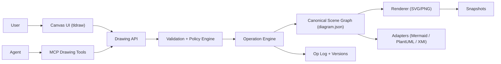

# Drawing Modality Implementation Guide (V2, Greenfield)

**Status:** Recommended  
**Date:** 2026-02-11  
**Scope:** End-to-end architecture and implementation plan for an agent-native drawing modality  
**Audience:** Product + platform + frontend + agent tooling engineers

---

## 1. Session Summary (What Was Done)

This session covered:

1. Defined candidate architectures for drawing:
   - DSL-first (Mermaid/PlantUML canonical)
   - Scene-graph-first (structured canonical model)
   - Image-first (vision on raster/vector artifacts)
2. Compared the current implementation against the scene-graph-first option.
3. Reviewed the current codebase at file-level (GraphIR, reconcile, layout, runtime hub, MCP).
4. Identified major strengths, gaps, and risks (path safety, partial type support, merge semantics).
5. Compared `tldraw` vs `excalidraw` for long-term agent-editable architecture.
6. Finalized a recommendation for a greenfield build that ignores existing implementation constraints.

Final recommendation from this session:

- Build a **Scene-Graph Canonical** architecture.
- Use **patch-only agent operations** (never full-document blind rewrites).
- Keep Mermaid/PlantUML as **import/export adapters**, not canonical storage.
- Prefer **tldraw** for extensibility and operation-level model control.

---

## 2. Product Intent and User Stories

Primary user intent:

1. User can create drawings the agent reliably understands.
2. User can view and trust drawings generated by the agent.
3. User and agent can both edit the same drawing.
4. Small edits preserve style and layout integrity.
5. Support software-engineering diagram families: block diagrams, flowcharts, state diagrams, UML, ER, sequence, C4.

Non-negotiables:

1. Stable object identity across edits.
2. Predictable incremental behavior.
3. Explicit validation and failure, not silent degradation.
4. Collaboration-safe concurrency model.

---

## 3. Architecture Decision

### 3.1 Chosen architecture

**Scene-Graph Canonical + Patch-Only Mutation + Adapter Projections**



### 3.2 Why this wins

1. Best fit for preserving style/layout under incremental edits.
2. Supports user + agent co-editing with operation granularity.
3. Enables strong semantic validation per diagram type.
4. Avoids brittle full-regeneration workflows.

---

## 4. Target System Components

## 4.1 Client (Web)

1. Drawing canvas: `tldraw`.
2. Inspector panel: semantic properties (node kind, relation type, constraints).
3. Change preview panel: shows proposed agent patch before apply.
4. Presence/collaboration indicators.
5. “Send to agent” with current selection/context handles.

## 4.2 Drawing API Service

1. CRUD for diagrams.
2. Patch proposal/apply endpoints.
3. Validation pipeline.
4. Versioning and branch/merge metadata.
5. Snapshot/export jobs.

## 4.3 Collaboration Service

1. Yjs document sync provider over WebSocket.
2. Conflict-safe merge at operation/field level.
3. Awareness/presence channel.

## 4.4 Storage

1. Canonical `diagram.json` (current head).
2. Append-only op log.
3. Snapshot storage (`.png`, `.svg`).
4. Optional exported DSL artifacts (`.mmd`, `.puml`) as derived outputs.

## 4.5 MCP Integration

1. `inspect_scene`
2. `propose_patch`
3. `validate_patch`
4. `apply_patch`
5. `export_diagram`
6. `import_diagram`

---

## 5. Canonical Data Contracts

## 5.1 Canonical artifact

`design/<name>.diagram.json`

```json
{
  "schemaVersion": "1.0",
  "diagramType": "class",
  "metadata": {
    "title": "Auth Domain",
    "createdAt": "2026-02-11T12:00:00Z",
    "updatedAt": "2026-02-11T12:10:00Z"
  },
  "style": {
    "theme": "engineering-default",
    "tokens": {
      "node.default": { "stroke": "#1f2937", "fill": "#ffffff", "font": "IBM Plex Sans" }
    }
  },
  "nodes": [
    {
      "id": "User",
      "kind": "class",
      "label": "User",
      "layout": { "x": 140, "y": 90, "w": 220, "h": 140, "locked": true },
      "styleToken": "node.default",
      "semantics": {
        "attributes": ["+id: UUID", "+email: String"],
        "methods": ["+login(): Session"]
      }
    }
  ],
  "edges": [
    {
      "id": "e1",
      "from": "User",
      "to": "Session",
      "relation": "association",
      "label": "creates",
      "routing": { "type": "orthogonal" },
      "styleToken": "edge.default"
    }
  ],
  "groups": [],
  "constraints": [
    { "id": "c1", "type": "preserve-position", "target": "User" }
  ],
  "sourceRefs": {
    "mermaid": { "User": "User" },
    "canvas": { "User": "shape:abcd1234" }
  }
}
```

## 5.2 Operation model

```json
{
  "opId": "op_000123",
  "baseVersion": 42,
  "actor": "agent",
  "ops": [
    { "type": "updateNodeLabel", "nodeId": "User", "label": "AccountUser" },
    { "type": "addEdge", "edge": { "id": "e2", "from": "AccountUser", "to": "Role", "relation": "association" } }
  ],
  "intent": "Rename class and connect role"
}
```

Rules:

1. All ops are schema-validated.
2. All ops are semantic-validated.
3. Apply is atomic per patch request.

---

## 6. Runtime and MCP APIs

## 6.1 Drawing API

1. `GET /drawings/:id` -> canonical scene graph
2. `POST /drawings/:id/patches/propose` -> dry-run + diff preview
3. `POST /drawings/:id/patches/apply` -> validated apply + new version
4. `GET /drawings/:id/history` -> op log
5. `POST /drawings/:id/export` -> `svg|png|mermaid|plantuml|xmi`
6. `POST /drawings/import` -> ingest external formats

## 6.2 MCP tool surface

1. `list_drawings`
2. `read_drawing`
3. `inspect_scene`
4. `propose_patch`
5. `validate_patch`
6. `apply_patch`
7. `export_drawing`
8. `import_drawing`

## 6.3 Event stream

1. `DRAWING_UPDATED`
2. `PATCH_APPLIED`
3. `VALIDATION_FAILED`
4. `EXPORT_READY`

---

## 7. Validation and Integrity Rules

## 7.1 Validation stages

1. Schema validation (shape of JSON and ops).
2. Graph integrity validation (no missing refs, no illegal cycles where disallowed).
3. Diagram-specific semantic validation:
   - Sequence message direction and participant constraints.
   - UML relation rules.
   - State transition validity.
4. Layout/stability policy checks:
   - Unchanged nodes must not move unless operation explicitly allows.
   - Style tokens preserved unless patch touches style.

## 7.2 Rejection policy

1. Reject unsupported constructs explicitly.
2. Return actionable error with location and reason.
3. Never silently downgrade semantics.

---

## 8. Layout and Style Strategy

1. Use incremental ELK layout for affected subgraph only.
2. Keep unchanged node coordinates stable.
3. Preserve edge routing where endpoints unchanged.
4. Use style tokens + local overrides:
   - Token-level updates for theme shifts.
   - Object-level overrides only when explicit.

---

## 9. Adapter Strategy (Interoperability)

Mermaid/PlantUML/XMI are adapter formats.

1. Import pipeline:
   - Parse -> map to canonical semantics -> normalize IDs -> validate.
2. Export pipeline:
   - Canonical -> adapter projection.
3. Fidelity tracking:
   - Export/import reports include “lossy fields” list.

---

## 10. Security and Reliability

1. Path safety and workspace scoping for all file operations.
2. AuthZ checks for patch/apply and export actions.
3. Rate limiting for agent apply endpoints.
4. Audit log for every patch:
   - actor
   - intent
   - changed objects
   - timestamp
5. Idempotency keys on apply endpoints.

---

## 11. Testing Strategy

## 11.1 Unit

1. Schema + semantic validators.
2. Operation engine correctness.
3. Adapter round-trip invariants.

## 11.2 Integration

1. API + DB + op log behavior.
2. MCP tool contracts.
3. Event stream correctness.

## 11.3 E2E

1. User edits -> autosave -> reload.
2. Agent propose -> preview -> apply.
3. Concurrent user + agent edits.
4. Diagram-family scenarios: flowchart, sequence, class, state, ER.

Acceptance targets:

1. Small patch apply p95 < 250ms for medium diagram.
2. Zero unexpected layout shift for untouched nodes.
3. Deterministic re-apply behavior for same base version and ops.

---

## 12. Implementation Plan (Greenfield)

## Phase 0: Foundations (1-2 weeks)

1. Define canonical schema and op schema.
2. Stand up drawing API service + storage.
3. Build validation pipeline skeleton.

## Phase 1: Core editor + patch engine (2-4 weeks)

1. Integrate `tldraw` with canonical model mapping.
2. Implement op engine and versioning.
3. Add previewable patch workflow.

## Phase 2: Agent and collaboration (2-4 weeks)

1. Add MCP drawing tools (`inspect/propose/validate/apply`).
2. Integrate Yjs collaboration.
3. Add conflict handling and replay testing.

## Phase 3: Interop + hardening (2-4 weeks)

1. Mermaid/PlantUML import/export adapters.
2. Semantic validators per diagram family.
3. Performance and reliability hardening.

## Phase 4: Expansion (ongoing)

1. Add advanced families (C4, BPMN, architecture templates).
2. Advanced review mode and inline diagram comments.

---

## 13. Explicit Non-Goals (V1)

1. Perfect fidelity for every external diagram format.
2. Full BPMN/UML2 complete semantics on day one.
3. Offline-first multi-user sync at launch.

---

## 14. Definition of Done

The drawing modality is “done” for V1 when:

1. Canonical scene graph is the only source of truth.
2. Agent edits go through propose/validate/apply patch flow.
3. User + agent concurrent edits are safely merged.
4. Small edits preserve style/layout of untouched objects.
5. Core software diagram families are supported with explicit validation.
6. Interop adapters exist with clear fidelity reporting.
7. Test coverage exists at unit, integration, and e2e layers.

---

## 15. Practical Tooling Recommendation

1. Canvas/editor: `tldraw` (preferred for extensibility and structured state).
2. Layout: `elkjs` (incremental graph layout).
3. Collaboration: `yjs` + websocket provider.
4. Validation: `ajv` + typed validators.
5. API: TypeScript service (Fastify/Express) + Postgres (`jsonb` + op tables).
6. Agent integration: MCP server with patch-first tools.

---

## 16. Final Recommendation

If starting from zero and optimizing for long-term quality:

1. Build **Scene-Graph Canonical** first.
2. Enforce **Patch-Only** mutation for both users and agents.
3. Treat Mermaid/Excalidraw as **projections/adapters**, not truth.
4. Invest early in validation and merge semantics.

This gives the strongest guarantees for integrity, style stability, explainability, and collaborative agent editing.

